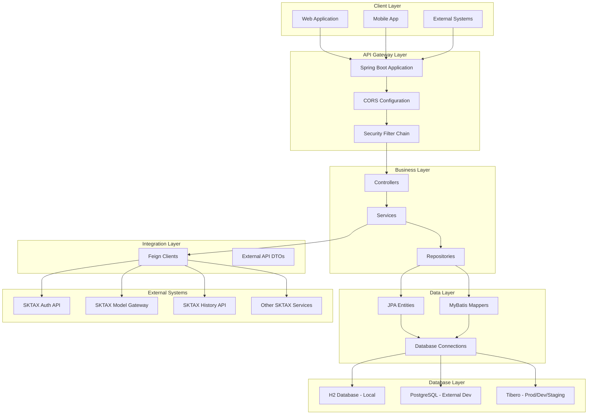
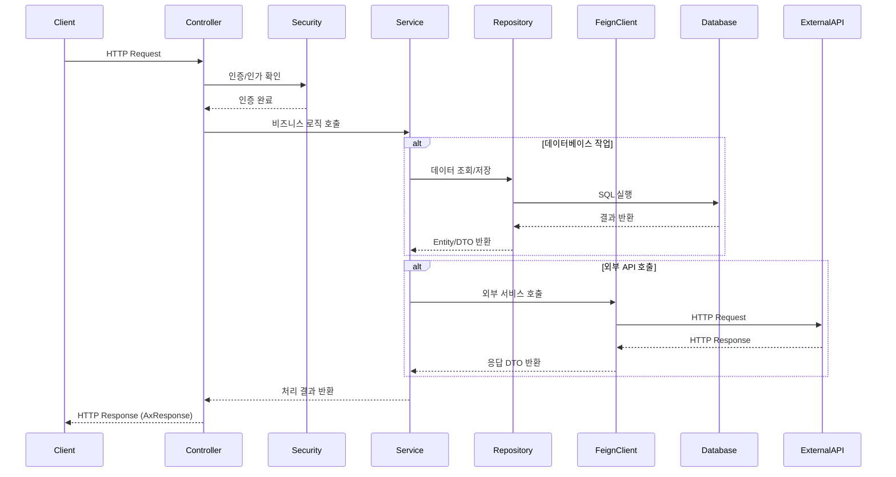
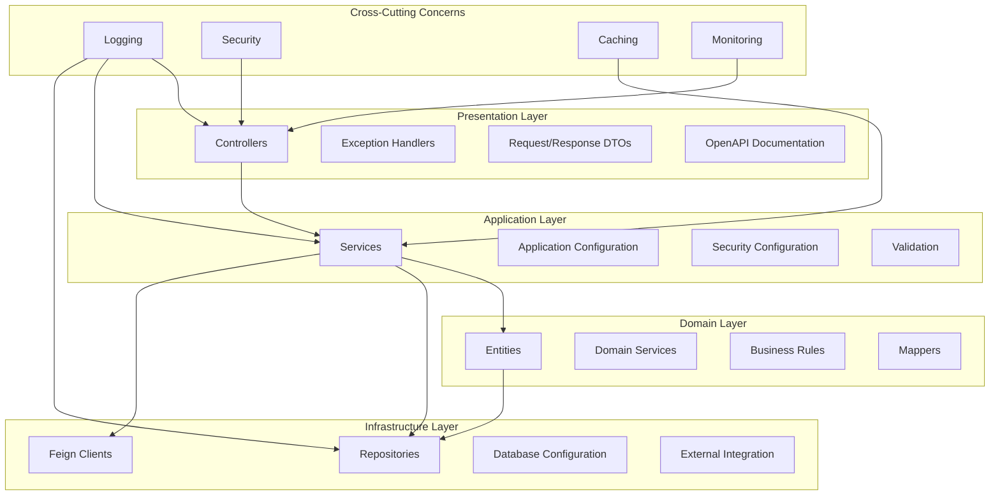
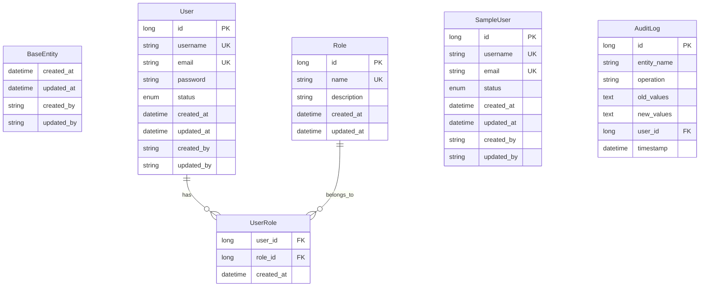
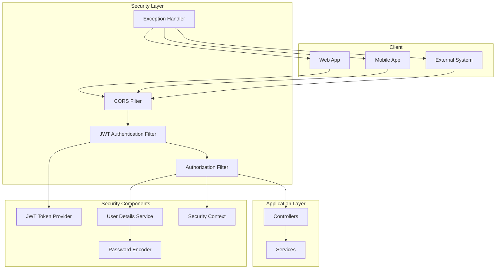
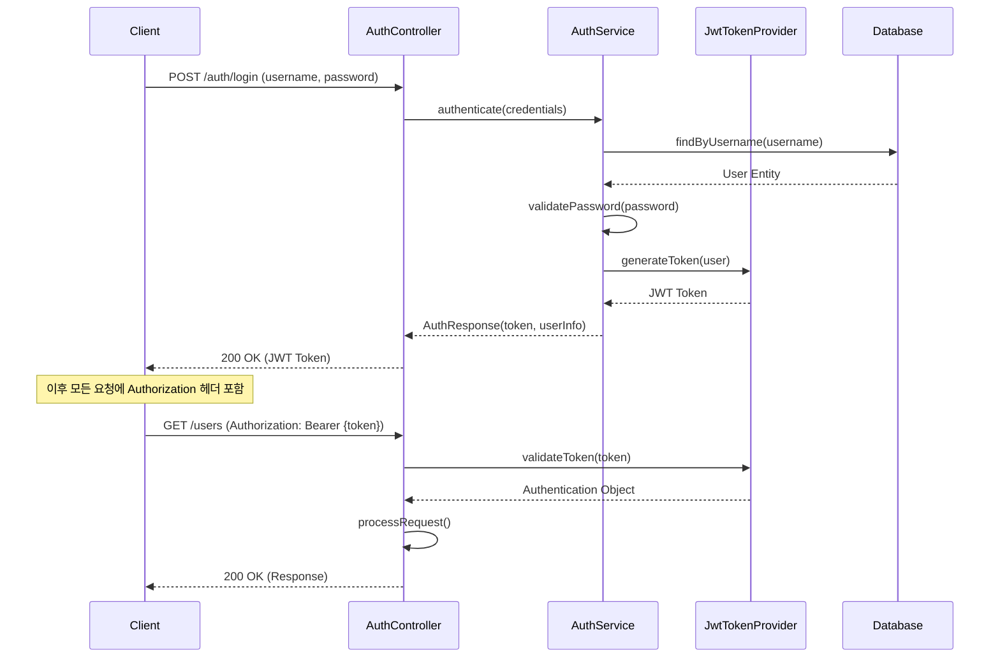
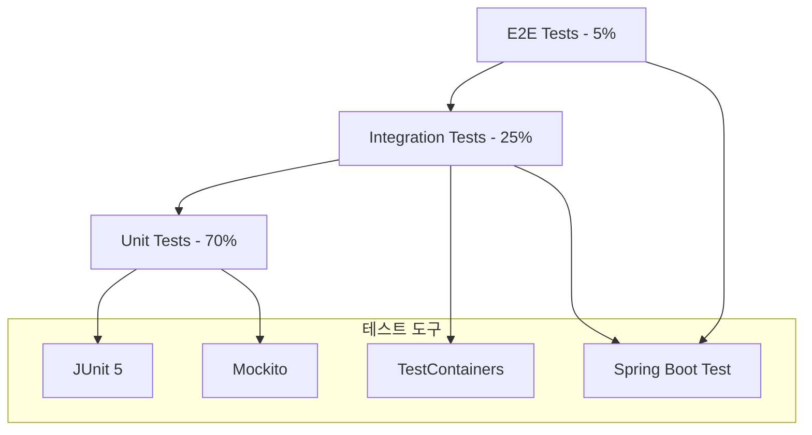

# AxportalBackend 아키텍처 정의서

## 목차
1. [프로젝트 개요](#1-프로젝트-개요)
2. [기술 스택](#2-기술-스택)
3. [전체 시스템 구조](#3-전체-시스템-구조)
4. [레이어드 아키텍처](#4-레이어드-아키텍처)
5. [주요 모듈 및 컴포넌트](#5-주요-모듈-및-컴포넌트)
6. [데이터베이스 설계](#6-데이터베이스-설계)
7. [API 설계 예시](#7-api-설계-예시)
8. [보안 및 인증](#8-보안-및-인증)
9. [배포 및 운영 환경](#9-배포-및-운영-환경)
10. [그 외 참고할 만한 사항](#10-그-외-참고할-만한-사항)

---

## 1. 프로젝트 개요

### 1.1 프로젝트 명
**AxportalBackend** - Spring Boot 기반의 AI Portal RESTful API

### 1.2 프로젝트 목적
- **SKTAX AI 플랫폼 통합 관리**: 13개 SKTAX AI 서비스를 하나의 통합 플랫폼으로 관리
- **다중 환경 지원**: 로컬, 외부개발, 개발, 스테이징, 운영 등 6개 환경별 설정 관리
- **보안 및 인증**: JWT 기반 통합 인증 시스템으로 안전한 API 접근 제어
- **API 표준화**: OpenAPI 3.0 기반의 일관된 API 문서화 및 관리

### 1.3 핵심 비즈니스 기능
- **인증 및 권한 관리**: 사용자 인증, 역할 기반 접근 제어
- **SKTAX AI 서비스 연동**: 외부 AI 서비스와의 통합 연동
- **데이터 관리**: 사용자, 히스토리, 모델 등 핵심 데이터 관리
- **API 게이트웨이**: 외부 시스템과의 안전한 API 통신
- **모니터링 및 로깅**: 시스템 상태 모니터링 및 구조화된 로깅

### 1.4 개발 정보
- **개발자**: ByounggwanLee
- **개발 시작일**: 2025-08-01
- **버전**: 1.0.0
- **라이선스**: Private

---

## 2. 기술 스택

### 2.1 핵심 프레임워크
- **Spring Boot**: 3.4.4
- **Java**: 17 (OpenJDK)
- **Spring Cloud**: 2024.0.1

### 2.2 웹 및 API
- **Spring Web**: RESTful API 구현
- **Spring Security**: 인증/인가 시스템
- **SpringDoc OpenAPI**: 3.0 기반 API 문서화
- **Spring Cloud OpenFeign**: 외부 API 연동

### 2.3 데이터 액세스
- **Spring Data JPA**: ORM 기반 데이터 액세스
- **MyBatis**: 3.0.5 (복잡한 쿼리용)
- **Hibernate**: JPA 구현체

### 2.4 데이터베이스
- **H2**: 로컬 개발 환경
- **PostgreSQL**: 외부 개발 환경
- **Tibero**: 8.0.11 (개발/테스트/운영 환경)

### 2.5 보안
- **Spring Security**: 보안 프레임워크
- **JWT (JJWT)**: 0.12.6 (토큰 기반 인증)
- **BCrypt**: 비밀번호 암호화

### 2.6 유틸리티 라이브러리
- **Lombok**: 1.18.36 (보일러플레이트 코드 제거)
- **MapStruct**: 1.6.3 (DTO-Entity 매핑)
- **Jakarta Validation**: 입력값 검증

### 2.7 테스트
- **JUnit 5**: 단위 테스트
- **Mockito**: 모킹 프레임워크
- **TestContainers**: 1.21.0 (통합 테스트)

### 2.8 빌드 및 배포
- **Maven**: 빌드 도구
- **Maven Wrapper**: 버전 일관성 보장
- **Spring Boot Actuator**: 애플리케이션 모니터링

---

## 3. 전체 시스템 구조

### 3.1 시스템 아키텍처 다이어그램



### 3.2 데이터 흐름



---

## 4. 레이어드 아키텍처

### 4.1 아키텍처 계층 구조



### 4.2 각 계층의 책임

#### 4.2.1 Presentation Layer (표현 계층)
- **Controllers**: REST API 엔드포인트 정의, HTTP 요청/응답 처리
- **Exception Handlers**: 글로벌 예외 처리, 에러 응답 표준화
- **DTOs**: 외부와의 데이터 교환을 위한 객체
- **OpenAPI**: API 문서 자동 생성 및 Swagger UI 제공

#### 4.2.2 Application Layer (애플리케이션 계층)
- **Services**: 비즈니스 로직 구현, 트랜잭션 관리
- **Configuration**: 애플리케이션 설정 관리
- **Security**: 인증/인가 로직 구현
- **Validation**: 입력값 검증 로직

#### 4.2.3 Domain Layer (도메인 계층)
- **Entities**: 비즈니스 도메인 객체, JPA 엔티티
- **Domain Services**: 도메인별 핵심 비즈니스 로직
- **Business Rules**: 비즈니스 규칙 및 제약사항
- **Mappers**: 도메인 객체와 DTO 간의 변환

#### 4.2.4 Infrastructure Layer (인프라 계층)
- **Repositories**: 데이터 액세스 추상화
- **Feign Clients**: 외부 API 연동 인터페이스
- **Database Configuration**: 데이터베이스 설정 및 연결
- **External Integration**: 외부 시스템 연동 구현

---

## 5. 주요 모듈 및 컴포넌트

### 5.1 패키지 구조

```
com.skax.aiplatform/
├── AxportalBackendApplication.java     # 메인 애플리케이션
├── client/                             # 외부 API 연동
│   └── sktax/                         # SKTAX API 클라이언트
│       ├── auth/                      # 인증 API
│       ├── modelgateway/              # 모델 게이트웨이 API
│       ├── history/                   # 히스토리 API
│       ├── serving/                   # 서빙 API
│       ├── resource/                  # 리소스 API
│       ├── evaluation/                # 평가 API
│       ├── finetuning/                # 파인튜닝 API
│       ├── data/                      # 데이터 API
│       ├── knowledge/                 # 지식베이스 API
│       ├── safetyfilter/              # 안전 필터 API
│       ├── agent/                     # 에이전트 API
│       ├── agentgateway/              # 에이전트 게이트웨이 API
│       ├── model/                     # 모델 API
│       ├── config/                    # Feign 설정
│       └── intercept/                 # 인터셉터
├── common/                            # 공통 기능
│   ├── exception/                     # 예외 처리
│   ├── filter/                        # 필터
│   ├── interceptor/                   # 인터셉터
│   ├── response/                      # 공통 응답
│   ├── security/                      # 보안
│   └── util/                          # 유틸리티
├── config/                            # 설정
│   ├── AopConfig.java                 # AOP 설정
│   ├── CorsConfig.java                # CORS 설정
│   ├── JpaAuditingConfig.java         # JPA 감사 설정
│   ├── JpaConfig.java                 # JPA 설정
│   ├── MapStructConfig.java           # MapStruct 설정
│   ├── OpenApiConfig.java             # OpenAPI 설정
│   ├── SecurityConfig.java            # Security 설정
│   └── WebConfig.java                 # Web 설정
├── constant/                          # 상수
├── controller/                        # 컨트롤러
│   ├── auth/                          # 인증 컨트롤러
│   ├── sample/                        # 샘플 컨트롤러
│   └── common/                        # 공통 컨트롤러
├── dto/                               # 데이터 전송 객체
│   ├── auth/                          # 인증 DTO
│   └── sample/                        # 샘플 DTO
│       ├── request/                   # 요청 DTO
│       └── response/                  # 응답 DTO
├── entity/                            # JPA 엔티티
│   ├── BaseEntity.java                # 기본 엔티티
│   ├── common/                        # 공통 엔티티
│   └── sample/                        # 샘플 엔티티
├── mapper/                            # MapStruct 매퍼
├── repository/                        # 리포지토리
│   ├── auth/                          # 인증 리포지토리
│   └── sample/                        # 샘플 리포지토리
└── service/                           # 서비스
    ├── auth/                          # 인증 서비스
    └── sample/                        # 샘플 서비스
```

### 5.2 핵심 컴포넌트 설명

#### 5.2.1 Common 컴포넌트
```java
// AxResponse - 표준 API 응답 래퍼
@Getter
@Builder
@JsonInclude(JsonInclude.Include.NON_NULL)
public class AxResponse<T> {
    private final boolean success;
    private final String message;
    private final T data;
    private final String errorCode;
    private final LocalDateTime timestamp;
}

// ErrorCode - 표준 에러 코드 정의
@Getter
@RequiredArgsConstructor
public enum ErrorCode {
    INVALID_INPUT_VALUE(HttpStatus.BAD_REQUEST, "C001", "잘못된 입력값입니다"),
    USER_NOT_FOUND(HttpStatus.NOT_FOUND, "R002", "사용자를 찾을 수 없습니다"),
    ACCESS_DENIED(HttpStatus.FORBIDDEN, "A003", "접근이 거부되었습니다");
}
```

#### 5.2.2 Security 컴포넌트
```java
// JWT 토큰 생성 및 검증
@Component
public class JwtTokenProvider {
    public String generateToken(Authentication authentication) { /* 구현 */ }
    public boolean validateToken(String token) { /* 구현 */ }
    public Authentication getAuthentication(String token) { /* 구현 */ }
}

// JWT 인증 필터
@Component
public class JwtAuthenticationFilter extends OncePerRequestFilter {
    protected void doFilterInternal(/* 파라미터 */) { /* 구현 */ }
}
```

#### 5.2.3 Feign Client 컴포넌트
```java
// SKTAX 인증 API 클라이언트
@FeignClient(
    name = "sktax-auth-client",
    url = "https://aip-stg.sktai.io",
    configuration = SktAxFeignConfig.class
)
public interface SktAxAuthClient {
    @PostMapping("/api/v1/auth/login")
    AccessTokenResponseWithProject loginAccessToken(
        @RequestBody BodyLoginAccessTokenApiV1AuthLoginPost request
    );
}
```

---

## 6. 데이터베이스 설계

### 6.1 데이터베이스 환경별 구성

| 환경 | 데이터베이스 | 용도 | 특징 |
|------|-------------|------|------|
| **local** | H2 | 로컬 개발 | 인메모리, 빠른 개발 |
| **elocal** | H2 | 외부 로컬 | 인메모리, H2 콘솔 활성화 |
| **edev** | PostgreSQL | 외부 개발 | 클라우드 기반 개발 |
| **dev** | Tibero | 개발 | 운영과 동일한 DB |
| **staging** | Tibero | 스테이징 | 운영 환경 검증 |
| **prod** | Tibero | 운영 | 고가용성, 성능 최적화 |

### 6.2 기본 엔티티 설계

#### 6.2.1 BaseEntity (공통 엔티티)
```java
@Getter
@MappedSuperclass
@EntityListeners(AuditingEntityListener.class)
public abstract class BaseEntity {
    @CreatedDate
    @Column(name = "created_at", updatable = false, nullable = false)
    private LocalDateTime createdAt;

    @LastModifiedDate
    @Column(name = "updated_at", nullable = false)
    private LocalDateTime updatedAt;

    @Column(name = "created_by", length = 50, updatable = false)
    private String createdBy;

    @Column(name = "updated_by", length = 50)
    private String updatedBy;
}
```

### 6.3 주요 엔티티 관계도



### 6.4 데이터베이스 설계 원칙

#### 6.4.1 명명 규칙
- **테이블명**: snake_case, 복수형 (예: users, user_roles, sample_users)
- **컬럼명**: snake_case (예: created_at, user_id, email_address)
- **인덱스명**: idx_테이블명_컬럼명 (예: idx_users_email, idx_users_username)
- **제약조건명**: 타입_테이블명_컬럼명 (예: uk_users_email, fk_user_roles_user_id)

#### 6.4.2 공통 필드
모든 엔티티는 BaseEntity를 상속받아 다음 공통 필드를 포함:
- `created_at`: 생성일시 (자동 설정, 수정 불가)
- `updated_at`: 수정일시 (자동 갱신)
- `created_by`: 생성자 (추후 Spring Security Context에서 자동 설정)
- `updated_by`: 수정자 (추후 Spring Security Context에서 자동 설정)

#### 6.4.3 데이터 타입 표준
- **ID**: BIGINT (Long) - 자동 증가
- **문자열**: VARCHAR (길이 명시)
- **날짜시간**: TIMESTAMP (LocalDateTime)
- **불린**: BOOLEAN (Boolean)
- **열거형**: VARCHAR (Enum.name())
- **대용량 텍스트**: TEXT 또는 CLOB

---

## 7. API 설계 예시

### 7.1 RESTful API 설계 원칙

#### 7.1.1 URL 패턴
```
기본 패턴: /api/v1/{resource}
- GET    /api/v1/users           # 전체 목록 조회
- GET    /api/v1/users/{id}      # 단건 조회
- POST   /api/v1/users           # 생성
- PUT    /api/v1/users/{id}      # 전체 수정
- PATCH  /api/v1/users/{id}      # 부분 수정
- DELETE /api/v1/users/{id}      # 삭제

특수 액션: /api/v1/{resource}/{id}/{action}
- POST   /api/v1/users/{id}/activate     # 사용자 활성화
- POST   /api/v1/users/{id}/deactivate   # 사용자 비활성화
- POST   /api/v1/users/{id}/reset-password  # 비밀번호 재설정

검색 및 필터: /api/v1/{resource}/search 또는 쿼리 파라미터
- GET    /api/v1/users/search?keyword=john&status=ACTIVE
- POST   /api/v1/users/search    # 복잡한 검색 조건 (Request Body)
```

#### 7.1.2 표준 응답 형식
```json
// 성공 응답
{
  "success": true,
  "message": "조회 성공",
  "data": {
    "id": 1,
    "username": "john_doe",
    "email": "john@example.com",
    "status": "ACTIVE",
    "created_at": "2025-08-03T10:30:00"
  },
  "timestamp": "2025-08-03T10:30:00"
}

// 목록 응답 (페이징)
{
  "success": true,
  "message": "목록 조회 성공",
  "data": {
    "content": [
      { "id": 1, "username": "john_doe", ... },
      { "id": 2, "username": "jane_doe", ... }
    ],
    "pageable": {
      "page": 0,
      "size": 20,
      "sort": "createdAt,desc"
    },
    "totalElements": 100,
    "totalPages": 5,
    "first": true,
    "last": false
  },
  "timestamp": "2025-08-03T10:30:00"
}

// 오류 응답
{
  "success": false,
  "message": "사용자를 찾을 수 없습니다",
  "errorCode": "USER_NOT_FOUND",
  "timestamp": "2025-08-03T10:30:00"
}
```

### 7.2 Controller 구현 예시

```java
@RestController
@RequestMapping("/api/v1/sample/users")
@RequiredArgsConstructor
@Tag(name = "Sample User", description = "샘플 사용자 관리 API")
public class SampleUserController {

    private final SampleUserService sampleUserService;

    @PostMapping
    @Operation(summary = "사용자 생성", description = "새로운 사용자를 생성합니다.")
    @ApiResponses({
        @ApiResponse(responseCode = "201", description = "사용자 생성 성공"),
        @ApiResponse(responseCode = "400", description = "잘못된 요청 데이터"),
        @ApiResponse(responseCode = "409", description = "사용자명 또는 이메일 중복")
    })
    public ResponseEntity<AxResponse<SampleUserRes>> createUser(
            @Valid @RequestBody SampleUserCreateReq request) {
        
        SampleUserRes user = sampleUserService.createUser(request);
        return ResponseEntity.status(HttpStatus.CREATED)
                .body(AxResponse.success(user, "사용자가 성공적으로 생성되었습니다."));
    }

    @GetMapping("/{id}")
    @Operation(summary = "사용자 조회", description = "ID로 사용자 정보를 조회합니다.")
    public ResponseEntity<AxResponse<SampleUserRes>> getUserById(@PathVariable Long id) {
        SampleUserRes user = sampleUserService.getUserById(id);
        return ResponseEntity.ok(AxResponse.success(user, "사용자 조회 성공"));
    }

    @GetMapping
    @Operation(summary = "사용자 목록 조회", description = "전체 사용자 목록을 페이징으로 조회합니다.")
    public ResponseEntity<AxResponse<Page<SampleUserRes>>> getAllUsers(
            @PageableDefault(size = 20, sort = "createdAt", direction = Sort.Direction.DESC) 
            Pageable pageable) {
        
        Page<SampleUserRes> users = sampleUserService.getAllUsers(pageable);
        return ResponseEntity.ok(AxResponse.success(users, "사용자 목록 조회 성공"));
    }
}
```

### 7.3 DTO 설계 예시

```java
// Request DTO
@Getter
@Builder
@NoArgsConstructor
@AllArgsConstructor
@JsonNaming(PropertyNamingStrategies.SnakeCaseStrategy.class)
public class SampleUserCreateReq {
    
    @NotBlank(message = "사용자명은 필수입니다")
    @Size(min = 3, max = 50, message = "사용자명은 3-50자 사이여야 합니다")
    private String username;
    
    @Email(message = "유효한 이메일 형식이어야 합니다")
    @NotBlank(message = "이메일은 필수입니다")
    private String email;
    
    @NotBlank(message = "비밀번호는 필수입니다")
    @Size(min = 8, message = "비밀번호는 최소 8자 이상이어야 합니다")
    private String password;
}

// Response DTO
@Getter
@Builder
@NoArgsConstructor
@AllArgsConstructor
@JsonNaming(PropertyNamingStrategies.SnakeCaseStrategy.class)
public class SampleUserRes {
    
    private Long id;
    private String username;
    private String email;
    private SampleUser.UserStatus status;
    
    @JsonFormat(pattern = "yyyy-MM-dd'T'HH:mm:ss")
    private LocalDateTime createdAt;
    
    @JsonFormat(pattern = "yyyy-MM-dd'T'HH:mm:ss")
    private LocalDateTime updatedAt;
}
```

### 7.4 OpenAPI 문서화

```java
@OpenAPIDefinition(
    info = @Info(
        title = "AxportalBackend API",
        version = "1.0.0",
        description = "Spring Boot 기반의 AI Portal RESTful API",
        contact = @Contact(
            name = "ByounggwanLee",
            email = "developer@example.com"
        )
    ),
    servers = {
        @Server(url = "http://localhost:8080/api/v1", description = "로컬 개발 서버"),
        @Server(url = "https://dev-api.example.com/api/v1", description = "개발 서버"),
        @Server(url = "https://api.example.com/api/v1", description = "운영 서버")
    }
)
```

---

## 8. 보안 및 인증

### 8.1 보안 아키텍처



### 8.2 JWT 기반 인증 시스템

#### 8.2.1 JWT 토큰 구조
```json
// JWT Header
{
  "alg": "HS512",
  "typ": "JWT"
}

// JWT Payload
{
  "sub": "1",
  "username": "john_doe",
  "roles": ["USER", "ADMIN"],
  "iat": 1691123400,
  "exp": 1691127000
}
```

#### 8.2.2 인증 프로세스


### 8.3 보안 설정

#### 8.3.1 Security Configuration
```java
@Configuration
@EnableWebSecurity
@EnableMethodSecurity
@RequiredArgsConstructor
public class SecurityConfig {

    @Bean
    public SecurityFilterChain filterChain(HttpSecurity http) throws Exception {
        http
            .csrf(AbstractHttpConfigurer::disable)
            .sessionManagement(session -> 
                session.sessionCreationPolicy(SessionCreationPolicy.STATELESS))
            .authorizeHttpRequests(auth -> auth
                .requestMatchers("/api/v1/auth/**").permitAll()
                .requestMatchers("/api/v1/health").permitAll()
                .requestMatchers("/swagger-ui/**", "/v3/api-docs/**").permitAll()
                .requestMatchers("/h2-console/**").permitAll()
                .anyRequest().authenticated()
            )
            .addFilterBefore(jwtAuthenticationFilter, 
                UsernamePasswordAuthenticationFilter.class)
            .exceptionHandling(ex -> ex
                .authenticationEntryPoint(jwtAuthenticationEntryPoint)
                .accessDeniedHandler(jwtAccessDeniedHandler)
            );
            
        return http.build();
    }

    @Bean
    public PasswordEncoder passwordEncoder() {
        return new BCryptPasswordEncoder();
    }
}
```

#### 8.3.2 CORS 설정
```java
@Configuration
@RequiredArgsConstructor
public class CorsConfig {

    @Bean
    public CorsConfigurationSource corsConfigurationSource() {
        CorsConfiguration configuration = new CorsConfiguration();
        
        configuration.setAllowedOriginPatterns(getAllowedOrigins());
        configuration.setAllowedMethods(getAllowedMethods());
        configuration.setAllowedHeaders(List.of("*"));
        configuration.setExposedHeaders(getExposedHeaders());
        configuration.setAllowCredentials(true);
        configuration.setMaxAge(86400L);
        
        UrlBasedCorsConfigurationSource source = new UrlBasedCorsConfigurationSource();
        source.registerCorsConfiguration("/**", configuration);
        return source;
    }
}
```

### 8.4 권한 관리

#### 8.4.1 역할 기반 접근 제어 (RBAC)
```java
// Method Level Security
@PreAuthorize("hasRole('ADMIN')")
public UserRes createUser(UserCreateReq request) { /* 구현 */ }

@PreAuthorize("hasRole('USER') or hasRole('ADMIN')")
public UserRes getUserProfile() { /* 구현 */ }

@PreAuthorize("#userId == authentication.principal.id or hasRole('ADMIN')")
public UserRes updateUser(@PathVariable Long userId, UserUpdateReq request) { /* 구현 */ }

// Controller Level Security
@RestController
@PreAuthorize("hasRole('ADMIN')")
public class AdminController { /* 구현 */ }
```

#### 8.4.2 보안 예외 처리
```java
@ControllerAdvice
public class SecurityExceptionHandler {

    @ExceptionHandler(AccessDeniedException.class)
    public ResponseEntity<AxResponse<Void>> handleAccessDenied(AccessDeniedException e) {
        return ResponseEntity.status(HttpStatus.FORBIDDEN)
            .body(AxResponse.error(ErrorCode.ACCESS_DENIED));
    }

    @ExceptionHandler(AuthenticationException.class)
    public ResponseEntity<AxResponse<Void>> handleAuthentication(AuthenticationException e) {
        return ResponseEntity.status(HttpStatus.UNAUTHORIZED)
            .body(AxResponse.error(ErrorCode.UNAUTHORIZED));
    }
}
```

---

## 9. 배포 및 운영 환경

### 9.1 환경별 구성

#### 9.1.1 환경 구분
| 환경 | 프로파일 | 목적 | DB | 특징 |
|------|---------|------|----|----- |
| **로컬** | local | 개발자 로컬 환경 | H2 | 빠른 개발, 디버깅 |
| **외부로컬** | elocal | 외부 로컬 환경 | H2 | H2 콘솔 활성화 |
| **외부개발** | edev | 클라우드 개발 환경 | PostgreSQL | 클라우드 리소스 활용 |
| **개발** | dev | 내부 개발 서버 | Tibero | 운영과 동일한 DB |
| **스테이징** | staging | 운영 전 검증 | Tibero | 운영 환경과 동일 설정 |
| **운영** | prod | 실제 서비스 | Tibero | 고가용성, 보안 강화 |

#### 9.1.2 환경별 설정 예시

**Local 환경 (application-local.yml)**
```yaml
spring:
  datasource:
    url: jdbc:h2:mem:axportal_local
    driver-class-name: org.h2.Driver
    username: sa
    password: 
  
  jpa:
    hibernate:
      ddl-auto: create-drop
    show-sql: true

jwt:
  secret: localDevSecretKey
  access-token-validity-in-seconds: 86400  # 24시간 (개발 편의)

logging:
  level:
    com.skax.aiplatform: DEBUG
    org.springframework.web: DEBUG
```

**운영 환경 (application-prod.yml)**
```yaml
spring:
  datasource:
    url: jdbc:tibero:thin:@${DB_HOST}:${DB_PORT}:${DB_SID}
    username: ${DB_USERNAME}
    password: ${DB_PASSWORD}
    hikari:
      maximum-pool-size: 20
      minimum-idle: 5
      connection-timeout: 30000
      idle-timeout: 600000
      max-lifetime: 1800000
  
  jpa:
    hibernate:
      ddl-auto: validate  # 운영환경에서는 validate만 사용
    show-sql: false

jwt:
  secret: ${JWT_SECRET}  # 환경변수에서 주입
  access-token-validity-in-seconds: 3600  # 1시간

logging:
  level:
    com.skax.aiplatform: INFO
    org.springframework.security: WARN
    
management:
  endpoints:
    web:
      exposure:
        include: health,info,metrics,prometheus
  endpoint:
    health:
      show-details: when-authorized
```

### 9.2 빌드 및 배포

#### 9.2.1 Maven 빌드
```bash
# 개발 환경 빌드
./mvnw clean package -Dspring.profiles.active=dev

# 운영 환경 빌드
./mvnw clean package -Dspring.profiles.active=prod -DskipTests=false

# Docker 이미지 빌드
./mvnw spring-boot:build-image -Dspring-boot.build-image.imageName=axportal-backend:1.0.0
```

#### 9.2.2 Docker 배포
```dockerfile
# Dockerfile
FROM openjdk:17-jdk-slim

WORKDIR /app

COPY target/aiplatform-1.0.0.jar app.jar

EXPOSE 8080

HEALTHCHECK --interval=30s --timeout=3s --start-period=60s --retries=3 \
    CMD curl -f http://localhost:8080/api/v1/health || exit 1

ENTRYPOINT ["java", "-jar", "app.jar"]
```

```yaml
# docker-compose.yml
version: '3.8'
services:
  app:
    build: .
    ports:
      - "8080:8080"
    environment:
      - SPRING_PROFILES_ACTIVE=edev
      - DB_HOST=db
      - DB_PORT=5432
      - DB_NAME=axportal
      - DB_USERNAME=postgres
      - DB_PASSWORD=password
      - JWT_SECRET=mySecretKey
    depends_on:
      - db
    
  db:
    image: postgres:15
    ports:
      - "5432:5432"
    environment:
      - POSTGRES_DB=axportal
      - POSTGRES_USER=postgres
      - POSTGRES_PASSWORD=password
    volumes:
      - postgres_data:/var/lib/postgresql/data

volumes:
  postgres_data:
```

### 9.3 모니터링 및 로깅

#### 9.3.1 애플리케이션 모니터링
```yaml
# Actuator 설정
management:
  endpoints:
    web:
      exposure:
        include: health,info,metrics,prometheus,loggers
  endpoint:
    health:
      show-details: always
      show-components: always
  health:
    db:
      enabled: true
    redis:
      enabled: false
  metrics:
    tags:
      application: axportal-backend
      environment: ${spring.profiles.active}
```

#### 9.3.2 구조화된 로깅
```xml
<!-- logback-spring.xml -->
<configuration>
    <springProfile name="!prod">
        <appender name="CONSOLE" class="ch.qos.logback.core.ConsoleAppender">
            <encoder class="net.logstash.logback.encoder.LoggingEventCompositeJsonEncoder">
                <providers>
                    <timestamp/>
                    <logLevel/>
                    <loggerName/>
                    <message/>
                    <mdc/>
                    <arguments/>
                    <stackTrace/>
                </providers>
            </encoder>
        </appender>
    </springProfile>
    
    <springProfile name="prod">
        <appender name="FILE" class="ch.qos.logback.core.rolling.RollingFileAppender">
            <file>logs/axportal-backend.log</file>
            <rollingPolicy class="ch.qos.logback.core.rolling.TimeBasedRollingPolicy">
                <fileNamePattern>logs/axportal-backend.%d{yyyy-MM-dd}.%i.gz</fileNamePattern>
                <maxFileSize>100MB</maxFileSize>
                <maxHistory>30</maxHistory>
                <totalSizeCap>3GB</totalSizeCap>
            </rollingPolicy>
            <encoder class="net.logstash.logback.encoder.LoggingEventCompositeJsonEncoder">
                <providers>
                    <timestamp/>
                    <logLevel/>
                    <loggerName/>
                    <message/>
                    <mdc/>
                    <arguments/>
                    <stackTrace/>
                </providers>
            </encoder>
        </appender>
    </springProfile>
</configuration>
```

### 9.4 운영 중 주의사항

#### 9.4.1 성능 최적화
- **데이터베이스 커넥션 풀**: HikariCP 설정 최적화
- **JPA 쿼리 최적화**: N+1 문제 방지, Fetch Join 활용
- **캐시 전략**: Spring Cache 적용
- **비동기 처리**: @Async 활용

#### 9.4.2 보안 강화
- **민감정보 관리**: 환경변수 또는 외부 설정 파일 사용
- **HTTPS 적용**: 운영 환경에서 필수
- **정기적인 보안 업데이트**: 종속성 라이브러리 업데이트
- **접근 로그 모니터링**: 비정상적인 접근 패턴 감지

#### 9.4.3 장애 대응
- **헬스체크**: Spring Boot Actuator 활용
- **서킷 브레이커**: 외부 API 호출 실패 대응
- **롤백 전략**: 배포 실패 시 이전 버전으로 빠른 복구
- **알람 시스템**: 임계치 초과 시 자동 알림

---

## 10. 그 외 참고할 만한 사항

### 10.1 개발 표준 및 가이드라인

#### 10.1.1 코딩 컨벤션
- **Java**: Google Java Style Guide 기반
- **네이밍**: 
  - 클래스: PascalCase (예: UserService, ProductController)
  - 메서드/변수: camelCase (예: createUser, findByEmail)
  - 상수: UPPER_SNAKE_CASE (예: MAX_RETRY_COUNT)
  - 패키지: lowercase with dots (예: com.skax.aiplatform.service)

#### 10.1.2 문서화 표준
- **JavaDoc**: 모든 public 메서드에 대한 문서화
- **OpenAPI**: API 엔드포인트 자동 문서화
- **README**: 프로젝트 개요, 설치, 실행 방법
- **아키텍처 문서**: 시스템 구조 및 설계 결정사항

### 10.2 테스트 전략

#### 10.2.1 테스트 피라미드


#### 10.2.2 테스트 커버리지 목표
- **전체 코드 커버리지**: 80% 이상
- **비즈니스 로직 커버리지**: 95% 이상
- **Controller 계층**: 90% 이상
- **Service 계층**: 95% 이상

### 10.3 성능 최적화 가이드

#### 10.3.1 데이터베이스 최적화
```java
// N+1 문제 방지
@Query("SELECT u FROM User u JOIN FETCH u.roles WHERE u.active = true")
List<User> findActiveUsersWithRoles();

// 페이징 최적화
@Query(value = "SELECT u FROM User u WHERE u.name LIKE %:name%",
       countQuery = "SELECT count(u) FROM User u WHERE u.name LIKE %:name%")
Page<User> findByNameContaining(@Param("name") String name, Pageable pageable);

// 배치 처리 최적화
@Modifying
@Query("UPDATE User u SET u.lastLoginAt = :loginTime WHERE u.id IN :userIds")
void updateLastLoginBatch(@Param("userIds") List<Long> userIds, 
                         @Param("loginTime") LocalDateTime loginTime);
```

#### 10.3.2 캐시 전략
```java
@Service
public class UserService {
    
    @Cacheable(value = "users", key = "#id")
    public UserRes getUserById(Long id) { /* 구현 */ }
    
    @CacheEvict(value = "users", key = "#result.id")
    public UserRes updateUser(Long id, UserUpdateReq request) { /* 구현 */ }
    
    @CacheEvict(value = "users", allEntries = true)
    public void clearUserCache() { /* 구현 */ }
}
```

### 10.4 외부 연동 모범 사례

#### 10.4.1 Feign Client 설정
```java
@FeignClient(
    name = "sktax-client",
    url = "${sktax.base-url}",
    configuration = SktAxFeignConfig.class
)
public interface SktAxClient {
    
    @Retryable(value = {Exception.class}, maxAttempts = 3, backoff = @Backoff(delay = 1000))
    @GetMapping("/api/v1/models")
    ModelListResponse getModels(@RequestParam Map<String, Object> params);
}

@Configuration
public class SktAxFeignConfig {
    
    @Bean
    public Retryer retryer() {
        return new Retryer.Default(100, 1000, 3);
    }
    
    @Bean
    public RequestInterceptor requestInterceptor() {
        return template -> {
            template.header("User-Agent", "AxportalBackend/1.0.0");
            template.header("Accept", "application/json");
        };
    }
}
```

### 10.5 배포 및 운영 모범 사례

#### 10.5.1 CI/CD 파이프라인
```yaml
# .github/workflows/ci-cd.yml
name: CI/CD Pipeline

on:
  push:
    branches: [ main, develop ]
  pull_request:
    branches: [ main ]

jobs:
  test:
    runs-on: ubuntu-latest
    steps:
    - uses: actions/checkout@v3
    - name: Set up JDK 17
      uses: actions/setup-java@v3
      with:
        java-version: '17'
        distribution: 'temurin'
    
    - name: Cache Maven dependencies
      uses: actions/cache@v3
      with:
        path: ~/.m2
        key: ${{ runner.os }}-m2-${{ hashFiles('**/pom.xml') }}
    
    - name: Run tests
      run: ./mvnw test
    
    - name: Generate test report
      run: ./mvnw jacoco:report
    
    - name: Upload coverage to Codecov
      uses: codecov/codecov-action@v3

  build-and-deploy:
    needs: test
    runs-on: ubuntu-latest
    if: github.ref == 'refs/heads/main'
    steps:
    - name: Build and deploy
      run: |
        ./mvnw clean package -DskipTests
        docker build -t axportal-backend:${{ github.sha }} .
        # 배포 스크립트 실행
```

#### 10.5.2 모니터링 및 알림 설정
```yaml
# prometheus.yml
global:
  scrape_interval: 15s

scrape_configs:
  - job_name: 'axportal-backend'
    static_configs:
      - targets: ['localhost:8080']
    metrics_path: '/api/v1/actuator/prometheus'
    scrape_interval: 30s

# alertmanager 규칙
groups:
  - name: axportal-backend
    rules:
    - alert: HighErrorRate
      expr: rate(http_requests_total{status=~"5.."}[5m]) > 0.1
      for: 5m
      annotations:
        summary: "High error rate detected"
    
    - alert: DatabaseConnectionPoolExhausted
      expr: hikaricp_connections_active / hikaricp_connections_max > 0.9
      for: 2m
      annotations:
        summary: "Database connection pool nearly exhausted"
```

### 10.6 보안 체크리스트

#### 10.6.1 애플리케이션 보안
- [ ] **인증/인가**: JWT 토큰 기반 인증 구현
- [ ] **입력 검증**: Jakarta Validation 활용한 모든 입력값 검증
- [ ] **SQL 인젝션 방지**: JPA/MyBatis PreparedStatement 사용
- [ ] **XSS 방지**: 입력값 이스케이프 처리
- [ ] **CSRF 방지**: 토큰 기반 인증으로 CSRF 비활성화
- [ ] **민감정보 보호**: 로그에 비밀번호, 토큰 등 출력 금지

#### 10.6.2 인프라 보안
- [ ] **HTTPS 적용**: 운영 환경에서 SSL/TLS 필수
- [ ] **방화벽 설정**: 필요한 포트만 개방
- [ ] **정기적인 업데이트**: OS, JVM, 라이브러리 보안 패치
- [ ] **백업 및 복구**: 정기적인 데이터 백업 및 복구 테스트
- [ ] **접근 제어**: 서버 접근 권한 최소화

---

> **문서 버전**: 1.0.0  
> **최종 수정일**: 2025-08-03  
> **작성자**: ByounggwanLee  
> 
> 본 아키텍처 정의서는 AxportalBackend 프로젝트의 전체적인 시스템 구조와 설계 원칙을 문서화한 것입니다. 프로젝트 진행에 따라 지속적으로 업데이트되어야 하며, 모든 개발팀원이 본 문서를 숙지하고 일관된 개발 표준을 준수해야 합니다.
