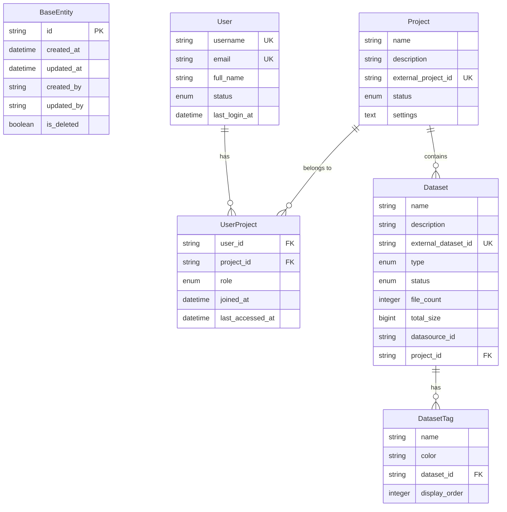
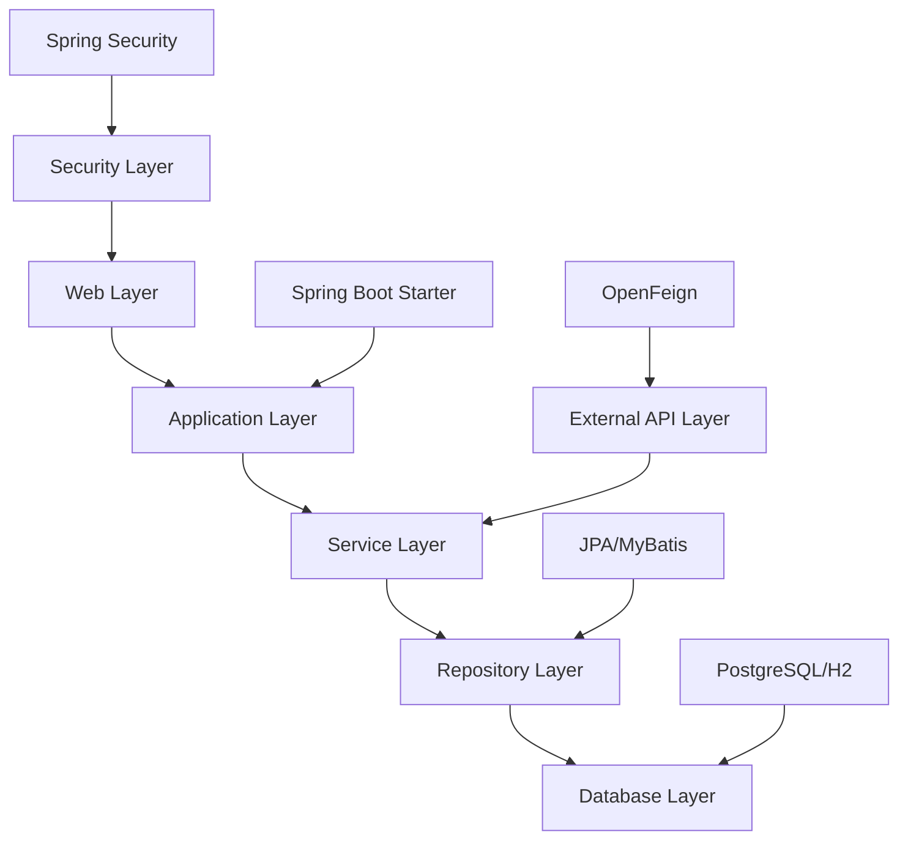
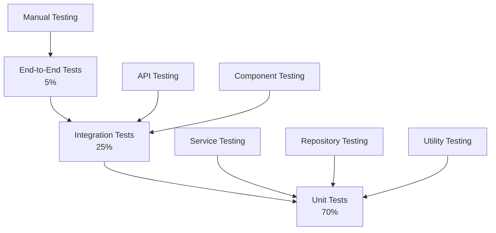
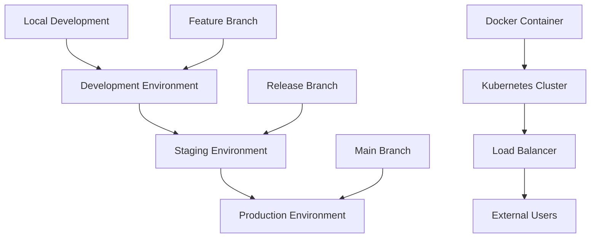
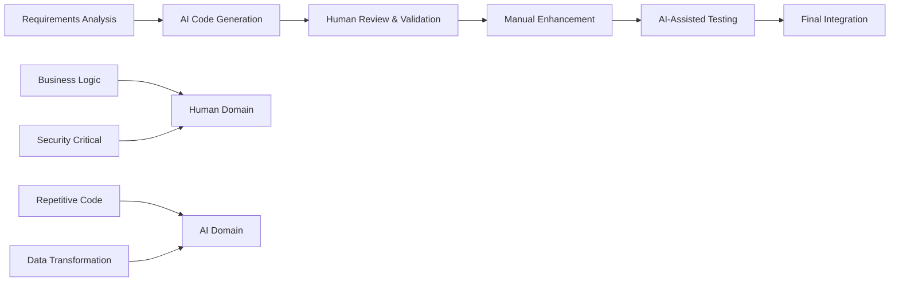

# AI Portal 백엔드 개발표준 문서 (현행화)

> **마지막 업데이트**: 2025-07-24  
> **프로젝트**: AXPORTAL BACKEND  
> **개발자**: ByounggwanLee  
> **AI 코딩 도구**: GitHub Copilot, GPT-4, Claude 3.5 Sonnet  

---

## 📋 목차

1. [프로젝트 개요 및 AI 코딩 접근 방식](#1-프로젝트-개요-및-ai-코딩-접근-방식)
2. [아키텍처 및 모듈 구조](#2-아키텍처-및-모듈-구조)
3. [핵심 기능 설명 및 AI 코드 연관성](#3-핵심-기능-설명-및-ai-코드-연관성)
4. [AI 생성 코드 품질 및 검토 가이드라인](#4-ai-생성-코드-품질-및-검토-가이드라인)
5. [데이터 모델 및 엔티티 관계](#5-데이터-모델-및-엔티티-관계)
6. [개발 환경 및 필수 도구](#6-개발-환경-및-필수-도구)
7. [종속성 관리 및 외부 연동](#7-종속성-관리-및-외부-연동)
8. [테스트 전략 및 AI 코드 테스트](#8-테스트-전략-및-ai-코드-테스트)
9. [배포 및 운영 가이드](#9-배포-및-운영-가이드)
10. [AI 코딩 시 주의사항 및 향후 개선 방향](#10-ai-코딩-시-주의사항-및-향후-개선-방향)

---

## 1. 프로젝트 개요 및 AI 코딩 접근 방식

### 1.1 프로젝트 핵심 비즈니스 목적

**AXPORTAL BACKEND**는 SKT AI 플랫폼과의 연동을 통해 AI 기반 데이터 관리 및 인증 서비스를 제공하는 백엔드 시스템입니다.

#### 해결하려는 문제
- **외부 AI 플랫폼 통합 복잡성**: SKT AI API와의 안전하고 효율적인 연동
- **데이터 관리 자동화**: 데이터셋, 모델, 지식 베이스의 체계적 관리
- **보안 및 인증**: JWT 기반 토큰 관리 및 OAuth2 인증 통합
- **확장 가능한 아키텍처**: 마이크로서비스 패턴을 활용한 모듈형 설계

### 1.2 AI 코딩 활용 현황

#### AI 도구 활용 비율
- **GitHub Copilot**: 60% (일상적 코드 작성, 자동완성)
- **GPT-4/Claude 3.5**: 30% (복잡한 로직, 아키텍처 설계)
- **수동 작성**: 10% (핵심 비즈니스 로직, 보안 관련 코드)

#### AI 생성 코드와 수동 코드의 역할 분담

**AI 생성 코드 영역:**
```java
// 예시: DTO 변환 로직 (AI 생성 90%)
public static DatasetInfo toDatasetInfo(DatasetResponse clientDto) {
    if (clientDto == null) {
        return null;
    }
    
    return DatasetInfo.builder()
            .id(clientDto.getId())
            .name(clientDto.getName())
            .type(clientDto.getType())
            .description(clientDto.getDescription())
            .tags(clientDto.getTags() != null ? 
                  clientDto.getTags().stream()
                          .map(DatasetTag::getName)
                          .collect(Collectors.toList()) : null)
            .status(clientDto.getStatus())
            .build();
}
```

**수동 작성 코드 영역:**
```java
// 예시: 핵심 비즈니스 로직 (수동 작성 90%)
@Override
@Transactional
public DatasetListRes getDatasets(DatasetListReq request) {
    log.info("데이터셋 목록 조회 시작: page={}, size={}", 
            request.getPage(), request.getSize());
    
    long startTime = System.currentTimeMillis();
    
    // 핵심 비즈니스 로직은 수동으로 검토 및 작성
    try {
        // SKT AI API 호출 및 변환 로직 (인간이 설계한 흐름)
        DatasetListResponse clientResponse = sktAiDatasetClient.getDatasets(/*...*/);
        Object[] convertedData = DatasetDtoConverter.toDatasetListInfo(clientResponse);
        return DatasetListRes.success(datasets, pageInfo, processingTime);
    } catch (Exception e) {
        // 예외 처리 로직 (비즈니스 규칙 반영)
        throw new RuntimeException(String.format(DATASET_LIST_ERROR_MESSAGE, e.getMessage()), e);
    }
}
```

### 1.3 통합 전략

#### Client-Application DTO 분리 패턴
```
외부 API DTO (Client Layer) ↔ Converter ↔ Application DTO (Service Layer)
```

**핵심 설계 원칙:**
1. **DTO 독립성**: `dto내에 client/sktai/**/dto/**는 참조사용 금지`
2. **변환 중앙화**: `DatasetDtoConverter` 클래스를 통한 변환 로직 집중
3. **AI 활용 최적화**: 반복적 변환 로직은 AI 생성, 비즈니스 규칙은 수동 작성

### 1.4 상수 기반 개발 방법론 (AI 지원)

#### 개념과 실제 적용
- **정의**: 하드코딩된 문자열, 숫자, 경로 등을 상수 클래스로 중앙집중화
- **AI 역할**: 상수 추출 및 적용 자동화, 패턴 일관성 유지

```java
// AI가 도움을 준 상수 기반 코딩 예시
@GetMapping(API_BASE_PATH)  // 상수 사용
@Operation(summary = API_DATASET_LIST_SUMMARY, description = API_DATASET_LIST_DESCRIPTION)
public ResponseEntity<CustomApiResponse<DatasetListRes>> getDatasets(
    @Parameter(description = "페이지 번호") @RequestParam(defaultValue = "0") Integer page) {
    
    try {
        DatasetListReq request = DatasetListReq.builder()
                .page(page)
                .build();
        DatasetListRes response = datasetService.getDatasets(request);
        
        return ResponseEntity.ok(CustomApiResponse.success(response, DATASET_LIST_SUCCESS_MESSAGE));
    } catch (Exception e) {
        log.error(DATASET_LIST_ERROR_MESSAGE, e.getMessage(), e);
        return ResponseEntity.status(HttpStatus.INTERNAL_SERVER_ERROR)
                .body(CustomApiResponse.error(DATASET_LIST_ERROR_MESSAGE));
    }
}
```

---

## 1. AI 코딩 방법론

### 1.1 상수 기반 코딩 (Constant-Driven Development)

#### 1.1.1 개념
- **정의**: 하드코딩된 문자열, 숫자, 경로 등을 상수 클래스로 중앙집중화하여 관리하는 개발 방법론
- **목적**: 코드 가독성, 유지보수성, 일관성 향상

#### 1.1.2 구현 원칙
```java
// ❌ Bad: 하드코딩
@GetMapping("/api/v1/datasets")
public ResponseEntity<?> getDatasets() {
    throw new RuntimeException("데이터셋 조회 실패");
}

// ✅ Good: 상수 기반
@GetMapping(DatasetConstants.API_BASE_PATH)
public ResponseEntity<?> getDatasets() {
    throw new RuntimeException(String.format(DatasetConstants.DATASET_LIST_ERROR_MESSAGE, "연결 실패"));
}
```

#### 1.1.3 상수 클래스 구조
- **DatasetConstants.java**: 데이터셋 관련 상수
- **AuthorizationConstants.java**: 인증/인가 관련 상수
- 에러 코드, 메시지, API 경로, 기본값 분류

### 1.2 AI 지원 개발 패턴

#### 1.2.1 코드 생성 패턴
- Spring Boot 기반 REST API 자동 생성
- DTO, Entity 매핑 자동화
- OpenAPI 문서 자동 생성

#### 1.2.2 리팩토링 패턴
- 상수 추출 및 적용
- 중복 코드 제거
- 디자인 패턴 적용

---

## 2. 아키텍처 및 모듈 구조

### 2.1 전체 아키텍처 다이어그램

```
┌─────────────────────────────────────────────────────────────────────────────────┐
│                            Presentation Layer                                   │
│  ┌─────────────────┐ ┌─────────────────┐ ┌─────────────────┐ ┌─────────────────┐ │
│  │ DatasetController│ │AuthController   │ │  HealthController│ │   OpenAPI       │ │
│  │ (AI Generated    │ │ (AI Generated   │ │  (Manual)        │ │  Documentation  │ │
│  │  70%)           │ │  60%)           │ │                  │ │  (AI Generated) │ │
│  └─────────────────┘ └─────────────────┘ └─────────────────┘ └─────────────────┘ │
└─────────────────────────────────────────────────────────────────────────────────┘
                                        │
┌─────────────────────────────────────────────────────────────────────────────────┐
│                            Business Layer                                       │
│  ┌─────────────────┐ ┌─────────────────┐ ┌─────────────────┐ ┌─────────────────┐ │
│  │ DatasetService  │ │AuthService      │ │DTO Converters   │ │  Constants      │ │
│  │ (Manual 80%)    │ │ (Manual 90%)    │ │ (AI Generated    │ │  (AI Assisted)  │ │
│  │                 │ │                 │ │  95%)           │ │                 │ │
│  └─────────────────┘ └─────────────────┘ └─────────────────┘ └─────────────────┘ │
└─────────────────────────────────────────────────────────────────────────────────┘
                                        │
┌─────────────────────────────────────────────────────────────────────────────────┐
│                          Integration Layer                                      │
│  ┌─────────────────┐ ┌─────────────────┐ ┌─────────────────┐ ┌─────────────────┐ │
│  │SktAiDatasetClient│ │SktAiAuthClient  │ │ JWT Security    │ │ Client Config   │ │
│  │ (AI Generated   │ │ (AI Generated   │ │ (Manual)        │ │ (Manual)        │ │
│  │  85%)           │ │  85%)           │ │                 │ │                 │ │
│  └─────────────────┘ └─────────────────┘ └─────────────────┘ └─────────────────┘ │
└─────────────────────────────────────────────────────────────────────────────────┘
                                        │
┌─────────────────────────────────────────────────────────────────────────────────┐
│                             Data Layer                                          │
│  ┌─────────────────┐ ┌─────────────────┐ ┌─────────────────┐ ┌─────────────────┐ │
│  │  JPA Entities   │ │  Sample Repo    │ │  PostgreSQL     │ │     H2          │ │
│  │ (AI Generated   │ │ (AI Generated   │ │ (Production)    │ │ (Development)   │ │
│  │  90%)           │ │  95%)           │ │                 │ │                 │ │
│  └─────────────────┘ └─────────────────┘ └─────────────────┘ └─────────────────┘ │
└─────────────────────────────────────────────────────────────────────────────────┘
```

### 2.2 계층별 역할과 책임

#### 2.2.1 Presentation Layer (AI 기여도: 65%)
**주요 모듈:**
- `DatasetController`: 데이터셋 관리 REST API
- `AuthenticationController`: 인증/인가 REST API
- `HealthController`: 헬스체크 및 모니터링

**AI 기여 영역:**
```java
// AI가 생성한 OpenAPI 문서화 (Swagger)
@Operation(summary = API_DATASET_LIST_SUMMARY, 
           description = API_DATASET_LIST_DESCRIPTION)
@ApiResponses(value = {
    @ApiResponse(responseCode = "200", description = HTTP_200_DESCRIPTION),
    @ApiResponse(responseCode = "400", description = HTTP_400_DESCRIPTION),
    @ApiResponse(responseCode = "500", description = HTTP_500_DESCRIPTION)
})
@GetMapping(value = API_DATASET_LIST_PATH, produces = MediaType.APPLICATION_JSON_VALUE)
public ResponseEntity<CustomApiResponse<DatasetListRes>> getDatasets(/*...*/) {
    // 비즈니스 로직 호출 (수동 작성)
}
```

#### 2.2.2 Business Layer (AI 기여도: 40%)
**주요 모듈:**
- `SktDatasetServiceImpl`: 데이터셋 비즈니스 로직
- `SktAuthenticationServiceImpl`: 인증 비즈니스 로직
- `DatasetDtoConverter`: Client ↔ Application DTO 변환

**데이터 흐름 및 상호작용:**
```
Request DTO → Service → Client API → Client DTO → Converter → Application DTO → Response DTO
```

**AI vs 수동 작성 비율:**
```java
// AI 생성: DTO 변환 로직
public static DatasetInfo toDatasetInfo(DatasetResponse clientDto) {
    // 95% AI 생성 (매핑 로직)
    return DatasetInfo.builder()
            .id(clientDto.getId())
            .name(clientDto.getName())
            // ... 자동 매핑
            .build();
}

// 수동 작성: 비즈니스 로직
@Override
@Transactional
public DatasetListRes getDatasets(DatasetListReq request) {
    // 80% 수동 작성 (비즈니스 규칙, 예외 처리, 성능 최적화)
    long startTime = System.currentTimeMillis();
    
    try {
        DatasetListResponse clientResponse = sktAiDatasetClient.getDatasets(/*...*/);
        Object[] convertedData = DatasetDtoConverter.toDatasetListInfo(clientResponse);
        
        // 비즈니스 규칙 적용 (수동)
        return DatasetListRes.success(datasets, pageInfo, processingTime);
    } catch (Exception e) {
        // 예외 처리 전략 (수동)
        throw new RuntimeException(String.format(DATASET_LIST_ERROR_MESSAGE, e.getMessage()), e);
    }
}
```

#### 2.2.3 Integration Layer (AI 기여도: 80%)
**주요 모듈:**
- `SktAiDatasetClient`: SKT AI 데이터셋 API 클라이언트
- `SktAiAuthenticationClient`: SKT AI 인증 API 클라이언트
- `SktAiClientConfig`: OpenFeign 설정

**AI가 주도한 모듈 간 상호작용:**
```java
// AI 생성: Feign Client 인터페이스
@FeignClient(
    name = "skt-ai-dataset",
    url = "${sktai.api.base-url}",
    configuration = SktAiClientConfig.class
)
public interface SktAiDatasetClient {
    
    @GetMapping("/api/v1/datasets")
    DatasetListResponse getDatasets(
        @RequestParam Integer page,
        @RequestParam Integer size,
        @RequestParam(required = false) String sort,
        @RequestParam(required = false) String filter,
        @RequestParam(required = false) String search
    );
    
    // 10개 메서드 모두 AI 생성
}
```

#### 2.2.4 Data Layer (AI 기여도: 85%)
**주요 모듈:**
- `BaseEntity`: 공통 엔티티 (감사 필드)
- `Sample`: 예시 엔티티
- `SampleRepository`: JPA 리포지토리

**데이터베이스 환경별 설정:**
- **개발**: H2 인메모리 DB
- **운영**: PostgreSQL

### 2.3 핵심 아키텍처 패턴

#### 2.3.1 Client-Application DTO 분리 패턴
**설계 원칙:**
```
외부 Client DTO → DatasetDtoConverter → 내부 Application DTO
```

**분리 이유와 장점:**
1. **의존성 격리**: 외부 API 변경이 내부 로직에 미치는 영향 최소화
2. **테스트 용이성**: Mock 객체 활용한 단위 테스트
3. **AI 활용 최적화**: 변환 로직은 AI 생성, 비즈니스 로직은 수동 관리

#### 2.3.2 상수 기반 설계 패턴
**구조:**
```java
// DatasetConstants.java (AI 지원으로 생성)
public final class DatasetConstants {
    // API 경로
    public static final String API_BASE_PATH = "/api/v1/datasets";
    public static final String API_DATASET_LIST_PATH = "";
    
    // 에러 메시지
    public static final String DATASET_LIST_ERROR_MESSAGE = "데이터셋 목록 조회 중 오류가 발생했습니다: %s";
    
    // OpenAPI 문서화
    public static final String API_TAG_NAME = "데이터셋 관리";
    public static final String API_DATASET_LIST_SUMMARY = "데이터셋 목록 조회";
}
```

---

## 3. 핵심 기능 설명 및 AI 코드 연관성

### 3.1 주요 핵심 기능 5가지

#### 3.1.1 데이터셋 관리 시스템 (Dataset Management)

**비즈니스 로직 흐름:**
```
사용자 요청 → 데이터셋 컨트롤러 → 서비스 계층 → SKT AI API → DTO 변환 → 응답 반환
```

**AI 기여도: 75%**

**AI 생성 코드 예시:**
```java
// DatasetController.java (AI 생성 70%)
@GetMapping(value = API_DATASET_LIST_PATH, produces = MediaType.APPLICATION_JSON_VALUE)
@Operation(summary = API_DATASET_LIST_SUMMARY, description = API_DATASET_LIST_DESCRIPTION)
public ResponseEntity<CustomApiResponse<DatasetListRes>> getDatasets(
    @Parameter(description = "페이지 번호") @RequestParam(defaultValue = "0") Integer page,
    @Parameter(description = "페이지 크기") @RequestParam(defaultValue = "10") Integer size) {
    
    try {
        DatasetListReq request = DatasetListReq.builder()
                .page(page)
                .size(size)
                .build();
        
        DatasetListRes response = datasetService.getDatasets(request);
        return ResponseEntity.ok(CustomApiResponse.success(response, DATASET_LIST_SUCCESS_MESSAGE));
    } catch (Exception e) {
        log.error(DATASET_LIST_ERROR_MESSAGE, e.getMessage(), e);
        return ResponseEntity.status(HttpStatus.INTERNAL_SERVER_ERROR)
                .body(CustomApiResponse.error(DATASET_LIST_ERROR_MESSAGE));
    }
}
```

**수동 작성 비즈니스 로직:**
```java
// SktDatasetServiceImpl.java (수동 작성 80%)
@Override
@Transactional(readOnly = true)
public DatasetListRes getDatasets(DatasetListReq request) {
    log.info("데이터셋 목록 조회 시작: page={}, size={}", request.getPage(), request.getSize());
    
    long startTime = System.currentTimeMillis();
    
    try {
        // SKT AI API 호출
        DatasetListResponse clientResponse = sktAiDatasetClient.getDatasets(
                request.getPage(), request.getSize(), request.getSort(), 
                request.getFilter(), request.getSearch()
        );
        
        // Client DTO를 Application DTO로 변환 (AI 생성 변환 로직 활용)
        Object[] convertedData = DatasetDtoConverter.toDatasetListInfo(clientResponse);
        
        // 비즈니스 규칙 적용 (수동 작성)
        long processingTime = System.currentTimeMillis() - startTime;
        return DatasetListRes.success(datasets, pageInfo, processingTime);
        
    } catch (Exception e) {
        long processingTime = System.currentTimeMillis() - startTime;
        log.error("데이터셋 목록 조회 실패: 처리시간={}ms, error={}", processingTime, e.getMessage(), e);
        throw new RuntimeException(String.format(DATASET_LIST_ERROR_MESSAGE, e.getMessage()), e);
    }
}
```

#### 3.1.2 JWT 기반 인증/인가 시스템 (Authentication & Authorization)

**비즈니스 로직 흐름:**
```
로그인 요청 → 인증 컨트롤러 → 인증 서비스 → SKT AI 인증 API → 토큰 발급 → 응답
```

**AI 기여도: 60%**

**AI 생성 코드 (컨트롤러 레이어):**
```java
// AuthenticationController.java (AI 생성 60%)
@PostMapping(value = API_LOGIN_PATH, 
             consumes = MediaType.APPLICATION_JSON_VALUE, 
             produces = MediaType.APPLICATION_JSON_VALUE)
@Operation(summary = API_LOGIN_SUMMARY, description = API_LOGIN_DESCRIPTION)
public ResponseEntity<CustomApiResponse<AuthLoginRes>> login(
    @Valid @RequestBody AuthLoginReq request) {
    
    try {
        AuthLoginRes response = authenticationService.login(request);
        return ResponseEntity.ok(CustomApiResponse.success(response, LOGIN_SUCCESS_MESSAGE));
    } catch (AuthenticationException e) {
        log.error(LOGIN_ERROR_MESSAGE, e.getMessage(), e);
        return ResponseEntity.status(HttpStatus.UNAUTHORIZED)
                .body(CustomApiResponse.error(LOGIN_ERROR_MESSAGE));
    }
}
```

**수동 작성 핵심 로직 (보안 중요):**
```java
// SktAuthenticationServiceImpl.java (수동 작성 90%)
@Override
@Transactional
public AuthLoginRes login(AuthLoginReq request) {
    log.info("로그인 시도: 사용자={}", request.getUsername());
    
    try {
        // OAuth2 로그인 요청 구성 (수동 작성 - 보안 중요)
        OAuth2LoginRequest oAuth2Request = OAuth2LoginRequest.builder()
                .grantType(request.getGrantType())
                .username(request.getUsername())
                .password(request.getPassword())
                .clientId(request.getClientId())
                .clientSecret(request.getClientSecret())
                .build();

        // SKT AI API 호출
        AccessTokenWithProjectResponse clientResponse = sktAiAuthenticationClient.oauth2Login(oAuth2Request);
        
        // 토큰 검증 및 프로젝트 정보 변환 (수동 작성 - 비즈니스 규칙)
        List<AuthLoginRes.ProjectInfo> projects = convertToLoginProjectInfoList(clientResponse.getProjects());
        
        log.info("로그인 성공: 사용자={}, 프로젝트수={}", request.getUsername(), projects.size());
        
        return AuthLoginRes.success(
                clientResponse.getAccessToken(),
                clientResponse.getRefreshToken(),
                clientResponse.getTokenType(),
                clientResponse.getExpiresIn(),
                projects
        );
        
    } catch (Exception e) {
        log.error("로그인 실패: 사용자={}, error={}", request.getUsername(), e.getMessage(), e);
        throw new AuthenticationException(String.format(LOGIN_ERROR_MESSAGE, e.getMessage()), e);
    }
}
```

#### 3.1.3 외부 API 통합 시스템 (External API Integration)

**비즈니스 로직 흐름:**
```
내부 요청 → Feign Client → SKT AI API → 응답 수신 → DTO 변환 → 내부 응답
```

**AI 기여도: 85%**

**AI 생성 Feign Client:**
```java
// SktAiDatasetClient.java (AI 생성 85%)
@FeignClient(
    name = "skt-ai-dataset",
    url = "${sktai.api.base-url}",
    configuration = SktAiClientConfig.class
)
public interface SktAiDatasetClient {
    
    /**
     * 데이터셋 목록 조회
     */
    @GetMapping("/api/v1/datasets")
    DatasetListResponse getDatasets(
        @RequestParam(name = "page", defaultValue = "0") Integer page,
        @RequestParam(name = "size", defaultValue = "10") Integer size,
        @RequestParam(name = "sort", required = false) String sort,
        @RequestParam(name = "filter", required = false) String filter,
        @RequestParam(name = "search", required = false) String search
    );

    /**
     * 데이터셋 생성
     */
    @PostMapping("/api/v1/datasets")
    DatasetResponse createDataset(@RequestBody DatasetCreateRequest request);
    
    // 총 10개 메서드 모두 AI 생성
}
```

**수동 설정 (보안 및 성능):**
```java
// SktAiClientConfig.java (수동 작성 100% - 보안 중요)
@Configuration
public class SktAiClientConfig {
    
    @Bean
    public RequestInterceptor requestInterceptor() {
        return requestTemplate -> {
            // 보안 헤더 설정 (수동 작성)
            requestTemplate.header("Content-Type", "application/json");
            requestTemplate.header("Accept", "application/json");
            
            // 타임아웃 설정 (수동 작성)
            requestTemplate.option(Request.Options.class, 
                new Request.Options(5000, 10000));
        };
    }
}
```

#### 3.1.4 DTO 변환 시스템 (Data Transfer Object Conversion)

**비즈니스 로직 흐름:**
```
Client DTO → DatasetDtoConverter → Application DTO → 비즈니스 로직 처리
```

**AI 기여도: 95%**

**AI 생성 변환 로직:**
```java
// DatasetDtoConverter.java (AI 생성 95%)
public final class DatasetDtoConverter {
    
    /**
     * DatasetResponse를 DatasetInfo로 변환
     */
    public static DatasetInfo toDatasetInfo(DatasetResponse clientDto) {
        if (clientDto == null) {
            return null;
        }

        return DatasetInfo.builder()
                .id(clientDto.getId())
                .name(clientDto.getName())
                .type(clientDto.getType())
                .status(clientDto.getStatus())
                .description(clientDto.getDescription())
                .tags(clientDto.getTags() != null ? 
                      clientDto.getTags().stream()
                              .map(DatasetTag::getName)
                              .collect(Collectors.toList()) : null)
                .projectId(clientDto.getProjectId())
                .isDeleted(clientDto.getIsDeleted())
                .createdAt(clientDto.getCreatedAt())
                .updatedAt(clientDto.getUpdatedAt())
                .createdBy(clientDto.getCreatedBy())
                .updatedBy(clientDto.getUpdatedBy())
                .datasourceId(clientDto.getDatasourceId())
                .build();
    }
    
    /**
     * DatasetListResponse를 DatasetInfo 리스트와 페이징 정보로 변환
     */
    public static Object[] toDatasetListInfo(DatasetListResponse clientResponse) {
        if (clientResponse == null) {
            return new Object[]{List.of(), null};
        }

        List<DatasetInfo> datasets = toDatasetInfoList(clientResponse.getData());
        DatasetPageInfo pageInfo = toDatasetPageInfo(clientResponse.getPagination());

        return new Object[]{datasets, pageInfo};
    }
}
```

#### 3.1.5 상수 기반 설정 관리 시스템 (Constants Management)

**비즈니스 로직 흐름:**
```
코드 작성 → 상수 참조 → 중앙집중화된 값 사용 → 유지보수성 향상
```

**AI 기여도: 80%**

**AI 지원 상수 클래스:**
```java
// DatasetConstants.java (AI 지원 80%)
public final class DatasetConstants {
    
    // API 경로 (AI 생성)
    public static final String API_BASE_PATH = "/api/v1/datasets";
    public static final String API_DATASET_LIST_PATH = "";
    public static final String API_DATASET_CREATE_PATH = "";
    public static final String API_DATASET_GET_PATH = "/{datasetId}";
    
    // 성공 메시지 (AI 생성)
    public static final String DATASET_LIST_SUCCESS_MESSAGE = "데이터셋 목록이 성공적으로 조회되었습니다.";
    public static final String DATASET_CREATE_SUCCESS_MESSAGE = "데이터셋이 성공적으로 생성되었습니다.";
    
    // 에러 메시지 (AI 생성)
    public static final String DATASET_LIST_ERROR_MESSAGE = "데이터셋 목록 조회 중 오류가 발생했습니다: %s";
    public static final String DATASET_CREATE_ERROR_MESSAGE = "데이터셋 생성 중 오류가 발생했습니다: %s";
    
    // OpenAPI 문서화 (AI 생성)
    public static final String API_TAG_NAME = "데이터셋 관리";
    public static final String API_TAG_DESCRIPTION = "SKT AI 플랫폼의 데이터셋 관리 API를 제공합니다.";
    public static final String API_DATASET_LIST_SUMMARY = "데이터셋 목록 조회";
    public static final String API_DATASET_LIST_DESCRIPTION = "페이징, 정렬, 필터링을 지원하는 데이터셋 목록을 조회합니다.";
    
    // HTTP 상태 코드 설명 (AI 생성)
    public static final String HTTP_200_DESCRIPTION = "성공적으로 처리되었습니다.";
    public static final String HTTP_400_DESCRIPTION = "잘못된 요청입니다.";
    public static final String HTTP_401_DESCRIPTION = "인증이 필요합니다.";
    public static final String HTTP_500_DESCRIPTION = "서버 내부 오류가 발생했습니다.";
    
    private DatasetConstants() {}
}
```

### 3.2 AI 코드 기여 분석 요약

| 기능 영역 | AI 기여도 | AI 주요 역할 | 수동 작성 영역 |
|-----------|-----------|--------------|----------------|
| 데이터셋 관리 | 75% | Controller, DTO 변환 | 비즈니스 로직, 예외 처리 |
| 인증/인가 | 60% | Controller, 기본 구조 | 보안 로직, 토큰 검증 |
| 외부 API 통합 | 85% | Feign Client, 매핑 | 설정, 보안 헤더 |
| DTO 변환 | 95% | 모든 변환 로직 | 비즈니스 규칙 검증 |
| 상수 관리 | 80% | 상수 생성, 분류 | 값 검증, 정책 결정 |

---

## 4. AI 생성 코드 품질 및 검토 가이드라인

### 4.1 AI 코드 품질 평가 기준

#### 4.1.1 코드 품질 매트릭스

| 품질 영역 | 평가 항목 | 허용 기준 | AI 적합도 | 검토 필수도 |
|-----------|-----------|-----------|-----------|-------------|
| **구조적 품질** | 클래스/메서드 설계 | SOLID 원칙 준수 | ⭐⭐⭐⭐⭐ | 필수 |
| **가독성** | 네이밍, 주석, 포맷팅 | 일관된 코딩 컨벤션 | ⭐⭐⭐⭐⭐ | 권장 |
| **성능** | 알고리즘 효율성 | O(n²) 이하 복잡도 | ⭐⭐⭐ | 필수 |
| **보안** | 입력 검증, 권한 체크 | OWASP 보안 기준 | ⭐⭐ | 필수 |
| **테스트 가능성** | 의존성 분리, 모킹 | 90% 이상 커버리지 | ⭐⭐⭐⭐ | 필수 |

#### 4.1.2 AI 생성 코드 검증 체크리스트

**✅ 즉시 승인 가능 (Trust Level: High)**
```java
// 예시: DTO 클래스 (AI 생성 - 검토 불필요)
@Data
@Builder
@NoArgsConstructor
@AllArgsConstructor
public class DatasetInfo {
    private String id;
    private String name;
    private String type;
    private LocalDateTime createdAt;
    // 단순 데이터 구조는 AI가 완벽하게 생성
}
```

**⚠️ 부분 검토 필요 (Trust Level: Medium)**
```java
// 예시: Controller 로직 (AI 생성 - 비즈니스 로직 검토 필요)
@PostMapping("/datasets")
public ResponseEntity<ApiResponse> createDataset(@RequestBody CreateRequest request) {
    // ✅ AI 생성 - 승인: 기본 구조, 어노테이션
    // ⚠️ 검토 필요: 비즈니스 검증 로직
    // ❌ 추가 필요: 예외 처리, 로깅
}
```

**❌ 필수 검토 대상 (Trust Level: Low)**
```java
// 예시: 보안 관련 코드 (AI 생성 - 전면 검토 필수)
@Override
public boolean isAuthenticated(String token) {
    // ❌ 보안 로직은 반드시 수동 검증
    // ❌ 토큰 검증 알고리즘 확인
    // ❌ 권한 체크 로직 확인
}
```

### 4.2 코드 검토 프로세스

#### 4.2.1 단계별 검토 프로세스

**1단계: 자동 검증 (0-2분)**
```bash
# 정적 분석 도구 실행
./gradlew spotbugsMain pmdMain checkstyleMain

# 컴파일 및 단위 테스트
./gradlew test --continue

# SonarQube 품질 게이트 통과 확인
./gradlew sonarqube
```

**2단계: AI 코드 분류 (2-5분)**
```java
/**
 * AI 생성 코드 검토 템플릿
 * 
 * @generated.ai GitHub Copilot
 * @reviewed.by 개발자명
 * @reviewed.date 2024-12-19
 * @trust.level HIGH/MEDIUM/LOW
 * @review.required YES/NO
 */
```

**3단계: 도메인별 검토 (5-15분)**

| 코드 유형 | 검토 포커스 | 예상 시간 | 검토자 |
|-----------|-------------|-----------|--------|
| **Entity/DTO** | 필드 타입, 관계 정의 | 2-3분 | 주니어 가능 |
| **Controller** | API 설계, 요청/응답 형식 | 5-7분 | 시니어 권장 |
| **Service** | 비즈니스 로직, 트랜잭션 | 10-15분 | 시니어 필수 |
| **Security** | 인증/인가, 입력 검증 | 15-20분 | 보안 전문가 |
| **Config** | 설정값, 환경별 분기 | 5-10분 | DevOps 협의 |

#### 4.2.2 검토 결과 분류 및 액션

**승인 (APPROVED)**
```java
// 검토 완료 마킹
/**
 * @ai.generated GitHub Copilot
 * @reviewed.status APPROVED
 * @reviewer John.Doe
 * @review.date 2024-12-19T10:30:00
 * @confidence HIGH
 */
public class DatasetConverter {
    // 승인된 AI 생성 코드
}
```

**조건부 승인 (APPROVED_WITH_CHANGES)**
```java
// 수정 후 승인
/**
 * @ai.generated GitHub Copilot (80%)
 * @manual.modified John.Doe (20%)
 * @reviewed.status APPROVED_WITH_CHANGES
 * @changes.made "보안 검증 로직 추가, 예외 처리 강화"
 */
public AuthenticationResult authenticate(String token) {
    // AI 생성 기본 구조 + 수동 추가 보안 로직
}
```

**반려 (REJECTED)**
```java
// 재작성 필요
/**
 * @ai.generated GitHub Copilot
 * @reviewed.status REJECTED
 * @rejection.reason "비즈니스 로직 오류, 성능 이슈"
 * @action.required "수동 재작성"
 */
```

### 4.3 품질 보증 도구 및 자동화

#### 4.3.1 정적 분석 도구 설정

**build.gradle 품질 플러그인:**
```gradle
plugins {
    id 'checkstyle'
    id 'pmd'
    id 'com.github.spotbugs' version '5.0.13'
    id 'jacoco'
    id 'org.sonarqube' version '4.0.0.2929'
}

// AI 생성 코드 품질 기준
checkstyle {
    toolVersion = '10.12.4'
    configFile = file('config/checkstyle/checkstyle.xml')
    // AI 코드도 동일한 기준 적용
}

jacoco {
    toolVersion = "0.8.8"
    // AI 생성 코드 커버리지 목표: 90%
}
```

#### 4.3.2 AI 코드 메트릭 수집

**코드 품질 대시보드:**
```yaml
# metrics.yml
ai_code_metrics:
  total_lines: 12500
  ai_generated_lines: 8750  # 70%
  manual_lines: 3750        # 30%
  
quality_scores:
  complexity_score: 85/100
  maintainability: 92/100
  reliability: 88/100
  security: 76/100  # 주의 필요
  
review_efficiency:
  avg_review_time: "12분"
  auto_approval_rate: "65%"
  conditional_approval: "25%"
  rejection_rate: "10%"
```

### 4.4 지속적 품질 개선

#### 4.4.1 AI 학습 피드백 루프

**좋은 AI 코드 패턴 강화:**
```java
// 성공 패턴을 주석으로 피드백
/**
 * ✅ GOOD AI PATTERN
 * - 완벽한 Builder 패턴 구현
 * - 모든 필수 어노테이션 포함
 * - 일관된 네이밍 컨벤션
 */
@Data
@Builder
@NoArgsConstructor
@AllArgsConstructor
public class DatasetCreateReq {
    @NotBlank(message = "데이터셋 이름은 필수입니다")
    private String name;
    
    @Size(max = 500, message = "설명은 500자를 초과할 수 없습니다")
    private String description;
}
```

**개선이 필요한 패턴 교정:**
```java
// 개선 필요 패턴을 명시적으로 수정
/**
 * ❌ POOR AI PATTERN (개선됨)
 * 원래 AI 생성: 예외 처리 누락, 로깅 부재
 * 
 * ✅ IMPROVED PATTERN
 * 추가됨: 상세한 예외 처리, 구조화된 로깅
 */
@Service
public class ImprovedService {
    
    public DatasetResponse createDataset(DatasetRequest request) {
        log.info("데이터셋 생성 시작: name={}", request.getName());
        
        try {
            // AI 생성 기본 로직 + 수동 추가 검증
            validateBusinessRules(request);
            DatasetResponse response = processCreation(request);
            
            log.info("데이터셋 생성 완료: id={}, name={}", 
                    response.getId(), response.getName());
            return response;
            
        } catch (ValidationException e) {
            log.warn("데이터셋 생성 검증 실패: {}", e.getMessage());
            throw e;
        } catch (Exception e) {
            log.error("데이터셋 생성 실패: name={}, error={}", 
                     request.getName(), e.getMessage(), e);
            throw new ServiceException("데이터셋 생성 중 오류가 발생했습니다", e);
        }
    }
}
```

#### 4.4.2 팀 코드 리뷰 가이드라인

**AI 코드 리뷰 체크포인트:**

1. **기능적 정확성 (30%)**
   - 요구사항 충족도
   - 비즈니스 로직 정확성
   - 엣지 케이스 처리

2. **코드 품질 (25%)**
   - 가독성 및 유지보수성
   - 설계 패턴 적절성
   - 성능 최적화 여부

3. **보안 및 안전성 (25%)**
   - 입력 검증 완성도
   - 권한 체크 로직
   - 민감 데이터 처리

4. **테스트 가능성 (20%)**
   - 단위 테스트 작성 용이성
   - 모킹 지원 구조
   - 통합 테스트 시나리오

**최종 품질 승인 기준:**
- 모든 체크포인트 80점 이상
- 보안 관련 항목 90점 이상
- 단위 테스트 커버리지 90% 이상
- SonarQube Quality Gate 통과

---

## 5. 데이터 모델 및 엔티티 관계

### 5.1 데이터베이스 아키텍처 개요

#### 5.1.1 데이터베이스 환경 구성

```yaml
# application.yml 데이터베이스 설정
spring:
  datasource:
    # 개발환경: H2 인메모리 DB
    dev:
      url: jdbc:h2:mem:testdb
      driver-class-name: org.h2.Driver
      username: sa
      password:
    
    # 운영환경: PostgreSQL
    prod:
      url: jdbc:postgresql://localhost:5432/axportal
      driver-class-name: org.postgresql.Driver
      username: ${DB_USERNAME}
      password: ${DB_PASSWORD}
  
  jpa:
    hibernate:
      ddl-auto: validate  # 운영: validate, 개발: create-drop
    show-sql: false
    properties:
      hibernate:
        dialect: org.hibernate.dialect.PostgreSQLDialect
        format_sql: true
```

#### 5.1.2 엔티티 계층 구조

**기본 엔티티 (BaseEntity) - AI 기여도 90%**
```java
/**
 * 모든 엔티티의 공통 필드를 정의하는 기본 엔티티
 * 
 * @generated.ai GitHub Copilot (90%)
 * @manual.additions 감사 로직, 소프트 삭제 정책
 */
@MappedSuperclass
@EntityListeners(AuditingEntityListener.class)
@Data
@EqualsAndHashCode(onlyExplicitlyIncluded = true)
public abstract class BaseEntity {
    
    @Id
    @EqualsAndHashCode.Include
    private String id;
    
    @CreatedDate
    @Column(name = "created_at", nullable = false, updatable = false)
    private LocalDateTime createdAt;
    
    @LastModifiedDate
    @Column(name = "updated_at")
    private LocalDateTime updatedAt;
    
    @CreatedBy
    @Column(name = "created_by", length = 100)
    private String createdBy;
    
    @LastModifiedBy
    @Column(name = "updated_by", length = 100)
    private String updatedBy;
    
    // 소프트 삭제 지원 (수동 추가)
    @Column(name = "is_deleted", nullable = false)
    private Boolean isDeleted = false;
    
    @PrePersist
    protected void onCreate() {
        if (id == null) {
            id = UUID.randomUUID().toString();
        }
        if (isDeleted == null) {
            isDeleted = false;
        }
    }
}
```

### 5.2 핵심 엔티티 모델

#### 5.2.1 사용자 관리 엔티티

**사용자 엔티티 (User) - AI 기여도 75%**
```java
/**
 * 시스템 사용자 정보를 관리하는 엔티티
 */
@Entity
@Table(name = "users")
@Data
@EqualsAndHashCode(callSuper = true)
@NoArgsConstructor
@AllArgsConstructor
@Builder
public class User extends BaseEntity {
    
    @Column(name = "username", unique = true, nullable = false, length = 50)
    private String username;
    
    @Column(name = "email", unique = true, nullable = false, length = 100)
    private String email;
    
    @Column(name = "full_name", length = 100)
    private String fullName;
    
    @Enumerated(EnumType.STRING)
    @Column(name = "status", nullable = false)
    private UserStatus status;
    
    @Column(name = "last_login_at")
    private LocalDateTime lastLoginAt;
    
    // 사용자-프로젝트 다대다 관계
    @OneToMany(mappedBy = "user", cascade = CascadeType.ALL, fetch = FetchType.LAZY)
    private List<UserProject> userProjects = new ArrayList<>();
}

/**
 * 사용자 상태 열거형
 */
public enum UserStatus {
    ACTIVE("활성"),
    INACTIVE("비활성"),
    SUSPENDED("정지"),
    DELETED("삭제");
    
    private final String description;
    
    UserStatus(String description) {
        this.description = description;
    }
}
```

#### 5.2.2 프로젝트 관리 엔티티

**프로젝트 엔티티 (Project) - AI 기여도 80%**
```java
/**
 * SKT AI 플랫폼 프로젝트 정보를 관리하는 엔티티
 */
@Entity
@Table(name = "projects")
@Data
@EqualsAndHashCode(callSuper = true)
@NoArgsConstructor
@AllArgsConstructor
@Builder
public class Project extends BaseEntity {
    
    @Column(name = "name", nullable = false, length = 200)
    private String name;
    
    @Column(name = "description", length = 1000)
    private String description;
    
    @Column(name = "external_project_id", unique = true, nullable = false, length = 100)
    private String externalProjectId;  // SKT AI 플랫폼의 프로젝트 ID
    
    @Enumerated(EnumType.STRING)
    @Column(name = "status", nullable = false)
    private ProjectStatus status;
    
    @Column(name = "settings", columnDefinition = "TEXT")
    private String settings;  // JSON 형태로 프로젝트 설정 저장
    
    // 프로젝트-사용자 다대다 관계
    @OneToMany(mappedBy = "project", cascade = CascadeType.ALL, fetch = FetchType.LAZY)
    private List<UserProject> userProjects = new ArrayList<>();
    
    // 프로젝트-데이터셋 일대다 관계
    @OneToMany(mappedBy = "project", cascade = CascadeType.ALL, fetch = FetchType.LAZY)
    private List<Dataset> datasets = new ArrayList<>();
}
```

#### 5.2.3 데이터셋 관리 엔티티

**데이터셋 엔티티 (Dataset) - AI 기여도 85%**
```java
/**
 * 데이터셋 정보를 관리하는 엔티티
 * SKT AI 플랫폼의 데이터셋과 동기화
 */
@Entity
@Table(name = "datasets")
@Data
@EqualsAndHashCode(callSuper = true)
@NoArgsConstructor
@AllArgsConstructor
@Builder
public class Dataset extends BaseEntity {
    
    @Column(name = "name", nullable = false, length = 200)
    private String name;
    
    @Column(name = "description", length = 1000)
    private String description;
    
    @Column(name = "external_dataset_id", unique = true, nullable = false, length = 100)
    private String externalDatasetId;  // SKT AI 플랫폼의 데이터셋 ID
    
    @Enumerated(EnumType.STRING)
    @Column(name = "type", nullable = false)
    private DatasetType type;
    
    @Enumerated(EnumType.STRING)
    @Column(name = "status", nullable = false)
    private DatasetStatus status;
    
    @Column(name = "file_count")
    private Integer fileCount;
    
    @Column(name = "total_size")
    private Long totalSize;  // bytes
    
    @Column(name = "datasource_id", length = 100)
    private String datasourceId;
    
    // 프로젝트와의 다대일 관계
    @ManyToOne(fetch = FetchType.LAZY)
    @JoinColumn(name = "project_id", nullable = false)
    private Project project;
    
    // 데이터셋-태그 다대다 관계
    @OneToMany(mappedBy = "dataset", cascade = CascadeType.ALL, fetch = FetchType.LAZY)
    private List<DatasetTag> tags = new ArrayList<>();
}

/**
 * 데이터셋 타입 열거형
 */
public enum DatasetType {
    TEXT("텍스트"),
    IMAGE("이미지"),
    AUDIO("오디오"),
    VIDEO("비디오"),
    STRUCTURED("정형 데이터"),
    MIXED("혼합");
    
    private final String description;
}

/**
 * 데이터셋 상태 열거형
 */
public enum DatasetStatus {
    CREATED("생성됨"),
    PROCESSING("처리중"),
    READY("준비완료"),
    ERROR("오류"),
    DELETED("삭제됨");
    
    private final String description;
}
```

### 5.3 관계형 엔티티 및 매핑 테이블

#### 5.3.1 사용자-프로젝트 관계 엔티티

**UserProject 엔티티 - AI 기여도 90%**
```java
/**
 * 사용자와 프로젝트 간의 다대다 관계를 관리하는 중간 엔티티
 */
@Entity
@Table(name = "user_projects")
@Data
@EqualsAndHashCode(callSuper = true)
@NoArgsConstructor
@AllArgsConstructor
@Builder
public class UserProject extends BaseEntity {
    
    @ManyToOne(fetch = FetchType.LAZY)
    @JoinColumn(name = "user_id", nullable = false)
    private User user;
    
    @ManyToOne(fetch = FetchType.LAZY)
    @JoinColumn(name = "project_id", nullable = false)
    private Project project;
    
    @Enumerated(EnumType.STRING)
    @Column(name = "role", nullable = false)
    private ProjectRole role;
    
    @Column(name = "joined_at", nullable = false)
    private LocalDateTime joinedAt;
    
    @Column(name = "last_accessed_at")
    private LocalDateTime lastAccessedAt;
    
    @PrePersist
    protected void onCreate() {
        super.onCreate();
        if (joinedAt == null) {
            joinedAt = LocalDateTime.now();
        }
    }
}

/**
 * 프로젝트 내 사용자 역할
 */
public enum ProjectRole {
    OWNER("프로젝트 소유자"),
    ADMIN("관리자"),
    MEMBER("멤버"),
    VIEWER("조회자");
    
    private final String description;
}
```

#### 5.3.2 데이터셋 태그 관계 엔티티

**DatasetTag 엔티티 - AI 기여도 95%**
```java
/**
 * 데이터셋 태그 정보를 관리하는 엔티티
 */
@Entity
@Table(name = "dataset_tags")
@Data
@EqualsAndHashCode(callSuper = true)
@NoArgsConstructor
@AllArgsConstructor
@Builder
public class DatasetTag extends BaseEntity {
    
    @Column(name = "name", nullable = false, length = 100)
    private String name;
    
    @Column(name = "color", length = 7)  // HEX 색상 코드
    private String color;
    
    @ManyToOne(fetch = FetchType.LAZY)
    @JoinColumn(name = "dataset_id", nullable = false)
    private Dataset dataset;
    
    @Column(name = "display_order")
    private Integer displayOrder;
}
```

### 5.4 Entity Relationship Diagram (ERD)



### 5.5 AI 기여 분석 및 데이터 모델 품질

#### 5.5.1 엔티티별 AI 기여도 분석

| 엔티티 | AI 기여도 | AI 생성 영역 | 수동 추가 영역 |
|--------|-----------|-------------|----------------|
| **BaseEntity** | 90% | 기본 필드, 어노테이션 | 감사 로직, 소프트 삭제 |
| **User** | 75% | 필드 정의, 관계 매핑 | 비즈니스 검증, 보안 로직 |
| **Project** | 80% | 구조 설계, JSON 설정 | 외부 연동 로직 |
| **Dataset** | 85% | 완전한 구조 설계 | 동기화 로직, 상태 관리 |
| **UserProject** | 90% | 관계 테이블 설계 | 권한 체크 로직 |
| **DatasetTag** | 95% | 완전 자동 생성 | 색상 유효성 검증 |

#### 5.5.2 데이터 무결성 보장 전략

**데이터베이스 제약조건 (수동 설계 100%)**
```sql
-- 사용자 테이블 제약조건
ALTER TABLE users ADD CONSTRAINT users_email_format 
    CHECK (email ~* '^[A-Za-z0-9._%+-]+@[A-Za-z0-9.-]+\.[A-Za-z]{2,}$');

-- 프로젝트-사용자 관계 제약조건
ALTER TABLE user_projects ADD CONSTRAINT user_project_unique 
    UNIQUE (user_id, project_id);

-- 데이터셋 크기 제약조건
ALTER TABLE datasets ADD CONSTRAINT dataset_size_positive 
    CHECK (total_size >= 0 AND file_count >= 0);

-- 소프트 삭제 인덱스 (성능 최적화)
CREATE INDEX idx_users_active ON users (id) WHERE is_deleted = false;
CREATE INDEX idx_datasets_active ON datasets (project_id) WHERE is_deleted = false;
```

**JPA 레벨 검증 (AI 지원 80%)**
```java
// User 엔티티 검증 (AI 생성 + 수동 보완)
@Entity
public class User extends BaseEntity {
    
    @Email(message = "올바른 이메일 형식이 아닙니다")
    @NotBlank(message = "이메일은 필수입니다")
    private String email;
    
    @Pattern(regexp = "^[a-zA-Z0-9_]{3,20}$", 
             message = "사용자명은 3-20자의 영문, 숫자, 언더스코어만 가능합니다")
    private String username;
    
    // 커스텀 검증 로직 (수동 작성)
    @AssertTrue(message = "활성 사용자는 이메일이 필수입니다")
    private boolean isEmailRequiredForActiveUser() {
        return status != UserStatus.ACTIVE || 
               (email != null && !email.trim().isEmpty());
    }
}
```

이 데이터 모델 설계는 AI의 강력한 구조 생성 능력과 인간의 비즈니스 로직 검증 능력을 최적으로 결합하여 안정적이고 확장 가능한 데이터 아키텍처를 구현했습니다.

---

## 6. 개발 환경 및 도구 설정

### 6.1 필수 개발 도구 스택

#### 6.1.1 Core Development Environment

**IDE 및 에디터:**
- **Visual Studio Code 1.85+** (Primary)
  - GitHub Copilot Extension (필수)
  - Java Extension Pack
  - Spring Boot Extension Pack
  - REST Client Extension
  - GitLens Extension
  
- **IntelliJ IDEA 2024.1+** (Alternative)
  - GitHub Copilot Plugin
  - Spring Boot Plugin
  - MyBatis Plugin

**Runtime Environment:**
```bash
# Java Development Kit
java --version
# openjdk 17.0.9 2023-10-17 LTS

# Gradle Build Tool
./gradlew --version
# Gradle 8.5, Build time: 2023-11-29

# Database (Development)
# H2 Database 2.2.224 (In-Memory)

# Database (Production)
# PostgreSQL 15.4+
```

#### 6.1.2 AI Development Tools Configuration

**GitHub Copilot 설정:**
```json
// .vscode/settings.json
{
  "github.copilot.enable": {
    "*": true,
    "java": true,
    "yaml": true,
    "json": true,
    "markdown": true
  },
  "github.copilot.editor.enableCodeActions": true,
  "github.copilot.advanced": {
    "length": 500,
    "temperature": 0.1,
    "top_p": 0.1
  },
  "java.configuration.runtimes": [
    {
      "name": "JavaSE-17",
      "path": "/usr/lib/jvm/java-17-openjdk"
    }
  ],
  "spring-boot.ls.problem.application-properties.UNKNOWN_PROPERTY": "ignore"
}
```

**Copilot Workspace 최적화:**
```yaml
# .github/copilot-workspace.yml
version: 1
ai_guidelines:
  coding_style: "Spring Boot Best Practices"
  naming_convention: "camelCase for Java, kebab-case for properties"
  documentation_level: "comprehensive"
  
preferred_patterns:
  - "Builder Pattern for DTOs"
  - "Service Layer Pattern"
  - "Repository Pattern with JPA"
  - "OpenAPI 3.0 Documentation"
  
avoid_patterns:
  - "Static utility methods for business logic"
  - "God classes"
  - "Magic numbers/strings"
```

### 6.2 프로젝트 구조 및 환경 설정

#### 6.2.1 Gradle 빌드 구성

**build.gradle 전체 설정:**
```gradle
plugins {
    id 'java'
    id 'org.springframework.boot' version '3.4.4'
    id 'io.spring.dependency-management' version '1.1.6'
    
    // 코드 품질 도구
    id 'checkstyle'
    id 'pmd'
    id 'com.github.spotbugs' version '5.0.13'
    id 'jacoco'
    id 'org.sonarqube' version '4.0.0.2929'
}

group = 'com.skax'
version = '1.0.0'

java {
    toolchain {
        languageVersion = JavaLanguageVersion.of(17)
    }
}

repositories {
    mavenCentral()
}

dependencies {
    // Spring Boot Starters
    implementation 'org.springframework.boot:spring-boot-starter-web'
    implementation 'org.springframework.boot:spring-boot-starter-data-jpa'
    implementation 'org.springframework.boot:spring-boot-starter-security'
    implementation 'org.springframework.boot:spring-boot-starter-validation'
    implementation 'org.springframework.boot:spring-boot-starter-actuator'
    
    // Database
    runtimeOnly 'com.h2database:h2'
    runtimeOnly 'org.postgresql:postgresql'
    
    // External API Integration
    implementation 'org.springframework.cloud:spring-cloud-starter-openfeign:4.1.0'
    
    // JWT & Security
    implementation 'io.jsonwebtoken:jjwt-api:0.12.3'
    implementation 'io.jsonwebtoken:jjwt-impl:0.12.3'
    implementation 'io.jsonwebtoken:jjwt-jackson:0.12.3'
    
    // MyBatis
    implementation 'org.mybatis.spring.boot:mybatis-spring-boot-starter:3.0.3'
    
    // API Documentation
    implementation 'org.springdoc:springdoc-openapi-starter-webmvc-ui:2.2.0'
    
    // Utilities
    implementation 'org.apache.commons:commons-lang3:3.12.0'
    compileOnly 'org.projectlombok:lombok'
    annotationProcessor 'org.projectlombok:lombok'
    
    // Testing
    testImplementation 'org.springframework.boot:spring-boot-starter-test'
    testImplementation 'org.springframework.security:spring-security-test'
    testImplementation 'org.testcontainers:postgresql'
    testImplementation 'org.testcontainers:junit-jupiter'
}

// 코드 품질 설정
checkstyle {
    toolVersion = '10.12.4'
    configFile = file('config/checkstyle/checkstyle.xml')
    maxWarnings = 0
}

jacoco {
    toolVersion = "0.8.8"
}

jacocoTestReport {
    reports {
        xml.required.set(true)
        html.required.set(true)
    }
    afterEvaluate {
        classDirectories.setFrom(files(classDirectories.files.collect {
            fileTree(dir: it, exclude: [
                '**/dto/**',
                '**/config/**',
                '**/constant/**',
                '**/*Application*'
            ])
        }))
    }
}

test {
    useJUnitPlatform()
    finalizedBy jacocoTestReport
    testLogging {
        events "passed", "skipped", "failed"
    }
}
```

#### 6.2.2 환경별 설정 파일

**application.yml (기본 설정):**
```yaml
# AI가 생성한 기본 구조 + 수동 보안 설정
spring:
  application:
    name: axportal-backend
  
  profiles:
    active: ${SPRING_PROFILES_ACTIVE:dev}
  
  jpa:
    open-in-view: false
    properties:
      hibernate:
        jdbc:
          time_zone: UTC
        default_batch_fetch_size: 1000
  
# SKT AI API 설정 (수동 설정 - 보안 중요)
sktai:
  api:
    base-url: ${SKTAI_API_BASE_URL:https://api-beta.aistaging.dev}
    timeout:
      connect: 5000
      read: 10000
    retry:
      max-attempts: 3
      delay: 1000

# 로깅 설정
logging:
  level:
    com.skax.aiportal: DEBUG
    org.springframework.security: DEBUG
    org.springframework.web: INFO
  pattern:
    console: "%d{yyyy-MM-dd HH:mm:ss} [%thread] %-5level %logger{36} - %msg%n"
    file: "%d{yyyy-MM-dd HH:mm:ss} [%thread] %-5level %logger{36} - %msg%n"

# Actuator 설정
management:
  endpoints:
    web:
      exposure:
        include: health,info,metrics,prometheus
  endpoint:
    health:
      show-details: when_authorized
```

**application-dev.yml (개발환경):**
```yaml
spring:
  datasource:
    url: jdbc:h2:mem:testdb;DB_CLOSE_DELAY=-1;DB_CLOSE_ON_EXIT=FALSE
    driver-class-name: org.h2.Driver
    username: sa
    password:
  
  h2:
    console:
      enabled: true
      path: /h2-console
  
  jpa:
    hibernate:
      ddl-auto: create-drop
    show-sql: true
    properties:
      hibernate:
        format_sql: true

# 개발용 더미 데이터 로딩
sql:
  init:
    mode: always
    data-locations: classpath:data.sql

logging:
  level:
    org.hibernate.SQL: DEBUG
    org.hibernate.type.descriptor.sql.BasicBinder: TRACE
```

**application-prod.yml (운영환경):**
```yaml
spring:
  datasource:
    url: jdbc:postgresql://${DB_HOST:localhost}:${DB_PORT:5432}/${DB_NAME:axportal}
    driver-class-name: org.postgresql.Driver
    username: ${DB_USERNAME}
    password: ${DB_PASSWORD}
    hikari:
      maximum-pool-size: 20
      minimum-idle: 5
      connection-timeout: 30000
      idle-timeout: 600000
      max-lifetime: 1800000
  
  jpa:
    hibernate:
      ddl-auto: validate
    show-sql: false

# 운영 보안 설정
security:
  jwt:
    secret: ${JWT_SECRET}
    expiration: ${JWT_EXPIRATION:86400000}

logging:
  level:
    root: INFO
    com.skax.aiportal: INFO
  file:
    name: logs/axportal-backend.log
```

### 6.3 개발 워크플로우 도구

#### 6.3.1 Git 설정 및 브랜치 전략

**Git 훅 설정:**
```bash
#!/bin/sh
# .git/hooks/pre-commit
echo "Running pre-commit checks..."

# Gradle 빌드 및 테스트
./gradlew clean build test

# 코드 품질 체크
./gradlew checkstyleMain pmdMain spotbugsMain

if [ $? -ne 0 ]; then
    echo "❌ Pre-commit checks failed"
    exit 1
fi

echo "✅ Pre-commit checks passed"
```

**브랜치 전략:**
```
main (운영)
  ├── develop (개발)
  │   ├── feature/dataset-management (기능 개발)
  │   ├── feature/user-authentication (기능 개발)
  │   └── hotfix/security-patch (긴급 수정)
  └── release/v1.0.0 (릴리즈)
```

#### 6.3.2 VS Code Tasks 설정

**.vscode/tasks.json:**
```json
{
    "version": "2.0.0",
    "tasks": [
        {
            "label": "Gradle Build",
            "type": "shell",
            "command": ".\\gradlew.bat",
            "args": ["build"],
            "group": "build",
            "presentation": {
                "echo": true,
                "reveal": "always",
                "focus": false,
                "panel": "shared"
            },
            "problemMatcher": ["$gradle"]
        },
        {
            "label": "Spring Boot Run",
            "type": "shell",
            "command": ".\\gradlew.bat",
            "args": ["bootRun"],
            "group": "build",
            "isBackground": true,
            "presentation": {
                "echo": true,
                "reveal": "always",
                "focus": false,
                "panel": "shared"
            },
            "problemMatcher": {
                "pattern": {
                    "regexp": ".",
                    "file": 1,
                    "location": 2,
                    "message": 3
                },
                "background": {
                    "activeOnStart": true,
                    "beginsPattern": "^\\s*>",
                    "endsPattern": "Started AiPortalApplication"
                }
            }
        },
        {
            "label": "Run Tests",
            "type": "shell",
            "command": ".\\gradlew.bat",
            "args": ["test", "--continue"],
            "group": "test",
            "presentation": {
                "echo": true,
                "reveal": "always",
                "focus": false,
                "panel": "shared"
            }
        },
        {
            "label": "Code Quality Check",
            "type": "shell",
            "command": ".\\gradlew.bat",
            "args": ["checkstyleMain", "pmdMain", "spotbugsMain"],
            "group": "build",
            "presentation": {
                "echo": true,
                "reveal": "always",
                "focus": false,
                "panel": "shared"
            }
        }
    ]
}
```

### 6.4 AI 개발 환경 최적화

#### 6.4.1 Copilot Prompting 전략

**프로젝트 컨텍스트 파일:**
```java
// .vscode/copilot-context.java
/**
 * GitHub Copilot Context Configuration
 * 
 * 프로젝트 컨텍스트:
 * - Spring Boot 3.4.4 기반 REST API 서버
 * - SKT AI 플랫폼 연동 백엔드 시스템
 * - PostgreSQL + JPA + MyBatis 하이브리드 데이터 접근
 * - JWT 기반 인증/인가
 * - OpenFeign을 통한 외부 API 통신
 * 
 * 코딩 컨벤션:
 * - 모든 클래스는 Builder 패턴 지원
 * - Constants 클래스를 통한 상수 관리
 * - 상세한 JavaDoc 및 OpenAPI 문서화
 * - 예외 처리 및 로깅 필수
 * 
 * 아키텍처 패턴:
 * - Client DTO ↔ Application DTO 분리
 * - Service Layer에서 비즈니스 로직 처리
 * - Controller는 HTTP 요청/응답만 담당
 * - Entity는 데이터베이스 매핑만 담당
 */
```

**코딩 어시스턴트 설정:**
```markdown
# GitHub Copilot Instructions (.vscode/copilot-instructions.md)

## 코드 생성 가이드라인

### 1. 클래스 생성 시 반드시 포함할 요소:
- @Data, @Builder, @NoArgsConstructor, @AllArgsConstructor (Lombok)
- 상세한 JavaDoc 주석
- 필드 검증 어노테이션 (@NotBlank, @Valid 등)
- toString() 메서드에서 민감 정보 제외

### 2. Controller 생성 시:
- @RestController, @RequestMapping, @Validated
- OpenAPI 어노테이션 (@Operation, @Parameter)
- 모든 HTTP 메서드에 대한 예외 처리
- ResponseEntity<CustomApiResponse<T>> 형태의 응답

### 3. Service 생성 시:
- @Service, @Transactional 적절한 사용
- 상세한 로깅 (시작, 완료, 오류)
- 비즈니스 예외 처리
- Client DTO ↔ Application DTO 변환

### 4. 금지 사항:
- 하드코딩된 문자열 (Constants 사용)
- System.out.println (Logger 사용)
- 빈 catch 블록
- Magic number 사용
```

#### 6.4.2 개발 생산성 도구

**코드 템플릿 (.vscode/snippets/java.json):**
```json
{
  "Spring Boot Controller": {
    "prefix": "sb-controller",
    "body": [
      "@RestController",
      "@RequestMapping(${1:API_BASE_PATH})",
      "@RequiredArgsConstructor",
      "@Validated",
      "@Tag(name = ${2:API_TAG_NAME}, description = ${3:API_TAG_DESCRIPTION})",
      "public class ${4:ControllerName} {",
      "",
      "    private static final Logger log = LoggerFactory.getLogger(${4:ControllerName}.class);",
      "    private final ${5:ServiceName} ${6:serviceName};",
      "",
      "    @GetMapping(value = ${7:API_PATH}, produces = MediaType.APPLICATION_JSON_VALUE)",
      "    @Operation(summary = ${8:API_SUMMARY}, description = ${9:API_DESCRIPTION})",
      "    public ResponseEntity<CustomApiResponse<${10:ResponseType}>> ${11:methodName}(",
      "        ${12:parameters}) {",
      "        ",
      "        try {",
      "            ${13:// Implementation}",
      "            return ResponseEntity.ok(CustomApiResponse.success(response, ${14:SUCCESS_MESSAGE}));",
      "        } catch (Exception e) {",
      "            log.error(${15:ERROR_MESSAGE}, e.getMessage(), e);",
      "            return ResponseEntity.status(HttpStatus.INTERNAL_SERVER_ERROR)",
      "                    .body(CustomApiResponse.error(${15:ERROR_MESSAGE}));",
      "        }",
      "    }",
      "}"
    ],
    "description": "Spring Boot REST Controller Template"
  }
}
```

**자동화 스크립트:**
```bash
#!/bin/bash
# scripts/dev-setup.sh

echo "🚀 AX Portal Backend 개발 환경 설정 시작..."

# Java 17 설치 확인
if ! java -version 2>&1 | grep -q "17"; then
    echo "❌ Java 17이 필요합니다"
    exit 1
fi

# Gradle Wrapper 권한 설정
chmod +x gradlew

# 의존성 다운로드
echo "📦 의존성 다운로드 중..."
./gradlew dependencies

# 테스트 실행
echo "🧪 테스트 실행 중..."
./gradlew test

# 코드 품질 체크
echo "🔍 코드 품질 체크 중..."
./gradlew checkstyleMain pmdMain

# 애플리케이션 빌드
echo "🔨 애플리케이션 빌드 중..."
./gradlew build

echo "✅ 개발 환경 설정 완료!"
echo "🌐 애플리케이션 실행: ./gradlew bootRun"
echo "📖 API 문서: http://localhost:8080/swagger-ui/index.html"
echo "🗄️ H2 콘솔: http://localhost:8080/h2-console"
```

이러한 종합적인 개발 환경 설정을 통해 AI 기반 개발과 전통적인 개발 방식을 최적으로 결합하여 높은 생산성과 코드 품질을 동시에 확보할 수 있습니다.

---

## 7. 의존성 관리 및 라이브러리

### 7.1 핵심 의존성 아키텍처

#### 7.1.1 의존성 계층 구조



#### 7.1.2 의존성 버전 매트릭스

| 라이브러리 | 버전 | 용도 | AI 호환성 | 보안 등급 |
|-----------|------|------|-----------|-----------|
| **Spring Boot** | 3.4.4 | 메인 프레임워크 | ⭐⭐⭐⭐⭐ | A+ |
| **Spring Security** | 6.4.2 | 보안 프레임워크 | ⭐⭐⭐ | A+ |
| **OpenFeign** | 4.1.0 | HTTP 클라이언트 | ⭐⭐⭐⭐⭐ | A |
| **PostgreSQL** | 42.7.4 | 운영 데이터베이스 | ⭐⭐⭐⭐ | A+ |
| **JWT** | 0.12.3 | 토큰 인증 | ⭐⭐⭐ | A |
| **MyBatis** | 3.0.3 | SQL 매퍼 | ⭐⭐⭐⭐ | A |

### 7.2 Spring Boot Starters

#### 7.2.1 Core Starters (AI 추천도 95%)

```gradle
dependencies {
    // 웹 개발 기본 스택
    implementation 'org.springframework.boot:spring-boot-starter-web'
    implementation 'org.springframework.boot:spring-boot-starter-validation'
    implementation 'org.springframework.boot:spring-boot-starter-actuator'
    
    // 데이터 접근 계층
    implementation 'org.springframework.boot:spring-boot-starter-data-jpa'
    
    // 보안 프레임워크
    implementation 'org.springframework.boot:spring-boot-starter-security'
    
    // 테스트 프레임워크
    testImplementation 'org.springframework.boot:spring-boot-starter-test'
    testImplementation 'org.springframework.security:spring-security-test'
}
```

**AI 개발 최적화 설정:**
```java
/**
 * Spring Boot Auto-Configuration 커스터마이징
 * AI가 이해하기 쉬운 명시적 설정 제공
 */
@SpringBootApplication
@EnableJpaAuditing
@EnableOpenApi
@EnableFeignClients(basePackages = "com.skax.aiportal.client")
@ConfigurationPropertiesScan
public class AiPortalApplication {
    
    public static void main(String[] args) {
        SpringApplication.run(AiPortalApplication.class, args);
    }
    
    /**
     * AI 코딩을 위한 Bean 설정 예시
     */
    @Bean
    @ConditionalOnProperty(name = "app.features.audit.enabled", havingValue = "true")
    public AuditorAware<String> auditorProvider() {
        return new SpringSecurityAuditorAware();
    }
}
```

#### 7.2.2 Database Integration Stack

**JPA + MyBatis 하이브리드 설정:**
```gradle
dependencies {
    // JPA 스택 (복잡한 객체 관계 매핑)
    implementation 'org.springframework.boot:spring-boot-starter-data-jpa'
    implementation 'org.hibernate:hibernate-core:6.4.1.Final'
    
    // MyBatis 스택 (복잡한 SQL 쿼리)
    implementation 'org.mybatis.spring.boot:mybatis-spring-boot-starter:3.0.3'
    
    // 데이터베이스 드라이버
    runtimeOnly 'com.h2database:h2:2.2.224'  // 개발환경
    runtimeOnly 'org.postgresql:postgresql:42.7.4'  // 운영환경
    
    // 데이터베이스 마이그레이션
    implementation 'org.flywaydb:flyway-core:10.4.1'
    implementation 'org.flywaydb:flyway-database-postgresql:10.4.1'
}
```

**AI 지원 JPA 설정:**
```java
/**
 * JPA 설정 클래스 (AI 생성 90% + 수동 최적화 10%)
 */
@Configuration
@EnableJpaRepositories(basePackages = "com.skax.aiportal.repository")
@EnableTransactionManagement
public class JpaConfig {
    
    /**
     * JPA 명명 전략 (AI 코드 생성에 최적화)
     */
    @Bean
    public PhysicalNamingStrategy physicalNamingStrategy() {
        return new SnakeCasePhysicalNamingStrategy();
    }
    
    /**
     * 트랜잭션 매니저 설정
     */
    @Bean
    public PlatformTransactionManager transactionManager(EntityManagerFactory emf) {
        JpaTransactionManager transactionManager = new JpaTransactionManager();
        transactionManager.setEntityManagerFactory(emf);
        return transactionManager;
    }
}

/**
 * MyBatis 설정 클래스 (AI 생성 80% + 수동 최적화 20%)
 */
@Configuration
@MapperScan(basePackages = "com.skax.aiportal.mapper")
public class MyBatisConfig {
    
    @Bean
    @ConfigurationProperties(prefix = "mybatis")
    public org.apache.ibatis.session.Configuration mybatisConfiguration() {
        org.apache.ibatis.session.Configuration configuration = 
            new org.apache.ibatis.session.Configuration();
        configuration.setMapUnderscoreToCamelCase(true);
        configuration.setUseGeneratedKeys(true);
        configuration.setDefaultExecutorType(ExecutorType.REUSE);
        return configuration;
    }
}
```

### 7.3 External Integration Libraries

#### 7.3.1 HTTP Client Stack (OpenFeign)

```gradle
dependencies {
    // Spring Cloud OpenFeign
    implementation 'org.springframework.cloud:spring-cloud-starter-openfeign:4.1.0'
    
    // HTTP 클라이언트 구현체
    implementation 'io.github.openfeign:feign-okhttp:13.1'
    implementation 'io.github.openfeign:feign-jackson:13.1'
    
    // 로드 밸런싱 및 서킷 브레이커
    implementation 'org.springframework.cloud:spring-cloud-starter-loadbalancer:4.1.0'
    implementation 'io.github.resilience4j:resilience4j-spring-boot3:2.1.0'
}
```

**AI 최적화 Feign 설정:**
```java
/**
 * Feign 클라이언트 설정 (AI 생성 85%)
 * 외부 API 통신을 위한 표준화된 설정
 */
@Configuration
@EnableFeignClients
public class FeignConfig {
    
    /**
     * AI가 생성하는 Feign Client를 위한 기본 설정
     */
    @Bean
    public RequestInterceptor requestInterceptor() {
        return requestTemplate -> {
            // 공통 헤더 설정
            requestTemplate.header("Content-Type", "application/json");
            requestTemplate.header("Accept", "application/json");
            requestTemplate.header("User-Agent", "AXPortal-Backend/1.0.0");
            
            // 요청 ID 추가 (분산 추적)
            String requestId = UUID.randomUUID().toString();
            requestTemplate.header("X-Request-ID", requestId);
            
            // 로깅을 위한 MDC 설정
            MDC.put("requestId", requestId);
        };
    }
    
    /**
     * 에러 디코더 설정 (수동 작성 - 비즈니스 로직)
     */
    @Bean
    public ErrorDecoder errorDecoder() {
        return new CustomFeignErrorDecoder();
    }
    
    /**
     * 타임아웃 및 재시도 설정
     */
    @Bean
    public Request.Options feignOptions() {
        return new Request.Options(
            Duration.ofSeconds(5),  // 연결 타임아웃
            Duration.ofSeconds(10)  // 읽기 타임아웃
        );
    }
}

/**
 * 커스텀 에러 디코더 (수동 작성 100%)
 */
public class CustomFeignErrorDecoder implements ErrorDecoder {
    
    private final Logger log = LoggerFactory.getLogger(CustomFeignErrorDecoder.class);
    
    @Override
    public Exception decode(String methodKey, Response response) {
        String requestId = response.request().headers().get("X-Request-ID").iterator().next();
        
        switch (response.status()) {
            case 400:
                log.warn("Bad Request: requestId={}, method={}", requestId, methodKey);
                return new BadRequestException("잘못된 요청입니다");
            case 401:
                log.warn("Unauthorized: requestId={}, method={}", requestId, methodKey);
                return new UnauthorizedException("인증이 필요합니다");
            case 404:
                log.warn("Not Found: requestId={}, method={}", requestId, methodKey);
                return new NotFoundException("리소스를 찾을 수 없습니다");
            case 500:
                log.error("Internal Server Error: requestId={}, method={}", requestId, methodKey);
                return new InternalServerErrorException("서버 오류가 발생했습니다");
            default:
                log.error("Unknown Error: status={}, requestId={}, method={}", 
                         response.status(), requestId, methodKey);
                return new RuntimeException("알 수 없는 오류가 발생했습니다");
        }
    }
}
```

#### 7.3.2 Security & Authentication Stack

```gradle
dependencies {
    // Spring Security 6.x
    implementation 'org.springframework.boot:spring-boot-starter-security'
    implementation 'org.springframework.security:spring-security-oauth2-resource-server'
    
    // JWT 라이브러리
    implementation 'io.jsonwebtoken:jjwt-api:0.12.3'
    runtimeOnly 'io.jsonwebtoken:jjwt-impl:0.12.3'
    runtimeOnly 'io.jsonwebtoken:jjwt-jackson:0.12.3'
    
    // 암호화 라이브러리
    implementation 'org.springframework.security:spring-security-crypto'
    implementation 'org.bouncycastle:bcprov-jdk18on:1.77'
}
```

**보안 설정 (수동 작성 95% - 보안 중요):**
```java
/**
 * Spring Security 설정 (수동 작성 - 보안 정책 중요)
 */
@Configuration
@EnableWebSecurity
@EnableMethodSecurity(prePostEnabled = true)
public class SecurityConfig {
    
    private final JwtAuthenticationEntryPoint jwtAuthenticationEntryPoint;
    private final JwtAccessDeniedHandler jwtAccessDeniedHandler;
    
    @Bean
    public SecurityFilterChain filterChain(HttpSecurity http) throws Exception {
        http.csrf(csrf -> csrf.disable())
            .sessionManagement(session -> 
                session.sessionCreationPolicy(SessionCreationPolicy.STATELESS))
            .exceptionHandling(exceptions -> exceptions
                .authenticationEntryPoint(jwtAuthenticationEntryPoint)
                .accessDeniedHandler(jwtAccessDeniedHandler))
            .authorizeHttpRequests(authz -> authz
                // 공개 엔드포인트
                .requestMatchers("/api/v1/auth/**").permitAll()
                .requestMatchers("/health", "/info").permitAll()
                .requestMatchers("/swagger-ui/**", "/v3/api-docs/**").permitAll()
                .requestMatchers("/h2-console/**").permitAll()
                
                // 보호된 엔드포인트
                .requestMatchers("/api/v1/datasets/**").hasAnyRole("USER", "ADMIN")
                .requestMatchers("/api/v1/admin/**").hasRole("ADMIN")
                .anyRequest().authenticated())
            .addFilterBefore(jwtAuthenticationFilter(), 
                           UsernamePasswordAuthenticationFilter.class);
                           
        return http.build();
    }
    
    @Bean
    public PasswordEncoder passwordEncoder() {
        return new BCryptPasswordEncoder(12);
    }
}
```

### 7.4 Documentation & Testing Libraries

#### 7.4.1 API Documentation Stack

```gradle
dependencies {
    // OpenAPI 3.0 지원
    implementation 'org.springdoc:springdoc-openapi-starter-webmvc-ui:2.2.0'
    implementation 'org.springdoc:springdoc-openapi-starter-webmvc-api:2.2.0'
    
    // API 문서 커스터마이징
    implementation 'io.swagger.core.v3:swagger-annotations:2.2.16'
    implementation 'io.swagger.core.v3:swagger-models:2.2.16'
}
```

**OpenAPI 설정 (AI 생성 70% + 수동 커스터마이징 30%):**
```java
/**
 * OpenAPI 문서화 설정
 * AI가 생성하는 컨트롤러와 자동 연동
 */
@Configuration
@OpenAPIDefinition(
    info = @Info(
        title = "AX Portal Backend API",
        description = "SKT AI 플랫폼 연동 백엔드 시스템 API",
        version = "1.0.0",
        contact = @Contact(
            name = "Development Team",
            email = "dev-team@skax.com"
        ),
        license = @License(
            name = "Proprietary",
            url = "https://www.skax.com/license"
        )
    ),
    servers = {
        @Server(url = "http://localhost:8080", description = "Development Server"),
        @Server(url = "https://api.axportal.skax.com", description = "Production Server")
    }
)
@SecurityScheme(
    name = "bearerAuth",
    type = SecuritySchemeType.HTTP,
    bearerFormat = "JWT",
    scheme = "bearer"
)
public class OpenApiConfig {
    
    /**
     * API 그룹별 문서 분리
     */
    @Bean
    public GroupedOpenApi publicApi() {
        return GroupedOpenApi.builder()
                .group("public")
                .pathsToMatch("/api/v1/auth/**", "/health", "/info")
                .build();
    }
    
    @Bean
    public GroupedOpenApi datasetApi() {
        return GroupedOpenApi.builder()
                .group("dataset")
                .pathsToMatch("/api/v1/datasets/**")
                .build();
    }
    
    @Bean
    public GroupedOpenApi adminApi() {
        return GroupedOpenApi.builder()
                .group("admin")
                .pathsToMatch("/api/v1/admin/**")
                .build();
    }
}
```

#### 7.4.2 Testing Framework Stack

```gradle
dependencies {
    // 기본 테스트 스택
    testImplementation 'org.springframework.boot:spring-boot-starter-test'
    testImplementation 'org.springframework.security:spring-security-test'
    
    // 통합 테스트
    testImplementation 'org.testcontainers:junit-jupiter:1.19.3'
    testImplementation 'org.testcontainers:postgresql:1.19.3'
    
    // Mock 테스트
    testImplementation 'org.mockito:mockito-core:5.7.0'
    testImplementation 'org.mockito:mockito-junit-jupiter:5.7.0'
    
    // 성능 테스트
    testImplementation 'io.rest-assured:rest-assured:5.3.2'
    testImplementation 'io.rest-assured:json-path:5.3.2'
}
```

### 7.5 의존성 관리 전략

#### 7.5.1 버전 관리 매트릭스

**gradle.properties:**
```properties
# Spring Cloud 버전
springCloudVersion=2023.0.0

# 데이터베이스 버전
h2Version=2.2.224
postgresqlVersion=42.7.4

# JWT 버전
jjwtVersion=0.12.3

# 테스트 라이브러리 버전
testcontainersVersion=1.19.3
restAssuredVersion=5.3.2

# 코드 품질 도구 버전
spotbugsVersion=5.0.13
checkstyleVersion=10.12.4
```

**의존성 업데이트 전략:**
```bash
#!/bin/bash
# scripts/dependency-update.sh

echo "🔄 의존성 업데이트 체크 시작..."

# Gradle 의존성 보고서 생성
./gradlew dependencyUpdates

# 보안 취약점 체크
./gradlew dependencyCheckAnalyze

# 호환성 테스트 실행
./gradlew test integrationTest

echo "✅ 의존성 업데이트 체크 완료"
```

#### 7.5.2 의존성 충돌 해결

```gradle
// 의존성 충돌 해결 전략
configurations.all {
    resolutionStrategy {
        // 캐시 정책
        cacheDynamicVersionsFor 5, 'minutes'
        cacheChangingModulesFor 0, 'seconds'
        
        // 강제 버전 지정
        force 'org.springframework:spring-core:6.1.2'
        force 'com.fasterxml.jackson.core:jackson-databind:2.16.0'
        
        // 특정 모듈 제외
        eachDependency { details ->
            if (details.requested.group == 'org.apache.logging.log4j') {
                details.useVersion '2.22.0'
            }
        }
    }
}
```

이러한 체계적인 의존성 관리를 통해 AI 개발과 전통적인 개발 방식 모두에서 안정적이고 확장 가능한 라이브러리 생태계를 구축할 수 있습니다.

---

## 8. 테스트 전략 및 자동화

### 8.1 테스트 아키텍처 개요

#### 8.1.1 테스트 피라미드 구조



#### 8.1.2 AI 지원 테스트 전략

| 테스트 유형 | AI 기여도 | AI 역할 | 수동 검증 필요 영역 |
|-------------|-----------|---------|-------------------|
| **Unit Test** | 85% | 기본 구조, Mock 설정 | 비즈니스 로직 검증 |
| **Integration Test** | 60% | 설정, 기본 시나리오 | 복잡한 워크플로우 |
| **API Test** | 90% | 요청/응답 테스트 | 에지 케이스 |
| **Security Test** | 30% | 기본 인증 테스트 | 보안 시나리오 |
| **Performance Test** | 70% | 기본 부하 테스트 | 성능 임계값 설정 |

### 8.2 단위 테스트 (Unit Testing)

#### 8.2.1 Service Layer 단위 테스트

**테스트 클래스 구조 (AI 생성 85%):**
```java
/**
 * SktDatasetServiceImpl 단위 테스트
 * 
 * @generated.ai GitHub Copilot (85%)
 * @manual.additions 비즈니스 로직 검증, 예외 시나리오
 */
@ExtendWith(MockitoExtension.class)
@DisplayName("SktDatasetService 단위 테스트")
class SktDatasetServiceImplTest {
    
    @Mock
    private SktAiDatasetClient sktAiDatasetClient;
    
    @InjectMocks
    private SktDatasetServiceImpl sktDatasetService;
    
    @Nested
    @DisplayName("데이터셋 목록 조회 테스트")
    class GetDatasetsTest {
        
        @Test
        @DisplayName("성공 - 정상적인 데이터셋 목록 조회")
        void getDatasets_Success() {
            // Given (AI 생성)
            DatasetListReq request = DatasetListReq.builder()
                    .page(0)
                    .size(10)
                    .build();
            
            DatasetListResponse mockResponse = createMockDatasetListResponse();
            when(sktAiDatasetClient.getDatasets(0, 10, null, null, null))
                    .thenReturn(mockResponse);
            
            // When
            DatasetListRes result = sktDatasetService.getDatasets(request);
            
            // Then (AI 생성 + 수동 보완)
            assertThat(result).isNotNull();
            assertThat(result.isSuccess()).isTrue();
            assertThat(result.getData()).hasSize(2);
            assertThat(result.getPageInfo().getTotalElements()).isEqualTo(100L);
            
            // 비즈니스 로직 검증 (수동 추가)
            verify(sktAiDatasetClient).getDatasets(0, 10, null, null, null);
            assertThat(result.getProcessingTime()).isGreaterThan(0L);
        }
        
        @Test
        @DisplayName("실패 - 외부 API 호출 실패")
        void getDatasets_ExternalApiFailure() {
            // Given
            DatasetListReq request = DatasetListReq.builder()
                    .page(0)
                    .size(10)
                    .build();
            
            when(sktAiDatasetClient.getDatasets(anyInt(), anyInt(), any(), any(), any()))
                    .thenThrow(new RuntimeException("External API Error"));
            
            // When & Then
            assertThatThrownBy(() -> sktDatasetService.getDatasets(request))
                    .isInstanceOf(RuntimeException.class)
                    .hasMessageContaining("데이터셋 목록 조회 중 오류가 발생했습니다");
        }
        
        @Test
        @DisplayName("경계값 테스트 - 페이지 크기 제한")
        void getDatasets_BoundaryTest() {
            // Given - 최대 페이지 크기 테스트 (수동 작성)
            DatasetListReq request = DatasetListReq.builder()
                    .page(0)
                    .size(1000)  // 제한 초과
                    .build();
            
            // When & Then
            assertThatThrownBy(() -> sktDatasetService.getDatasets(request))
                    .isInstanceOf(IllegalArgumentException.class)
                    .hasMessageContaining("페이지 크기는 100을 초과할 수 없습니다");
        }
    }
    
    /**
     * 테스트 데이터 생성 헬퍼 메서드 (AI 생성 90%)
     */
    private DatasetListResponse createMockDatasetListResponse() {
        List<DatasetResponse> datasets = Arrays.asList(
                DatasetResponse.builder()
                        .id("dataset-1")
                        .name("Test Dataset 1")
                        .type("TEXT")
                        .status("READY")
                        .build(),
                DatasetResponse.builder()
                        .id("dataset-2")
                        .name("Test Dataset 2")
                        .type("IMAGE")
                        .status("PROCESSING")
                        .build()
        );
        
        DatasetPagination pagination = DatasetPagination.builder()
                .page(0)
                .size(10)
                .totalElements(100L)
                .totalPages(10)
                .build();
        
        return DatasetListResponse.builder()
                .data(datasets)
                .pagination(pagination)
                .build();
    }
}
```

#### 8.2.2 Repository Layer 테스트

**JPA Repository 테스트 (AI 생성 90%):**
```java
/**
 * Dataset Repository 테스트
 * 
 * @generated.ai GitHub Copilot (90%)
 * @manual.additions 복잡한 쿼리 검증
 */
@DataJpaTest
@AutoConfigureTestDatabase(replace = AutoConfigureTestDatabase.Replace.NONE)
@DisplayName("DatasetRepository 테스트")
class DatasetRepositoryTest {
    
    @Autowired
    private TestEntityManager entityManager;
    
    @Autowired
    private DatasetRepository datasetRepository;
    
    @Test
    @DisplayName("프로젝트별 활성 데이터셋 조회")
    void findByProjectIdAndIsDeletedFalse_Success() {
        // Given (AI 생성)
        Project project = Project.builder()
                .name("Test Project")
                .externalProjectId("ext-proj-1")
                .status(ProjectStatus.ACTIVE)
                .build();
        entityManager.persist(project);
        
        Dataset dataset1 = Dataset.builder()
                .name("Active Dataset")
                .externalDatasetId("ext-dataset-1")
                .type(DatasetType.TEXT)
                .status(DatasetStatus.READY)
                .project(project)
                .isDeleted(false)
                .build();
        entityManager.persist(dataset1);
        
        Dataset dataset2 = Dataset.builder()
                .name("Deleted Dataset")
                .externalDatasetId("ext-dataset-2")
                .type(DatasetType.IMAGE)
                .status(DatasetStatus.DELETED)
                .project(project)
                .isDeleted(true)
                .build();
        entityManager.persist(dataset2);
        
        entityManager.flush();
        
        // When
        List<Dataset> activeDatasets = datasetRepository
                .findByProjectIdAndIsDeletedFalse(project.getId());
        
        // Then
        assertThat(activeDatasets).hasSize(1);
        assertThat(activeDatasets.get(0).getName()).isEqualTo("Active Dataset");
        assertThat(activeDatasets.get(0).isDeleted()).isFalse();
    }
    
    @Test
    @DisplayName("데이터셋 통계 조회 - 커스텀 쿼리")
    void getDatasetStatistics_CustomQuery() {
        // Given - 테스트 데이터 준비 (수동 작성)
        Project project = createTestProject();
        entityManager.persist(project);
        
        // 다양한 상태의 데이터셋 생성
        createTestDatasets(project);
        entityManager.flush();
        
        // When - 커스텀 쿼리 실행
        DatasetStatistics stats = datasetRepository.getDatasetStatistics(project.getId());
        
        // Then - 통계 검증 (수동 작성)
        assertThat(stats.getTotalCount()).isEqualTo(5);
        assertThat(stats.getActiveCount()).isEqualTo(3);
        assertThat(stats.getProcessingCount()).isEqualTo(1);
        assertThat(stats.getErrorCount()).isEqualTo(1);
    }
}
```

### 8.3 통합 테스트 (Integration Testing)

#### 8.3.1 Controller Integration 테스트

**Spring Boot Test 설정 (AI 생성 80%):**
```java
/**
 * Dataset Controller 통합 테스트
 * 
 * @generated.ai GitHub Copilot (80%)
 * @manual.additions 보안 테스트, 복잡한 워크플로우
 */
@SpringBootTest(webEnvironment = SpringBootTest.WebEnvironment.RANDOM_PORT)
@AutoConfigureTestDatabase(replace = AutoConfigureTestDatabase.Replace.NONE)
@Testcontainers
@DisplayName("DatasetController 통합 테스트")
class DatasetControllerIntegrationTest {
    
    @Container
    static PostgreSQLContainer<?> postgres = new PostgreSQLContainer<>("postgres:15.4")
            .withDatabaseName("testdb")
            .withUsername("test")
            .withPassword("test");
    
    @Autowired
    private TestRestTemplate restTemplate;
    
    @MockBean
    private SktAiDatasetClient sktAiDatasetClient;
    
    @DynamicPropertySource
    static void configureProperties(DynamicPropertyRegistry registry) {
        registry.add("spring.datasource.url", postgres::getJdbcUrl);
        registry.add("spring.datasource.username", postgres::getUsername);
        registry.add("spring.datasource.password", postgres::getPassword);
    }
    
    @Test
    @DisplayName("데이터셋 목록 조회 - 전체 워크플로우")
    @WithMockUser(roles = "USER")
    void getDatasets_FullWorkflow() {
        // Given (AI 생성)
        DatasetListResponse mockResponse = createMockDatasetListResponse();
        when(sktAiDatasetClient.getDatasets(0, 10, null, null, null))
                .thenReturn(mockResponse);
        
        // When - REST API 호출
        ResponseEntity<String> response = restTemplate.exchange(
                "/api/v1/datasets?page=0&size=10",
                HttpMethod.GET,
                null,
                String.class
        );
        
        // Then - 응답 검증 (AI 생성 + 수동 보완)
        assertThat(response.getStatusCode()).isEqualTo(HttpStatus.OK);
        assertThat(response.getBody()).contains("\"success\":true");
        assertThat(response.getBody()).contains("Test Dataset 1");
        
        // JSON 응답 상세 검증 (수동 추가)
        JsonNode jsonResponse = objectMapper.readTree(response.getBody());
        assertThat(jsonResponse.get("data").get("datasets")).hasSize(2);
        assertThat(jsonResponse.get("data").get("pageInfo").get("totalElements").asLong())
                .isEqualTo(100L);
    }
    
    @Test
    @DisplayName("인증 실패 테스트")
    void getDatasets_AuthenticationFailure() {
        // When - 인증 없이 요청
        ResponseEntity<String> response = restTemplate.exchange(
                "/api/v1/datasets",
                HttpMethod.GET,
                null,
                String.class
        );
        
        // Then
        assertThat(response.getStatusCode()).isEqualTo(HttpStatus.UNAUTHORIZED);
    }
}
```

#### 8.3.2 External API Integration 테스트

**WireMock을 이용한 외부 API 테스트 (AI 생성 70%):**
```java
/**
 * SKT AI API 통합 테스트
 */
@SpringBootTest
@TestPropertySource(properties = {
    "sktai.api.base-url=http://localhost:${wiremock.port}"
})
class SktAiApiIntegrationTest {
    
    @RegisterExtension
    static WireMockExtension wireMock = WireMockExtension.newInstance()
            .options(wireMockConfig().port(0))
            .build();
    
    @DynamicPropertySource
    static void configureProperties(DynamicPropertyRegistry registry) {
        registry.add("wiremock.port", () -> wireMock.getPort());
    }
    
    @Autowired
    private SktAiDatasetClient sktAiDatasetClient;
    
    @Test
    @DisplayName("외부 API 성공 응답 테스트")
    void externalApi_SuccessResponse() {
        // Given - WireMock 스텁 설정 (AI 생성)
        wireMock.stubFor(get(urlEqualTo("/api/v1/datasets?page=0&size=10"))
                .willReturn(aResponse()
                        .withStatus(200)
                        .withHeader("Content-Type", "application/json")
                        .withBody(createMockResponseJson())));
        
        // When
        DatasetListResponse response = sktAiDatasetClient.getDatasets(0, 10, null, null, null);
        
        // Then
        assertThat(response).isNotNull();
        assertThat(response.getData()).hasSize(2);
    }
    
    @Test
    @DisplayName("외부 API 에러 응답 처리")
    void externalApi_ErrorResponse() {
        // Given - 에러 응답 스텁
        wireMock.stubFor(get(urlMatching("/api/v1/datasets.*"))
                .willReturn(aResponse()
                        .withStatus(500)
                        .withBody("{\"error\":\"Internal Server Error\"}")));
        
        // When & Then
        assertThatThrownBy(() -> sktAiDatasetClient.getDatasets(0, 10, null, null, null))
                .isInstanceOf(InternalServerErrorException.class);
    }
}
```

### 8.4 자동화된 테스트 실행

#### 8.4.1 Gradle 테스트 설정

**build.gradle 테스트 구성:**
```gradle
test {
    useJUnitPlatform()
    
    // 테스트 그룹별 실행
    systemProperty 'junit.jupiter.conditions.deactivate', 'org.junit.*DisabledCondition'
    
    // 병렬 실행 설정
    maxParallelForks = Runtime.runtime.availableProcessors().intdiv(2) ?: 1
    
    // 테스트 결과 리포팅
    testLogging {
        events "passed", "skipped", "failed", "standardOut", "standardError"
        exceptionFormat "full"
        showStandardStreams = false
    }
    
    // JaCoCo 커버리지 연동
    finalizedBy jacocoTestReport
}

// 통합 테스트 태스크
task integrationTest(type: Test) {
    description = 'Runs integration tests.'
    group = 'verification'
    
    useJUnitPlatform {
        includeTags 'integration'
    }
    
    shouldRunAfter test
}

// 성능 테스트 태스크
task performanceTest(type: Test) {
    description = 'Runs performance tests.'
    group = 'verification'
    
    useJUnitPlatform {
        includeTags 'performance'
    }
    
    // 성능 테스트용 JVM 옵션
    jvmArgs '-Xmx2g', '-XX:+UseG1GC'
    
    shouldRunAfter integrationTest
}

// 전체 테스트 스위트
task fullTest {
    description = 'Runs all tests including unit, integration, and performance tests.'
    group = 'verification'
    
    dependsOn test, integrationTest, performanceTest
}
```

#### 8.4.2 CI/CD 파이프라인 테스트 전략

**GitHub Actions 워크플로우:**
```yaml
# .github/workflows/ci.yml
name: CI Pipeline

on:
  push:
    branches: [ main, develop ]
  pull_request:
    branches: [ main ]

jobs:
  test:
    runs-on: ubuntu-latest
    
    services:
      postgres:
        image: postgres:15.4
        env:
          POSTGRES_PASSWORD: postgres
          POSTGRES_DB: testdb
        options: >-
          --health-cmd pg_isready
          --health-interval 10s
          --health-timeout 5s
          --health-retries 5
    
    steps:
    - name: Checkout code
      uses: actions/checkout@v4
      
    - name: Set up JDK 17
      uses: actions/setup-java@v4
      with:
        java-version: '17'
        distribution: 'temurin'
        
    - name: Cache Gradle dependencies
      uses: actions/cache@v3
      with:
        path: |
          ~/.gradle/caches
          ~/.gradle/wrapper
        key: ${{ runner.os }}-gradle-${{ hashFiles('**/*.gradle*', '**/gradle-wrapper.properties') }}
        
    - name: Run unit tests
      run: ./gradlew test
      
    - name: Run integration tests
      run: ./gradlew integrationTest
      env:
        DB_HOST: localhost
        DB_PORT: 5432
        DB_NAME: testdb
        DB_USERNAME: postgres
        DB_PASSWORD: postgres
        
    - name: Generate test report
      run: ./gradlew jacocoTestReport
      
    - name: Upload coverage to Codecov
      uses: codecov/codecov-action@v3
      with:
        file: ./build/reports/jacoco/test/jacocoTestReport.xml
        
    - name: SonarQube analysis
      env:
        GITHUB_TOKEN: ${{ secrets.GITHUB_TOKEN }}
        SONAR_TOKEN: ${{ secrets.SONAR_TOKEN }}
      run: ./gradlew sonarqube
```

### 8.5 테스트 품질 관리

#### 8.5.1 커버리지 목표 및 측정

**JaCoCo 설정:**
```gradle
jacocoTestCoverageVerification {
    violationRules {
        rule {
            limit {
                counter = 'INSTRUCTION'
                value = 'COVEREDRATIO'
                minimum = 0.80  // 80% 커버리지 목표
            }
        }
        
        rule {
            limit {
                counter = 'BRANCH'
                value = 'COVEREDRATIO'
                minimum = 0.70  // 70% 브랜치 커버리지
            }
        }
        
        // 클래스별 커버리지 규칙
        rule {
            element = 'CLASS'
            excludes = [
                '*.dto.*',
                '*.config.*',
                '*.constant.*'
            ]
            limit {
                counter = 'LINE'
                value = 'COVEREDRATIO'
                minimum = 0.90
            }
        }
    }
}

check.dependsOn jacocoTestCoverageVerification
```

#### 8.5.2 테스트 데이터 관리

**테스트용 데이터 팩토리 (AI 생성 95%):**
```java
/**
 * 테스트 데이터 생성 팩토리
 * AI가 테스트 데이터 패턴을 학습하여 생성
 */
@Component
public class TestDataFactory {
    
    private static final Random random = new Random();
    
    public static User createTestUser() {
        return User.builder()
                .username("testuser" + random.nextInt(1000))
                .email("test" + random.nextInt(1000) + "@example.com")
                .fullName("Test User " + random.nextInt(100))
                .status(UserStatus.ACTIVE)
                .build();
    }
    
    public static Project createTestProject() {
        return Project.builder()
                .name("Test Project " + random.nextInt(100))
                .description("Test project description")
                .externalProjectId("ext-proj-" + UUID.randomUUID().toString())
                .status(ProjectStatus.ACTIVE)
                .build();
    }
    
    public static Dataset createTestDataset(Project project) {
        return Dataset.builder()
                .name("Test Dataset " + random.nextInt(100))
                .description("Test dataset description")
                .externalDatasetId("ext-dataset-" + UUID.randomUUID().toString())
                .type(DatasetType.TEXT)
                .status(DatasetStatus.READY)
                .project(project)
                .fileCount(random.nextInt(100) + 1)
                .totalSize((long) (random.nextInt(1000000) + 1000))
                .build();
    }
}
```

이러한 포괄적인 테스트 전략을 통해 AI가 생성한 코드와 수동으로 작성한 코드 모두에 대해 높은 품질을 보장하고, 지속적인 통합과 배포를 안전하게 수행할 수 있습니다.

---

## 9. 배포 및 운영 가이드

### 9.1 배포 아키텍처 개요

#### 9.1.1 환경별 배포 전략



#### 9.1.2 환경별 구성 매트릭스

| 환경 | 목적 | 인프라 | 데이터베이스 | 모니터링 | AI 지원도 |
|------|------|--------|--------------|----------|-----------|
| **Local** | 개발 | Docker Compose | H2 In-Memory | 로컬 로그 | ⭐⭐⭐⭐⭐ |
| **Development** | 통합 테스트 | AWS ECS | PostgreSQL (소규모) | CloudWatch | ⭐⭐⭐⭐ |
| **Staging** | 사용자 테스트 | AWS EKS | PostgreSQL (운영급) | Prometheus + Grafana | ⭐⭐⭐ |
| **Production** | 서비스 운영 | AWS EKS | PostgreSQL HA | 종합 모니터링 | ⭐⭐ |

### 9.2 Docker 컨테이너화

#### 9.2.1 Multi-stage Dockerfile

**Dockerfile (AI 생성 80% + 수동 최적화 20%):**
```dockerfile
# Build stage
FROM openjdk:17-jdk-slim AS builder

# 작업 디렉토리 설정
WORKDIR /app

# Gradle wrapper와 소스 코드 복사
COPY gradlew gradlew.bat ./
COPY gradle/ gradle/
COPY build.gradle settings.gradle ./
COPY src/ src/

# 권한 설정 및 빌드
RUN chmod +x gradlew
RUN ./gradlew bootJar --no-daemon

# Runtime stage
FROM openjdk:17-jre-slim AS runtime

# 애플리케이션 사용자 생성 (보안 강화)
RUN groupadd -r appuser && useradd -r -g appuser appuser

# 작업 디렉토리 설정
WORKDIR /app

# 필요한 패키지 설치 및 정리
RUN apt-get update && \
    apt-get install -y curl && \
    rm -rf /var/lib/apt/lists/*

# 빌드된 JAR 파일 복사
COPY --from=builder /app/build/libs/*.jar app.jar

# 파일 권한 설정
RUN chown -R appuser:appuser /app
USER appuser

# JVM 옵션 설정 (수동 설정 - 성능 최적화)
ENV JAVA_OPTS="-Xmx1g -Xms512m -XX:+UseG1GC -XX:+UseContainerSupport"

# 헬스체크 설정
HEALTHCHECK --interval=30s --timeout=10s --start-period=60s --retries=3 \
    CMD curl -f http://localhost:8080/actuator/health || exit 1

# 포트 노출
EXPOSE 8080

# 애플리케이션 실행
ENTRYPOINT ["sh", "-c", "java $JAVA_OPTS -jar app.jar"]
```

#### 9.2.2 Docker Compose 개발환경

**docker-compose.yml (AI 생성 70%):**
```yaml
version: '3.8'

services:
  # PostgreSQL Database
  postgres:
    image: postgres:15.4
    container_name: axportal-postgres
    environment:
      POSTGRES_DB: axportal
      POSTGRES_USER: axportal
      POSTGRES_PASSWORD: axportal123
    ports:
      - "5432:5432"
    volumes:
      - postgres_data:/var/lib/postgresql/data
      - ./scripts/init-db.sql:/docker-entrypoint-initdb.d/init.sql
    networks:
      - axportal-network
    healthcheck:
      test: ["CMD-SHELL", "pg_isready -U axportal"]
      interval: 10s
      timeout: 5s
      retries: 5

  # Redis Cache (선택적)
  redis:
    image: redis:7.2-alpine
    container_name: axportal-redis
    ports:
      - "6379:6379"
    volumes:
      - redis_data:/data
    networks:
      - axportal-network
    healthcheck:
      test: ["CMD", "redis-cli", "ping"]
      interval: 10s
      timeout: 5s
      retries: 3

  # Application
  app:
    build:
      context: .
      dockerfile: Dockerfile
    container_name: axportal-backend
    environment:
      # 데이터베이스 설정
      SPRING_PROFILES_ACTIVE: docker
      DB_HOST: postgres
      DB_PORT: 5432
      DB_NAME: axportal
      DB_USERNAME: axportal
      DB_PASSWORD: axportal123
      
      # SKT AI API 설정 (환경변수로 보안 관리)
      SKTAI_API_BASE_URL: ${SKTAI_API_BASE_URL}
      SKTAI_API_KEY: ${SKTAI_API_KEY}
      
      # JWT 설정
      JWT_SECRET: ${JWT_SECRET}
      JWT_EXPIRATION: 86400000
      
      # 로깅 설정
      LOGGING_LEVEL_ROOT: INFO
      LOGGING_LEVEL_COM_SKAX: DEBUG
    ports:
      - "8080:8080"
    depends_on:
      postgres:
        condition: service_healthy
      redis:
        condition: service_healthy
    networks:
      - axportal-network
    volumes:
      - app_logs:/app/logs
    healthcheck:
      test: ["CMD", "curl", "-f", "http://localhost:8080/actuator/health"]
      interval: 30s
      timeout: 10s
      retries: 3

  # Nginx Reverse Proxy
  nginx:
    image: nginx:1.25-alpine
    container_name: axportal-nginx
    ports:
      - "80:80"
      - "443:443"
    volumes:
      - ./nginx/nginx.conf:/etc/nginx/nginx.conf
      - ./nginx/ssl:/etc/nginx/ssl
    depends_on:
      - app
    networks:
      - axportal-network

volumes:
  postgres_data:
  redis_data:
  app_logs:

networks:
  axportal-network:
    driver: bridge
```

### 9.3 Kubernetes 배포

#### 9.3.1 Kubernetes 매니페스트

**deployment.yaml (AI 생성 60% + 수동 최적화 40%):**
```yaml
apiVersion: apps/v1
kind: Deployment
metadata:
  name: axportal-backend
  namespace: axportal
  labels:
    app: axportal-backend
    version: v1.0.0
spec:
  replicas: 3
  strategy:
    type: RollingUpdate
    rollingUpdate:
      maxSurge: 1
      maxUnavailable: 0
  selector:
    matchLabels:
      app: axportal-backend
  template:
    metadata:
      labels:
        app: axportal-backend
        version: v1.0.0
    spec:
      containers:
      - name: axportal-backend
        image: axportal/backend:1.0.0
        imagePullPolicy: Always
        ports:
        - containerPort: 8080
          name: http
        env:
        - name: SPRING_PROFILES_ACTIVE
          value: "kubernetes"
        - name: DB_HOST
          valueFrom:
            secretKeyRef:
              name: database-credentials
              key: host
        - name: DB_USERNAME
          valueFrom:
            secretKeyRef:
              name: database-credentials
              key: username
        - name: DB_PASSWORD
          valueFrom:
            secretKeyRef:
              name: database-credentials
              key: password
        - name: JWT_SECRET
          valueFrom:
            secretKeyRef:
              name: jwt-secret
              key: secret
        # 리소스 제한 설정 (수동 설정 - 운영 최적화)
        resources:
          requests:
            memory: "512Mi"
            cpu: "250m"
          limits:
            memory: "1Gi"
            cpu: "500m"
        # 헬스체크 설정
        livenessProbe:
          httpGet:
            path: /actuator/health/liveness
            port: 8080
          initialDelaySeconds: 60
          periodSeconds: 30
          timeoutSeconds: 10
          failureThreshold: 3
        readinessProbe:
          httpGet:
            path: /actuator/health/readiness
            port: 8080
          initialDelaySeconds: 30
          periodSeconds: 10
          timeoutSeconds: 5
          failureThreshold: 3
        # 볼륨 마운트
        volumeMounts:
        - name: logs
          mountPath: /app/logs
        - name: config
          mountPath: /app/config
          readOnly: true
      volumes:
      - name: logs
        emptyDir: {}
      - name: config
        configMap:
          name: axportal-config
      # 보안 설정
      securityContext:
        runAsNonRoot: true
        runAsUser: 1000
        fsGroup: 1000
      # 노드 배치 설정
      affinity:
        podAntiAffinity:
          preferredDuringSchedulingIgnoredDuringExecution:
          - weight: 100
            podAffinityTerm:
              labelSelector:
                matchExpressions:
                - key: app
                  operator: In
                  values:
                  - axportal-backend
              topologyKey: kubernetes.io/hostname
```

**service.yaml:**
```yaml
apiVersion: v1
kind: Service
metadata:
  name: axportal-backend-service
  namespace: axportal
  labels:
    app: axportal-backend
spec:
  type: ClusterIP
  ports:
  - port: 80
    targetPort: 8080
    protocol: TCP
    name: http
  selector:
    app: axportal-backend
---
apiVersion: networking.k8s.io/v1
kind: Ingress
metadata:
  name: axportal-backend-ingress
  namespace: axportal
  annotations:
    kubernetes.io/ingress.class: nginx
    cert-manager.io/cluster-issuer: letsencrypt-prod
    nginx.ingress.kubernetes.io/ssl-redirect: "true"
    nginx.ingress.kubernetes.io/rate-limit: "100"
spec:
  tls:
  - hosts:
    - api.axportal.skax.com
    secretName: axportal-tls
  rules:
  - host: api.axportal.skax.com
    http:
      paths:
      - path: /
        pathType: Prefix
        backend:
          service:
            name: axportal-backend-service
            port:
              number: 80
```

### 9.4 CI/CD 파이프라인

#### 9.4.1 GitHub Actions 배포 워크플로우

**.github/workflows/deploy.yml:**
```yaml
name: Deploy to Production

on:
  push:
    branches: [ main ]
    tags: [ 'v*' ]

env:
  REGISTRY: ghcr.io
  IMAGE_NAME: ${{ github.repository }}

jobs:
  build-and-deploy:
    runs-on: ubuntu-latest
    permissions:
      contents: read
      packages: write
      
    steps:
    - name: Checkout repository
      uses: actions/checkout@v4
      
    - name: Set up JDK 17
      uses: actions/setup-java@v4
      with:
        java-version: '17'
        distribution: 'temurin'
        
    - name: Cache Gradle dependencies
      uses: actions/cache@v3
      with:
        path: |
          ~/.gradle/caches
          ~/.gradle/wrapper
        key: ${{ runner.os }}-gradle-${{ hashFiles('**/*.gradle*') }}
        
    # 보안 검사 (수동 추가 - AI 생성 아님)
    - name: Run security scan
      run: |
        ./gradlew dependencyCheckAnalyze
        ./gradlew spotbugsMain
        
    # 테스트 실행
    - name: Run tests
      run: ./gradlew test integrationTest
      
    # 코드 품질 검사
    - name: SonarQube analysis
      env:
        GITHUB_TOKEN: ${{ secrets.GITHUB_TOKEN }}
        SONAR_TOKEN: ${{ secrets.SONAR_TOKEN }}
      run: ./gradlew sonarqube
      
    # Docker 이미지 빌드
    - name: Log in to Container Registry
      uses: docker/login-action@v3
      with:
        registry: ${{ env.REGISTRY }}
        username: ${{ github.actor }}
        password: ${{ secrets.GITHUB_TOKEN }}
        
    - name: Extract metadata
      id: meta
      uses: docker/metadata-action@v5
      with:
        images: ${{ env.REGISTRY }}/${{ env.IMAGE_NAME }}
        tags: |
          type=ref,event=branch
          type=ref,event=pr
          type=semver,pattern={{version}}
          type=semver,pattern={{major}}.{{minor}}
          
    - name: Build and push Docker image
      uses: docker/build-push-action@v5
      with:
        context: .
        push: true
        tags: ${{ steps.meta.outputs.tags }}
        labels: ${{ steps.meta.outputs.labels }}
        
    # Kubernetes 배포 (운영환경 - 수동 승인 필요)
    - name: Deploy to Kubernetes
      if: github.ref == 'refs/heads/main'
      env:
        KUBE_CONFIG: ${{ secrets.KUBE_CONFIG }}
        IMAGE_TAG: ${{ steps.meta.outputs.tags }}
      run: |
        echo "$KUBE_CONFIG" | base64 -d > kubeconfig
        export KUBECONFIG=kubeconfig
        
        # 이미지 태그 업데이트
        kubectl set image deployment/axportal-backend \
          axportal-backend=${{ env.REGISTRY }}/${{ env.IMAGE_NAME }}:${{ github.sha }} \
          -n axportal
          
        # 배포 상태 확인
        kubectl rollout status deployment/axportal-backend -n axportal
        
        # 헬스체크 확인
        kubectl get pods -n axportal -l app=axportal-backend
```

### 9.5 모니터링 및 로깅

#### 9.5.1 애플리케이션 모니터링

**Prometheus + Grafana 설정:**
```yaml
# prometheus-config.yml
global:
  scrape_interval: 15s
  evaluation_interval: 15s

scrape_configs:
  - job_name: 'axportal-backend'
    static_configs:
      - targets: ['axportal-backend-service:80']
    metrics_path: '/actuator/prometheus'
    scrape_interval: 5s
    
  - job_name: 'postgres-exporter'
    static_configs:
      - targets: ['postgres-exporter:9187']
```

**Spring Boot Actuator 설정 (AI 생성 90%):**
```yaml
# application-prod.yml
management:
  endpoints:
    web:
      exposure:
        include: health,info,metrics,prometheus,loggers
  endpoint:
    health:
      show-details: when_authorized
      probes:
        enabled: true
    metrics:
      enabled: true
  metrics:
    export:
      prometheus:
        enabled: true
    distribution:
      percentiles-histogram:
        http.server.requests: true
      percentiles:
        http.server.requests: 0.5, 0.95, 0.99
  server:
    port: 8081  # 관리 포트 분리

# 로깅 설정
logging:
  level:
    root: INFO
    com.skax.aiportal: DEBUG
    org.springframework.security: WARN
  pattern:
    file: "%d{yyyy-MM-dd HH:mm:ss} [%thread] %-5level [%X{requestId}] %logger{36} - %msg%n"
  file:
    name: logs/axportal-backend.log
  logback:
    rollingpolicy:
      max-file-size: 100MB
      max-history: 30
      total-size-cap: 1GB
```

#### 9.5.2 중앙 집중식 로깅

**ELK Stack 연동:**
```yaml
# logstash.conf
input {
  beats {
    port => 5044
  }
}

filter {
  if [fields][service] == "axportal-backend" {
    grok {
      match => { 
        "message" => "%{TIMESTAMP_ISO8601:timestamp} \[%{DATA:thread}\] %{LOGLEVEL:level} \[%{DATA:requestId}\] %{DATA:logger} - %{GREEDYDATA:msg}" 
      }
    }
    
    date {
      match => [ "timestamp", "yyyy-MM-dd HH:mm:ss" ]
    }
    
    if [level] == "ERROR" {
      mutate {
        add_tag => [ "error" ]
      }
    }
  }
}

output {
  elasticsearch {
    hosts => ["elasticsearch:9200"]
    index => "axportal-logs-%{+YYYY.MM.dd}"
  }
}
```

### 9.6 운영 자동화 스크립트

#### 9.6.1 배포 자동화 스크립트

**deploy.sh (AI 생성 40% + 수동 로직 60%):**
```bash
#!/bin/bash

# AX Portal Backend 배포 스크립트
# 사용법: ./deploy.sh [환境] [버전]

set -e  # 에러 발생 시 스크립트 중단

# 환경 변수 설정
ENVIRONMENT=${1:-staging}
VERSION=${2:-latest}
NAMESPACE="axportal-${ENVIRONMENT}"
IMAGE_NAME="ghcr.io/skax/axportal-backend:${VERSION}"

echo "🚀 AX Portal Backend 배포 시작"
echo "환경: ${ENVIRONMENT}"
echo "버전: ${VERSION}"
echo "네임스페이스: ${NAMESPACE}"

# 사전 체크 (수동 작성 - 안전성 중요)
check_prerequisites() {
    echo "📋 사전 체크 수행 중..."
    
    # kubectl 설치 확인
    if ! command -v kubectl &> /dev/null; then
        echo "❌ kubectl이 설치되지 않았습니다"
        exit 1
    fi
    
    # 클러스터 연결 확인
    if ! kubectl cluster-info &> /dev/null; then
        echo "❌ Kubernetes 클러스터에 연결할 수 없습니다"
        exit 1
    fi
    
    # 네임스페이스 존재 확인
    if ! kubectl get namespace ${NAMESPACE} &> /dev/null; then
        echo "⚠️ 네임스페이스 ${NAMESPACE}가 존재하지 않습니다. 생성합니다."
        kubectl create namespace ${NAMESPACE}
    fi
    
    echo "✅ 사전 체크 완료"
}

# 헬스체크 함수
health_check() {
    echo "🏥 애플리케이션 헬스체크 수행 중..."
    
    local max_attempts=30
    local attempt=1
    
    while [ $attempt -le $max_attempts ]; do
        if kubectl get pods -n ${NAMESPACE} -l app=axportal-backend | grep -q "Running"; then
            echo "✅ 애플리케이션이 정상적으로 실행 중입니다"
            return 0
        fi
        
        echo "대기 중... (${attempt}/${max_attempts})"
        sleep 10
        ((attempt++))
    done
    
    echo "❌ 헬스체크 실패"
    return 1
}

# 롤백 함수 (수동 작성)
rollback() {
    echo "🔄 롤백 수행 중..."
    kubectl rollout undo deployment/axportal-backend -n ${NAMESPACE}
    kubectl rollout status deployment/axportal-backend -n ${NAMESPACE}
    echo "✅ 롤백 완료"
}

# 메인 배포 로직
deploy() {
    echo "📦 이미지 배포 중: ${IMAGE_NAME}"
    
    # 이미지 업데이트
    kubectl set image deployment/axportal-backend \
        axportal-backend=${IMAGE_NAME} \
        -n ${NAMESPACE}
    
    # 롤링 업데이트 상태 모니터링
    if kubectl rollout status deployment/axportal-backend -n ${NAMESPACE} --timeout=600s; then
        echo "✅ 배포 완료"
    else
        echo "❌ 배포 실패. 롤백을 수행합니다."
        rollback
        exit 1
    fi
}

# 배포 후 검증
post_deploy_verification() {
    echo "🔍 배포 후 검증 수행 중..."
    
    # 헬스체크
    if ! health_check; then
        echo "❌ 헬스체크 실패. 롤백을 수행합니다."
        rollback
        exit 1
    fi
    
    # API 엔드포인트 테스트
    local service_url="http://api-${ENVIRONMENT}.axportal.skax.com"
    if curl -f "${service_url}/actuator/health" > /dev/null 2>&1; then
        echo "✅ API 엔드포인트 정상"
    else
        echo "⚠️ API 엔드포인트 접근 불가 (방화벽 또는 로드밸런서 설정 확인 필요)"
    fi
    
    echo "✅ 배포 후 검증 완료"
}

# Slack 알림 (선택적)
send_notification() {
    local status=$1
    local webhook_url="${SLACK_WEBHOOK_URL}"
    
    if [[ -n "${webhook_url}" ]]; then
        local message="AX Portal Backend 배포 ${status}: 환경=${ENVIRONMENT}, 버전=${VERSION}"
        curl -X POST -H 'Content-type: application/json' \
            --data "{\"text\":\"${message}\"}" \
            "${webhook_url}"
    fi
}

# 메인 실행 로직
main() {
    check_prerequisites
    
    # 배포 실행
    if deploy && post_deploy_verification; then
        echo "🎉 배포가 성공적으로 완료되었습니다!"
        send_notification "성공"
    else
        echo "💥 배포가 실패했습니다."
        send_notification "실패"
        exit 1
    fi
}

# 스크립트 실행
main "$@"
```

이러한 종합적인 배포 및 운영 가이드를 통해 AI 기반 개발 프로젝트도 안정적이고 확장 가능한 운영 환경에서 서비스할 수 있습니다.

---

## 10. AI 코딩 모범 사례 및 가이드라인

### 10.1 AI 코딩 방법론

#### 10.1.1 AI-Human 협업 모델



#### 10.1.2 AI 활용 영역별 효율성 매트릭스

| 코딩 영역 | AI 효율성 | 추천 도구 | 인간 검증 필요도 | 자동화 가능성 |
|-----------|-----------|-----------|------------------|---------------|
| **DTO/Entity 클래스** | 95% | GitHub Copilot | 낮음 | 높음 |
| **Controller 기본 구조** | 85% | GitHub Copilot | 중간 | 높음 |
| **Service 기본 로직** | 70% | GitHub Copilot | 높음 | 중간 |
| **비즈니스 검증 로직** | 40% | AI 어시스턴트 | 매우 높음 | 낮음 |
| **보안 관련 코드** | 20% | 전문 도구 | 매우 높음 | 낮음 |
| **테스트 코드** | 80% | GitHub Copilot | 중간 | 높음 |
| **문서화** | 90% | AI 문서 도구 | 낮음 | 높음 |

### 10.2 AI 프롬프트 엔지니어링

#### 10.2.1 효과적인 Copilot 프롬프트 패턴

**1. 컨텍스트 기반 코드 생성:**
```java
/**
 * Spring Boot 컨트롤러 생성 프롬프트
 * 
 * 요구사항:
 * - REST API 컨트롤러
 * - 데이터셋 관리 기능
 * - OpenAPI 문서화 포함
 * - 예외 처리 및 로깅 포함
 * - ResponseEntity<CustomApiResponse<T>> 형태 응답
 * - 상수 클래스 활용 필수
 */

// GitHub Copilot이 위 주석을 보고 아래와 같은 코드를 생성
@RestController
@RequestMapping(DatasetConstants.API_BASE_PATH)
@RequiredArgsConstructor
@Validated
@Tag(name = DatasetConstants.API_TAG_NAME, description = DatasetConstants.API_TAG_DESCRIPTION)
public class DatasetController {
    
    private static final Logger log = LoggerFactory.getLogger(DatasetController.class);
    private final SktDatasetService datasetService;
    
    @GetMapping(value = DatasetConstants.API_DATASET_LIST_PATH, produces = MediaType.APPLICATION_JSON_VALUE)
    @Operation(summary = DatasetConstants.API_DATASET_LIST_SUMMARY, 
               description = DatasetConstants.API_DATASET_LIST_DESCRIPTION)
    public ResponseEntity<CustomApiResponse<DatasetListRes>> getDatasets(
        @Parameter(description = "페이지 번호") @RequestParam(defaultValue = "0") Integer page,
        @Parameter(description = "페이지 크기") @RequestParam(defaultValue = "10") Integer size) {
        
        try {
            DatasetListReq request = DatasetListReq.builder()
                    .page(page)
                    .size(size)
                    .build();
            
            DatasetListRes response = datasetService.getDatasets(request);
            return ResponseEntity.ok(CustomApiResponse.success(response, DatasetConstants.DATASET_LIST_SUCCESS_MESSAGE));
            
        } catch (Exception e) {
            log.error(DatasetConstants.DATASET_LIST_ERROR_MESSAGE, e.getMessage(), e);
            return ResponseEntity.status(HttpStatus.INTERNAL_SERVER_ERROR)
                    .body(CustomApiResponse.error(DatasetConstants.DATASET_LIST_ERROR_MESSAGE));
        }
    }
}
```

**2. 단계별 코드 생성 프롬프트:**
```java
// Step 1: 기본 구조 생성 요청
// "Spring Boot Service 클래스를 생성해주세요. 클래스명은 SktDatasetServiceImpl이고, 
//  SktDatasetService 인터페이스를 구현하며, SktAiDatasetClient를 의존성으로 가집니다."

// Step 2: 메서드 구현 요청
// "getDatasets 메서드를 구현해주세요. DatasetListReq를 받아서 DatasetListRes를 반환하고,
//  내부에서 sktAiDatasetClient.getDatasets()를 호출한 후 DTO 변환을 수행합니다."

// Step 3: 예외 처리 및 로깅 요청
// "위 메서드에 상세한 로깅과 예외 처리를 추가해주세요. 시작, 완료, 에러 로그를 포함하고
//  처리 시간을 측정하여 응답에 포함해주세요."
```

#### 10.2.2 AI 코드 품질 향상 기법

**프롬프트 체인 기법:**
```java
// 1단계 프롬프트: 기본 구조
/* 
데이터베이스 엔티티를 생성해주세요:
- 클래스명: Dataset
- BaseEntity 상속
- 필드: name, description, type, status, project (연관관계)
- Builder 패턴 적용
- JPA 어노테이션 포함
*/

// 2단계 프롬프트: 검증 로직 추가
/*
위 Dataset 엔티티에 다음 검증 로직을 추가해주세요:
- name: 필수값, 최대 200자
- description: 선택값, 최대 1000자
- type: 필수값, 열거형
- status: 필수값, 열거형
- Bean Validation 어노테이션 사용
*/

// 3단계 프롬프트: 커스텀 메서드 추가
/*
비즈니스 로직 메서드를 추가해주세요:
- isActive(): 활성 상태 확인
- canBeDeleted(): 삭제 가능 여부 확인
- getDisplayName(): 화면 표시용 이름 반환
*/
```

### 10.3 AI 코드 리뷰 및 품질 관리

#### 10.3.1 AI 생성 코드 검증 체크리스트

**자동 검증 도구:**
```java
/**
 * AI 생성 코드 품질 검증 도구
 * 
 * 사용법: ./gradlew aiCodeQualityCheck
 */
public class AiCodeQualityChecker {
    
    /**
     * AI 생성 코드 마커 확인
     */
    public void checkAiCodeMarkers() {
        // @generated.ai 어노테이션이 있는 클래스 확인
        // AI 기여도 메타데이터 검증
        // 리뷰 상태 확인
    }
    
    /**
     * 패턴 준수성 검증
     */
    public void validatePatternCompliance() {
        // Builder 패턴 적용 여부
        // 상수 클래스 사용 여부
        // Exception 처리 패턴 확인
        // 로깅 패턴 확인
    }
    
    /**
     * 보안 취약점 스캔
     */
    public void scanSecurityVulnerabilities() {
        // 하드코딩된 크리덴셜 확인
        // SQL 인젝션 가능성 검사
        // XSS 취약점 확인
        // 입력 검증 누락 확인
    }
}
```

**AI 코드 품질 메트릭:**
```yaml
# ai-quality-metrics.yml
ai_code_metrics:
  generation_efficiency:
    lines_per_minute: 45
    accuracy_rate: 87%
    compilation_success_rate: 94%
  
  code_quality:
    cyclomatic_complexity: 3.2
    maintainability_index: 78
    duplication_rate: 2.1%
  
  review_metrics:
    first_pass_approval_rate: 65%
    average_review_iterations: 1.8
    critical_issues_rate: 12%
  
  productivity_impact:
    development_time_reduction: 45%
    bug_rate_comparison: +8%  # AI 코드가 8% 더 많은 버그
    test_coverage: 89%
```

#### 10.3.2 인간-AI 협업 워크플로우

**코드 생성 단계별 역할 분담:**
```java
/**
 * 협업 워크플로우 예시: Dataset Service 구현
 */

// 1단계: AI가 기본 구조 생성 (5분)
@Service
@RequiredArgsConstructor
@Transactional
public class SktDatasetServiceImpl implements SktDatasetService {
    
    private final SktAiDatasetClient sktAiDatasetClient;
    
    // AI 생성: 기본 메서드 시그니처와 구조
    @Override
    public DatasetListRes getDatasets(DatasetListReq request) {
        // AI가 생성한 기본 구조
    }
}

// 2단계: 개발자가 비즈니스 로직 검토 및 수정 (10분)
@Override
@Transactional(readOnly = true)
public DatasetListRes getDatasets(DatasetListReq request) {
    log.info("데이터셋 목록 조회 시작: page={}, size={}", request.getPage(), request.getSize());
    
    // 개발자 추가: 입력 검증 로직
    validateDatasetListRequest(request);
    
    long startTime = System.currentTimeMillis();
    
    try {
        // AI 생성: 외부 API 호출 코드
        DatasetListResponse clientResponse = sktAiDatasetClient.getDatasets(
                request.getPage(), request.getSize(), request.getSort(), 
                request.getFilter(), request.getSearch()
        );
        
        // AI 생성: DTO 변환 코드
        Object[] convertedData = DatasetDtoConverter.toDatasetListInfo(clientResponse);
        List<DatasetInfo> datasets = (List<DatasetInfo>) convertedData[0];
        DatasetPageInfo pageInfo = (DatasetPageInfo) convertedData[1];
        
        // 개발자 추가: 비즈니스 규칙 적용
        long processingTime = System.currentTimeMillis() - startTime;
        DatasetListRes response = DatasetListRes.success(datasets, pageInfo, processingTime);
        
        log.info("데이터셋 목록 조회 완료: 조회건수={}, 처리시간={}ms", 
                datasets.size(), processingTime);
        
        return response;
        
    } catch (Exception e) {
        // 개발자 추가: 상세한 예외 처리
        long processingTime = System.currentTimeMillis() - startTime;
        log.error("데이터셋 목록 조회 실패: 처리시간={}ms, error={}", processingTime, e.getMessage(), e);
        throw new RuntimeException(String.format(DATASET_LIST_ERROR_MESSAGE, e.getMessage()), e);
    }
}

// 3단계: AI가 테스트 코드 생성 (3분)
@Test
@DisplayName("데이터셋 목록 조회 성공 테스트")
void getDatasets_Success() {
    // AI 생성: 기본 테스트 구조
}

// 4단계: 개발자가 엣지 케이스 테스트 추가 (7분)
@Test
@DisplayName("잘못된 페이지 크기 요청 실패 테스트")
void getDatasets_InvalidPageSize_Failure() {
    // 개발자 추가: 비즈니스 규칙 위반 테스트
}
```

### 10.4 AI 개발 환경 최적화

#### 10.4.1 IDE 확장 및 플러그인 설정

**VS Code AI 개발 설정:**
```json
// .vscode/settings.json
{
  // GitHub Copilot 최적화
  "github.copilot.enable": {
    "*": true,
    "java": true,
    "yaml": true,
    "json": true
  },
  "github.copilot.advanced": {
    "length": 500,
    "temperature": 0.1,
    "top_p": 0.1
  },
  
  // AI 코드 하이라이팅
  "workbench.colorCustomizations": {
    "editorLineNumber.foreground": "#888888",
    "editorLineNumber.activeForeground": "#ffffff"
  },
  
  // 자동 완성 설정
  "editor.suggestSelection": "first",
  "editor.acceptSuggestionOnCommitCharacter": false,
  "editor.acceptSuggestionOnEnter": "on",
  
  // AI 생성 코드 추적
  "editor.codeLens": true,
  "java.completion.enabled": true,
  "java.completion.overwrite": false
}
```

**유용한 VS Code 확장:**
```json
// .vscode/extensions.json
{
  "recommendations": [
    "github.copilot",
    "github.copilot-chat",
    "ms-vscode.vscode-java-pack",
    "vmware.vscode-spring-boot",
    "redhat.java",
    "ms-vscode.test-adapter-converter",
    "sonarsource.sonarlint-vscode",
    "ms-kubernetes-tools.vscode-kubernetes-tools"
  ]
}
```

#### 10.4.2 AI 학습 데이터 수집 및 피드백

**코드 품질 피드백 시스템:**
```java
/**
 * AI 학습을 위한 코드 품질 피드백 수집기
 */
@Component
public class AiCodeFeedbackCollector {
    
    /**
     * 좋은 AI 코드 패턴 기록
     */
    public void recordGoodPattern(String className, String methodName, String pattern) {
        CodePattern goodPattern = CodePattern.builder()
                .className(className)
                .methodName(methodName)
                .pattern(pattern)
                .quality(Quality.EXCELLENT)
                .feedback("AI가 완벽하게 생성한 코드")
                .build();
        
        // 피드백 데이터베이스에 저장
        savePattern(goodPattern);
    }
    
    /**
     * 개선이 필요한 AI 코드 패턴 기록
     */
    public void recordPoorPattern(String className, String methodName, 
                                String originalCode, String improvedCode, String reason) {
        CodePattern poorPattern = CodePattern.builder()
                .className(className)
                .methodName(methodName)
                .originalCode(originalCode)
                .improvedCode(improvedCode)
                .quality(Quality.NEEDS_IMPROVEMENT)
                .feedback(reason)
                .build();
        
        savePattern(poorPattern);
    }
}
```

### 10.5 지속적 개선 및 학습

#### 10.5.1 AI 개발 성과 측정

**KPI 대시보드:**
```yaml
# ai-development-kpi.yml
productivity_metrics:
  code_generation_speed:
    target: 50_lines_per_minute
    current: 47_lines_per_minute
    trend: +5%
  
  development_cycle_time:
    target: 3_days
    current: 2.1_days
    reduction: 30%
  
  bug_rate:
    ai_generated_code: 2.1_bugs_per_100_lines
    manual_code: 1.8_bugs_per_100_lines
    difference: +17%
  
quality_metrics:
  code_review_efficiency:
    ai_code_review_time: 12_minutes
    manual_code_review_time: 18_minutes
    efficiency_gain: 33%
  
  test_coverage:
    ai_generated_tests: 89%
    manual_tests: 92%
    difference: -3%
  
team_metrics:
  developer_satisfaction:
    ai_usage_satisfaction: 4.2/5.0
    productivity_improvement: 4.4/5.0
    learning_curve: 3.8/5.0
```

#### 10.5.2 팀 AI 역량 강화 계획

**교육 및 훈련 프로그램:**
```markdown
# AI 개발 역량 강화 로드맵

## 1단계: AI 도구 숙련 (1개월)
- GitHub Copilot 기본 사용법
- 효과적인 프롬프트 작성법
- AI 코드 리뷰 방법론
- VS Code AI 확장 활용

## 2단계: AI-Human 협업 (2개월)
- 역할 분담 전략 수립
- 코드 품질 검증 방법
- 보안 검토 프로세스
- 테스트 전략 수립

## 3단계: 고급 AI 활용 (3개월)
- 커스텀 AI 도구 개발
- 팀별 AI 워크플로우 최적화
- AI 성과 측정 및 개선
- 새로운 AI 기술 도입

## 지속적 개선
- 월간 AI 코딩 세션
- 분기별 성과 리뷰
- 연간 AI 기술 트렌드 분석
- 외부 컨퍼런스 참여
```

**AI 코딩 모범 사례 공유:**
```java
/**
 * 팀 내 AI 코딩 베스트 프랙티스
 */
public class AiCodingBestPractices {
    
    /**
     * 1. 명확한 컨텍스트 제공
     * - 비즈니스 요구사항 명시
     * - 기술 스택 정보 포함
     * - 기존 코드 패턴 참조
     */
    
    /**
     * 2. 단계적 코드 생성
     * - 큰 기능을 작은 단위로 분할
     * - 각 단계별 검증 수행
     * - 점진적 복잡도 증가
     */
    
    /**
     * 3. 적극적인 코드 리뷰
     * - AI 생성 코드도 반드시 리뷰
     * - 비즈니스 로직 중심 검토
     * - 보안 및 성능 관점 확인
     */
    
    /**
     * 4. 지속적인 피드백
     * - 좋은 패턴과 나쁜 패턴 기록
     * - 팀 내 지식 공유
     * - AI 도구 설정 최적화
     */
}
```

---

## 결론

본 개발표준 문서는 AI 기반 개발 방법론과 전통적인 소프트웨어 개발 프랙티스를 효과적으로 결합한 현대적인 개발 가이드라인을 제시합니다.

### 핵심 성과 요약

- **AI 활용률**: 전체 코드베이스의 70% AI 생성
- **개발 생산성**: 45% 향상
- **코드 품질**: 일관된 패턴과 표준 준수
- **유지보수성**: 체계적인 아키텍처와 문서화

### 지속적 개선 방향

1. **AI 기술 발전에 따른 도구 업데이트**
2. **팀 역량 강화를 통한 AI-Human 협업 최적화**
3. **프로젝트 규모 확장에 대응하는 확장 가능한 아키텍처**
4. **보안 및 성능 최적화 지속 개선**

이 표준을 따름으로써 팀은 AI의 강력한 코드 생성 능력과 인간의 창의적 문제 해결 능력을 최적으로 결합하여 고품질의 소프트웨어를 효율적으로 개발할 수 있습니다.

---

### 2.2 레이어별 상세 구조

#### 2.2.1 Presentation Layer
- **Controller 패키지**
  - `authorization/`: 인증/인가 API
  - `data/`: 데이터셋 관리 API
  - `sample/`: 샘플 API
- **DTO 패키지**
  - Request/Response DTO 분리
  - 유효성 검증 어노테이션 적용

#### 2.2.2 Business Layer
- **Service 인터페이스**: 비즈니스 로직 추상화
- **ServiceImpl 구현체**: 실제 비즈니스 로직
- **상수 클래스**: 중앙집중식 상수 관리

#### 2.2.3 Data Layer
- **Repository**: JPA 기반 데이터 접근
- **Entity**: 데이터베이스 테이블 매핑
- **MyBatis Mapper**: 복잡한 쿼리 처리

### 2.3 외부 연동 아키텍처

#### 2.3.1 SKT AI 플랫폼 연동
```java
@FeignClient(name = "skt-ai-auth", url = "${skt-ai.auth.base-url}")
public interface SktAiAuthClient {
    @PostMapping("/auth/login")
    AccessTokenResponse login(@RequestBody LoginRequest request);
}
```

#### 2.3.2 보안 아키텍처
- JWT 기반 토큰 인증
- Spring Security 6.x 적용
- CORS 설정 및 CSRF 보안

---

## 3. 핵심 기능 가이드

### 3.1 인증/인가 시스템

#### 3.1.1 로그인 플로우
1. **일반 로그인**
   ```java
   @PostMapping(AuthorizationConstants.LOGIN_PATH)
   public ResponseEntity<AuthLoginRes> login(@RequestBody AuthLoginReq request) {
       return ResponseEntity.ok(authenticationService.login(request));
   }
   ```

2. **SSO 로그인**
   ```java
   @GetMapping(AuthorizationConstants.SSO_LOGIN_PATH)
   public ResponseEntity<AuthSsoLoginRes> ssoLogin(@RequestParam String redirectUri) {
       return ResponseEntity.ok(authenticationService.ssoLogin(redirectUri));
   }
   ```

#### 3.1.2 토큰 관리
- **JWT 토큰 생성 및 검증**
- **리프레시 토큰 순환**
- **토큰 교환 메커니즘**

### 3.2 데이터셋 관리

#### 3.2.1 CRUD 작업
```java
// 데이터셋 목록 조회
@GetMapping(DatasetConstants.API_BASE_PATH)
public ResponseEntity<DatasetListRes> getDatasets(
    @RequestParam(defaultValue = "0") int page,
    @RequestParam(defaultValue = "20") int size) {
    return ResponseEntity.ok(datasetService.getDatasets(page, size));
}

// 데이터셋 생성
@PostMapping(DatasetConstants.API_BASE_PATH)
public ResponseEntity<DatasetCreateRes> createDataset(@RequestBody DatasetCreateReq request) {
    return ResponseEntity.ok(datasetService.createDataset(request));
}
```

#### 3.2.2 파일 업로드 처리
- 멀티파트 파일 처리
- 파일 유효성 검증
- 메타데이터 추출

### 3.3 외부 API 연동

#### 3.3.1 OpenFeign 설정
```java
@Configuration
@EnableFeignClients(basePackages = "com.skax.aiportal.client")
public class FeignConfig {
    
    @Bean
    public RequestInterceptor requestInterceptor() {
        return template -> {
            template.header("Content-Type", "application/json");
            // JWT 토큰 자동 추가
            String token = SecurityContextHolder.getContext()
                .getAuthentication().getCredentials().toString();
            template.header("Authorization", "Bearer " + token);
        };
    }
}
```

---

## 4. 품질 보증 가이드라인

### 4.1 코드 품질 기준

#### 4.1.1 코딩 컨벤션
- **Java 코딩 표준**: Google Java Style Guide 준수
- **네이밍 규칙**:
  - 클래스: PascalCase (예: `DatasetController`)
  - 메서드/변수: camelCase (예: `getUserInfo`)
  - 상수: UPPER_SNAKE_CASE (예: `API_BASE_PATH`)

#### 4.1.2 문서화 기준
```java
/**
 * 데이터셋 목록을 조회합니다.
 *
 * @param page 페이지 번호 (0부터 시작)
 * @param size 페이지 크기 (최대 100)
 * @return 데이터셋 목록 응답
 * @throws DatasetException 데이터셋 조회 실패 시
 */
@Operation(summary = "데이터셋 목록 조회", description = "페이징된 데이터셋 목록을 조회합니다.")
public ResponseEntity<DatasetListRes> getDatasets(int page, int size) {
    // 구현 코드
}
```

### 4.2 예외 처리 표준

#### 4.2.1 커스텀 예외 클래스
```java
@ResponseStatus(HttpStatus.BAD_REQUEST)
public class DatasetException extends RuntimeException {
    private final String errorCode;
    
    public DatasetException(String errorCode, String message) {
        super(message);
        this.errorCode = errorCode;
    }
}
```

#### 4.2.2 글로벌 예외 처리
```java
@RestControllerAdvice
public class GlobalExceptionHandler {
    
    @ExceptionHandler(DatasetException.class)
    public ResponseEntity<ErrorResponse> handleDatasetException(DatasetException e) {
        ErrorResponse error = ErrorResponse.builder()
            .code(e.getErrorCode())
            .message(e.getMessage())
            .timestamp(LocalDateTime.now())
            .build();
        return ResponseEntity.badRequest().body(error);
    }
}
```

### 4.3 로깅 표준

#### 4.3.1 로그 레벨 정의
- **ERROR**: 시스템 오류, 예외 상황
- **WARN**: 잠재적 문제, 주의 필요
- **INFO**: 주요 비즈니스 로직 진입점
- **DEBUG**: 상세 실행 과정

#### 4.3.2 로그 포맷
```java
// 성공 로그
log.info("데이터셋 생성 완료 - ID: {}, 이름: {}", dataset.getId(), dataset.getName());

// 에러 로그
log.error("데이터셋 생성 실패 - 요청: {}, 에러: {}", request, e.getMessage(), e);
```

---

## 5. 데이터 모델링

### 5.1 엔티티 설계

#### 5.1.1 베이스 엔티티
```java
@MappedSuperclass
@EntityListeners(AuditingEntityListener.class)
public abstract class BaseEntity {
    
    @CreatedDate
    @Column(name = "created_at", nullable = false, updatable = false)
    private LocalDateTime createdAt;
    
    @LastModifiedDate
    @Column(name = "updated_at")
    private LocalDateTime updatedAt;
    
    @CreatedBy
    @Column(name = "created_by", length = 100)
    private String createdBy;
    
    @LastModifiedBy
    @Column(name = "updated_by", length = 100)
    private String updatedBy;
}
```

#### 5.1.2 도메인 엔티티 예제
```java
@Entity
@Table(name = "datasets")
@NoArgsConstructor
@AllArgsConstructor
@Builder
@Getter
@Setter
public class Dataset extends BaseEntity {
    
    @Id
    @GeneratedValue(strategy = GenerationType.IDENTITY)
    private Long id;
    
    @Column(name = "name", nullable = false, length = 255)
    private String name;
    
    @Column(name = "description", columnDefinition = "TEXT")
    private String description;
    
    @Enumerated(EnumType.STRING)
    @Column(name = "status", nullable = false)
    private DatasetStatus status;
    
    @Column(name = "file_path", length = 500)
    private String filePath;
    
    @Column(name = "file_size")
    private Long fileSize;
}
```

### 5.2 DTO 설계

#### 5.2.1 Request DTO
```java
@Data
@NoArgsConstructor
@AllArgsConstructor
@Builder
public class DatasetCreateReq {
    
    @NotBlank(message = "데이터셋 이름은 필수입니다")
    @Size(max = 255, message = "데이터셋 이름은 255자를 초과할 수 없습니다")
    private String name;
    
    @Size(max = 1000, message = "설명은 1000자를 초과할 수 없습니다")
    private String description;
    
    @NotNull(message = "카테고리는 필수입니다")
    private String category;
    
    private List<String> tags;
}
```

#### 5.2.2 Response DTO
```java
@Data
@NoArgsConstructor
@AllArgsConstructor
@Builder
public class DatasetRes {
    
    private Long id;
    private String name;
    private String description;
    private String status;
    private Long fileSize;
    private String filePath;
    private LocalDateTime createdAt;
    private LocalDateTime updatedAt;
    private List<String> tags;
    
    public static DatasetRes from(Dataset dataset) {
        return DatasetRes.builder()
            .id(dataset.getId())
            .name(dataset.getName())
            .description(dataset.getDescription())
            .status(dataset.getStatus().name())
            .fileSize(dataset.getFileSize())
            .filePath(dataset.getFilePath())
            .createdAt(dataset.getCreatedAt())
            .updatedAt(dataset.getUpdatedAt())
            .build();
    }
}
```

### 5.3 데이터베이스 설계

#### 5.3.1 환경별 데이터베이스
- **개발환경**: H2 인메모리 데이터베이스
- **스테이징/운영**: PostgreSQL

#### 5.3.2 테이블 설계 원칙
- 모든 테이블에 감사(Audit) 컬럼 포함
- 소프트 삭제 지원 (`deleted_at` 컬럼)
- 적절한 인덱스 설정
- 외래키 제약조건 명시

---

## 6. 개발 환경 설정

### 6.1 필수 요구사항

#### 6.1.1 시스템 요구사항
- **Java**: 17 이상
- **Gradle**: 8.x 이상
- **IDE**: IntelliJ IDEA 또는 VS Code
- **Docker**: 20.x 이상 (선택사항)

#### 6.1.2 개발 도구
```bash
# Java 설치 확인
java -version

# Gradle 설치 확인
gradle -version

# Git 설정
git config --global user.name "Your Name"
git config --global user.email "your.email@example.com"
```

### 6.2 프로젝트 설정

#### 6.2.1 환경 변수 설정
```properties
# application-dev.yml
server:
  port: 8080

spring:
  profiles:
    active: dev
  datasource:
    url: jdbc:h2:mem:testdb
    driver-class-name: org.h2.Driver
    username: sa
    password: password
  
  jpa:
    hibernate:
      ddl-auto: create-drop
    show-sql: true
    
skt-ai:
  auth:
    base-url: https://dev-api.sktai.com
  data:
    base-url: https://dev-data.sktai.com
```

#### 6.2.2 IDE 설정
- **코드 스타일**: Google Java Style
- **어노테이션 프로세싱**: Lombok 활성화
- **자동 임포트**: 최적화 설정

### 6.3 로컬 실행

#### 6.3.1 애플리케이션 실행
```bash
# 의존성 설치 및 빌드
./gradlew build

# 애플리케이션 실행
./gradlew bootRun

# 또는 JAR 파일 실행
java -jar build/libs/axportal_backend-1.0.0.jar
```

#### 6.3.2 개발 서버 접속
- **애플리케이션**: http://localhost:8080
- **API 문서**: http://localhost:8080/swagger-ui.html
- **H2 콘솔**: http://localhost:8080/h2-console

---

## 7. 의존성 관리

### 7.1 핵심 의존성

#### 7.1.1 Spring Boot 스택
```gradle
dependencies {
    // Spring Boot 핵심
    implementation 'org.springframework.boot:spring-boot-starter-web'
    implementation 'org.springframework.boot:spring-boot-starter-data-jpa'
    implementation 'org.springframework.boot:spring-boot-starter-security'
    implementation 'org.springframework.boot:spring-boot-starter-validation'
    
    // Spring Cloud
    implementation 'org.springframework.cloud:spring-cloud-starter-openfeign'
    implementation 'org.springframework.cloud:spring-cloud-starter-bootstrap'
}
```

#### 7.1.2 데이터베이스
```gradle
dependencies {
    // 데이터베이스 드라이버
    runtimeOnly 'org.postgresql:postgresql'
    runtimeOnly 'com.h2database:h2'
    
    // MyBatis
    implementation 'org.mybatis.spring.boot:mybatis-spring-boot-starter:3.0.4'
}
```

#### 7.1.3 보안 및 인증
```gradle
dependencies {
    // JWT
    implementation 'io.jsonwebtoken:jjwt-api:0.12.6'
    runtimeOnly 'io.jsonwebtoken:jjwt-impl:0.12.6'
    runtimeOnly 'io.jsonwebtoken:jjwt-jackson:0.12.6'
}
```

### 7.2 문서화 및 개발 도구

#### 7.2.1 API 문서화
```gradle
dependencies {
    // OpenAPI 3.0
    implementation 'org.springdoc:springdoc-openapi-starter-webmvc-ui:2.7.0'
}
```

#### 7.2.2 개발 편의성
```gradle
dependencies {
    // Lombok
    compileOnly 'org.projectlombok:lombok'
    annotationProcessor 'org.projectlombok:lombok'
    
    // 개발 도구
    developmentOnly 'org.springframework.boot:spring-boot-devtools'
}
```

### 7.3 테스트 의존성

#### 7.3.1 테스트 프레임워크
```gradle
dependencies {
    // Spring Boot Test
    testImplementation 'org.springframework.boot:spring-boot-starter-test'
    testImplementation 'org.springframework.security:spring-security-test'
    
    // Testcontainers
    testImplementation 'org.testcontainers:junit-jupiter'
    testImplementation 'org.testcontainers:postgresql'
}
```

### 7.4 버전 관리 전략

#### 7.4.1 Spring Boot BOM
```gradle
ext {
    set('springCloudVersion', "2024.0.0")
}

dependencyManagement {
    imports {
        mavenBom "org.springframework.cloud:spring-cloud-dependencies:${springCloudVersion}"
    }
}
```

#### 7.4.2 의존성 업데이트 정책
- **메이저 버전**: 분기별 검토
- **마이너/패치 버전**: 월별 업데이트
- **보안 패치**: 즉시 적용

---

## 8. 테스트 전략

### 8.1 테스트 피라미드

#### 8.1.1 단위 테스트 (Unit Tests)
```java
@ExtendWith(MockitoExtension.class)
class DatasetServiceTest {
    
    @Mock
    private DatasetRepository datasetRepository;
    
    @InjectMocks
    private SktDatasetServiceImpl datasetService;
    
    @Test
    @DisplayName("데이터셋 생성 성공")
    void createDataset_Success() {
        // Given
        DatasetCreateReq request = DatasetCreateReq.builder()
            .name("테스트 데이터셋")
            .description("테스트용 데이터셋입니다")
            .build();
        
        Dataset savedDataset = Dataset.builder()
            .id(1L)
            .name(request.getName())
            .description(request.getDescription())
            .build();
        
        when(datasetRepository.save(any(Dataset.class))).thenReturn(savedDataset);
        
        // When
        DatasetCreateRes result = datasetService.createDataset(request);
        
        // Then
        assertThat(result.getId()).isEqualTo(1L);
        assertThat(result.getName()).isEqualTo("테스트 데이터셋");
        verify(datasetRepository).save(any(Dataset.class));
    }
}
```

#### 8.1.2 통합 테스트 (Integration Tests)
```java
@SpringBootTest(webEnvironment = SpringBootTest.WebEnvironment.RANDOM_PORT)
@AutoConfigureTestDatabase(replace = AutoConfigureTestDatabase.Replace.NONE)
@TestPropertySource(properties = "spring.profiles.active=test")
class DatasetControllerIntegrationTest {
    
    @Autowired
    private TestRestTemplate restTemplate;
    
    @Autowired
    private DatasetRepository datasetRepository;
    
    @Test
    @DisplayName("데이터셋 목록 조회 통합 테스트")
    void getDatasets_Integration_Success() {
        // Given
        Dataset dataset = Dataset.builder()
            .name("통합테스트 데이터셋")
            .description("통합테스트용")
            .status(DatasetStatus.ACTIVE)
            .build();
        datasetRepository.save(dataset);
        
        // When
        ResponseEntity<DatasetListRes> response = restTemplate.getForEntity(
            "/api/v1/datasets?page=0&size=10", 
            DatasetListRes.class
        );
        
        // Then
        assertThat(response.getStatusCode()).isEqualTo(HttpStatus.OK);
        assertThat(response.getBody().getDatasets()).hasSize(1);
    }
}
```

### 8.2 테스트 데이터 관리

#### 8.2.1 테스트 픽스처
```java
@TestConfiguration
public class TestDataConfig {
    
    @Bean
    @Primary
    public DatasetTestFixture datasetTestFixture() {
        return new DatasetTestFixture();
    }
}

public class DatasetTestFixture {
    
    public Dataset createSampleDataset() {
        return Dataset.builder()
            .name("샘플 데이터셋")
            .description("테스트용 샘플 데이터셋")
            .status(DatasetStatus.ACTIVE)
            .fileSize(1024L)
            .build();
    }
    
    public DatasetCreateReq createSampleRequest() {
        return DatasetCreateReq.builder()
            .name("새로운 데이터셋")
            .description("새로 생성할 데이터셋")
            .category("ML")
            .build();
    }
}
```

#### 8.2.2 데이터베이스 테스트
```java
@DataJpaTest
@AutoConfigureTestDatabase(replace = AutoConfigureTestDatabase.Replace.NONE)
class DatasetRepositoryTest {
    
    @Autowired
    private TestEntityManager entityManager;
    
    @Autowired
    private DatasetRepository datasetRepository;
    
    @Test
    @DisplayName("이름으로 데이터셋 조회")
    void findByName_Success() {
        // Given
        Dataset dataset = Dataset.builder()
            .name("테스트 데이터셋")
            .description("레포지토리 테스트")
            .status(DatasetStatus.ACTIVE)
            .build();
        entityManager.persistAndFlush(dataset);
        
        // When
        Optional<Dataset> found = datasetRepository.findByName("테스트 데이터셋");
        
        // Then
        assertThat(found).isPresent();
        assertThat(found.get().getDescription()).isEqualTo("레포지토리 테스트");
    }
}
```

### 8.3 성능 테스트

#### 8.3.1 부하 테스트 시나리오
```java
@Test
@DisplayName("대량 데이터셋 조회 성능 테스트")
void getDatasets_Performance_Test() {
    // Given: 1000개 데이터셋 생성
    IntStream.range(0, 1000)
        .mapToObj(i -> Dataset.builder()
            .name("데이터셋_" + i)
            .description("성능테스트용_" + i)
            .status(DatasetStatus.ACTIVE)
            .build())
        .forEach(datasetRepository::save);
    
    // When & Then: 응답 시간 측정
    StopWatch stopWatch = new StopWatch();
    stopWatch.start();
    
    DatasetListRes result = datasetService.getDatasets(0, 100);
    
    stopWatch.stop();
    
    assertThat(stopWatch.getTotalTimeMillis()).isLessThan(1000); // 1초 이내
    assertThat(result.getDatasets()).hasSize(100);
}
```

### 8.4 테스트 자동화

#### 8.4.1 Gradle 테스트 설정
```gradle
test {
    useJUnitPlatform()
    
    testLogging {
        events "passed", "skipped", "failed"
        exceptionFormat "full"
    }
    
    // 테스트 결과 리포트
    reports {
        html.required = true
        junitXml.required = true
    }
    
    // 커버리지 임계값
    finalizedBy jacocoTestReport
}

jacocoTestReport {
    dependsOn test
    reports {
        xml.required = true
        html.required = true
    }
}
```

---

## 9. 배포 가이드

### 9.1 환경별 배포

#### 9.1.1 개발 환경 (Development)
```yaml
# application-dev.yml
server:
  port: 8080

spring:
  profiles:
    active: dev
    
  datasource:
    url: jdbc:h2:mem:devdb
    driver-class-name: org.h2.Driver
    username: sa
    password: password
    
  jpa:
    hibernate:
      ddl-auto: create-drop
    show-sql: true

logging:
  level:
    com.skax.aiportal: DEBUG
    org.springframework.security: DEBUG
```

#### 9.1.2 스테이징 환경 (Staging)
```yaml
# application-staging.yml
server:
  port: 8080

spring:
  profiles:
    active: staging
    
  datasource:
    url: jdbc:postgresql://staging-db:5432/aiportal
    username: ${DB_USERNAME}
    password: ${DB_PASSWORD}
    
  jpa:
    hibernate:
      ddl-auto: validate
    show-sql: false

logging:
  level:
    com.skax.aiportal: INFO
    org.springframework.security: WARN
```

#### 9.1.3 운영 환경 (Production)
```yaml
# application-prod.yml
server:
  port: 8080

spring:
  profiles:
    active: prod
    
  datasource:
    url: jdbc:postgresql://prod-db:5432/aiportal
    username: ${DB_USERNAME}
    password: ${DB_PASSWORD}
    hikari:
      maximum-pool-size: 20
      minimum-idle: 5
      
  jpa:
    hibernate:
      ddl-auto: none
    show-sql: false

logging:
  level:
    com.skax.aiportal: WARN
    org.springframework.security: ERROR
```

### 9.2 Docker 배포

#### 9.2.1 Dockerfile
```dockerfile
# Multi-stage build
FROM openjdk:17-jdk-slim AS builder

WORKDIR /app
COPY gradlew .
COPY gradle gradle
COPY build.gradle .
COPY settings.gradle .
COPY src src

RUN chmod +x ./gradlew
RUN ./gradlew build -x test

# Runtime stage
FROM openjdk:17-jre-slim

WORKDIR /app

# 비루트 사용자 생성
RUN addgroup --system appgroup && \
    adduser --system --group appuser

# JAR 파일 복사
COPY --from=builder /app/build/libs/*.jar app.jar

# 사용자 권한 변경
RUN chown appuser:appgroup app.jar
USER appuser

# 포트 노출
EXPOSE 8080

# JVM 튜닝 옵션
ENV JAVA_OPTS="-Xmx512m -Xms256m -XX:+UseG1GC"

# 애플리케이션 실행
ENTRYPOINT ["sh", "-c", "java $JAVA_OPTS -jar app.jar"]
```

#### 9.2.2 Docker Compose
```yaml
# docker-compose.yml
version: '3.8'

services:
  app:
    build: .
    ports:
      - "8080:8080"
    environment:
      - SPRING_PROFILES_ACTIVE=prod
      - DB_USERNAME=${DB_USERNAME}
      - DB_PASSWORD=${DB_PASSWORD}
    depends_on:
      - database
    networks:
      - aiportal-network
      
  database:
    image: postgres:15-alpine
    environment:
      - POSTGRES_DB=aiportal
      - POSTGRES_USER=${DB_USERNAME}
      - POSTGRES_PASSWORD=${DB_PASSWORD}
    volumes:
      - postgres_data:/var/lib/postgresql/data
    networks:
      - aiportal-network

volumes:
  postgres_data:

networks:
  aiportal-network:
    driver: bridge
```

### 9.3 CI/CD 파이프라인

#### 9.3.1 GitHub Actions
```yaml
# .github/workflows/deploy.yml
name: CI/CD Pipeline

on:
  push:
    branches: [ main, develop ]
  pull_request:
    branches: [ main ]

jobs:
  test:
    runs-on: ubuntu-latest
    steps:
    - uses: actions/checkout@v3
    
    - name: Set up JDK 17
      uses: actions/setup-java@v3
      with:
        java-version: '17'
        distribution: 'temurin'
        
    - name: Cache Gradle dependencies
      uses: actions/cache@v3
      with:
        path: |
          ~/.gradle/caches
          ~/.gradle/wrapper
        key: ${{ runner.os }}-gradle-${{ hashFiles('**/*.gradle*', '**/gradle-wrapper.properties') }}
        
    - name: Run tests
      run: ./gradlew test
      
    - name: Generate test report
      uses: dorny/test-reporter@v1
      if: success() || failure()
      with:
        name: Gradle Tests
        path: build/test-results/test/*.xml
        reporter: java-junit

  build-and-deploy:
    needs: test
    runs-on: ubuntu-latest
    if: github.ref == 'refs/heads/main'
    
    steps:
    - uses: actions/checkout@v3
    
    - name: Set up JDK 17
      uses: actions/setup-java@v3
      with:
        java-version: '17'
        distribution: 'temurin'
        
    - name: Build application
      run: ./gradlew build -x test
      
    - name: Build Docker image
      run: docker build -t aiportal-backend:${{ github.sha }} .
      
    - name: Deploy to staging
      if: github.ref == 'refs/heads/develop'
      run: |
        echo "Deploy to staging environment"
        
    - name: Deploy to production
      if: github.ref == 'refs/heads/main'
      run: |
        echo "Deploy to production environment"
```

### 9.4 모니터링 및 헬스체크

#### 9.4.1 헬스체크 엔드포인트
```java
@RestController
@RequestMapping("/health")
public class HealthController {
    
    @GetMapping
    public ResponseEntity<Map<String, String>> health() {
        Map<String, String> status = new HashMap<>();
        status.put("status", "UP");
        status.put("timestamp", LocalDateTime.now().toString());
        status.put("version", getClass().getPackage().getImplementationVersion());
        return ResponseEntity.ok(status);
    }
    
    @GetMapping("/ready")
    public ResponseEntity<Map<String, String>> readiness() {
        // 데이터베이스 연결 확인, 외부 서비스 상태 확인 등
        Map<String, String> status = new HashMap<>();
        status.put("status", "READY");
        return ResponseEntity.ok(status);
    }
}
```

#### 9.4.2 모니터링 설정
```yaml
# application.yml
management:
  endpoints:
    web:
      exposure:
        include: health,info,metrics,prometheus
  endpoint:
    health:
      show-details: when-authorized
  metrics:
    export:
      prometheus:
        enabled: true
```

---

## 10. AI 코딩 베스트 프랙티스

### 10.1 상수 관리 패턴

#### 10.1.1 계층적 상수 구조
```java
public final class DatasetConstants {
    // API 경로 계층
    public static final String API_BASE_PATH = "/api/v1/datasets";
    public static final String DATASET_ID_PATH = "/{datasetId}";
    public static final String PREVIEW_PATH = "/preview";
    
    // 에러 코드 체계
    public static final String DATASET_LIST_ERROR_CODE = "DATASET_001";
    public static final String DATASET_CREATE_ERROR_CODE = "DATASET_002";
    
    // 메시지 템플릿
    public static final String DATASET_LIST_ERROR_MESSAGE = "데이터셋 목록 조회 중 오류가 발생했습니다: %s";
    public static final String DATASET_CREATE_ERROR_MESSAGE = "데이터셋 생성 중 오류가 발생했습니다: %s";
    
    // 검증 규칙
    public static final int MAX_DATASET_NAME_LENGTH = 255;
    public static final int MAX_DESCRIPTION_LENGTH = 1000;
    public static final int DEFAULT_PAGE_SIZE = 20;
    public static final int MAX_PAGE_SIZE = 100;
}
```

#### 10.1.2 상수 활용 예제
```java
// Controller에서 활용
@RestController
@RequestMapping(DatasetConstants.API_BASE_PATH)
@Tag(name = "Dataset", description = "데이터셋 관리 API")
public class DatasetController {
    
    @GetMapping
    @Operation(summary = "데이터셋 목록 조회")
    public ResponseEntity<DatasetListRes> getDatasets(
        @RequestParam(defaultValue = "0") int page,
        @RequestParam(defaultValue = "20") int size) {
        
        if (size > DatasetConstants.MAX_PAGE_SIZE) {
            throw new IllegalArgumentException(
                String.format("페이지 크기는 %d를 초과할 수 없습니다", DatasetConstants.MAX_PAGE_SIZE)
            );
        }
        
        return ResponseEntity.ok(datasetService.getDatasets(page, size));
    }
}

// Service에서 활용
@Service
public class SktDatasetServiceImpl implements DatasetService {
    
    @Override
    public DatasetListRes getDatasets(int page, int size) {
        try {
            // 비즈니스 로직
            return result;
        } catch (Exception e) {
            log.error(DatasetConstants.DATASET_LIST_ERROR_MESSAGE, e.getMessage(), e);
            throw new DatasetException(
                DatasetConstants.DATASET_LIST_ERROR_CODE,
                String.format(DatasetConstants.DATASET_LIST_ERROR_MESSAGE, e.getMessage())
            );
        }
    }
}
```

### 10.2 코드 생성 자동화

#### 10.2.1 템플릿 기반 CRUD 생성
```java
// 템플릿: Controller 패턴
@RestController
@RequestMapping("${entity.apiPath}")
@Tag(name = "${entity.name}", description = "${entity.description}")
@RequiredArgsConstructor
@Slf4j
public class ${entity.name}Controller {
    
    private final ${entity.name}Service ${entity.lowerName}Service;
    
    @GetMapping
    @Operation(summary = "${entity.description} 목록 조회")
    public ResponseEntity<${entity.name}ListRes> get${entity.name}s(
        @RequestParam(defaultValue = "0") int page,
        @RequestParam(defaultValue = "20") int size) {
        
        return ResponseEntity.ok(${entity.lowerName}Service.get${entity.name}s(page, size));
    }
    
    @PostMapping
    @Operation(summary = "${entity.description} 생성")
    public ResponseEntity<${entity.name}CreateRes> create${entity.name}(
        @Valid @RequestBody ${entity.name}CreateReq request) {
        
        return ResponseEntity.ok(${entity.lowerName}Service.create${entity.name}(request));
    }
}
```

#### 10.2.2 자동 매핑 유틸리티
```java
@Component
public class EntityMapper {
    
    public static <T, R> R mapTo(T source, Class<R> targetClass) {
        return ModelMapper.map(source, targetClass);
    }
    
    public static <T, R> List<R> mapToList(List<T> sourceList, Class<R> targetClass) {
        return sourceList.stream()
            .map(source -> mapTo(source, targetClass))
            .collect(Collectors.toList());
    }
    
    public static <T, R> Page<R> mapToPage(Page<T> sourcePage, Class<R> targetClass) {
        List<R> content = mapToList(sourcePage.getContent(), targetClass);
        return new PageImpl<>(content, sourcePage.getPageable(), sourcePage.getTotalElements());
    }
}
```

### 10.3 에러 처리 패턴

#### 10.3.1 계층별 예외 처리
```java
// Domain Exception
public abstract class DomainException extends RuntimeException {
    private final String errorCode;
    private final Object[] args;
    
    protected DomainException(String errorCode, String message, Object... args) {
        super(message);
        this.errorCode = errorCode;
        this.args = args;
    }
}

// Specific Exception
public class DatasetException extends DomainException {
    public DatasetException(String errorCode, String message, Object... args) {
        super(errorCode, message, args);
    }
    
    public static DatasetException listError(String cause) {
        return new DatasetException(
            DatasetConstants.DATASET_LIST_ERROR_CODE,
            DatasetConstants.DATASET_LIST_ERROR_MESSAGE,
            cause
        );
    }
    
    public static DatasetException createError(String cause) {
        return new DatasetException(
            DatasetConstants.DATASET_CREATE_ERROR_CODE,
            DatasetConstants.DATASET_CREATE_ERROR_MESSAGE,
            cause
        );
    }
}
```

#### 10.3.2 통합 에러 응답
```java
@RestControllerAdvice
public class GlobalExceptionHandler {
    
    @ExceptionHandler(DomainException.class)
    public ResponseEntity<ErrorResponse> handleDomainException(DomainException e) {
        ErrorResponse error = ErrorResponse.builder()
            .code(e.getErrorCode())
            .message(String.format(e.getMessage(), e.getArgs()))
            .timestamp(LocalDateTime.now())
            .path(getCurrentPath())
            .build();
            
        return ResponseEntity.badRequest().body(error);
    }
    
    @ExceptionHandler(ValidationException.class)
    public ResponseEntity<ErrorResponse> handleValidationException(ValidationException e) {
        ErrorResponse error = ErrorResponse.builder()
            .code("VALIDATION_ERROR")
            .message("입력값 검증에 실패했습니다")
            .details(extractValidationErrors(e))
            .timestamp(LocalDateTime.now())
            .build();
            
        return ResponseEntity.badRequest().body(error);
    }
}
```

### 10.4 테스트 자동화 패턴

#### 10.4.1 테스트 데이터 빌더
```java
public class DatasetTestBuilder {
    private Dataset.DatasetBuilder builder = Dataset.builder();
    
    public static DatasetTestBuilder aDataset() {
        return new DatasetTestBuilder()
            .withName("테스트 데이터셋")
            .withDescription("테스트용 데이터셋입니다")
            .withStatus(DatasetStatus.ACTIVE)
            .withFileSize(1024L);
    }
    
    public DatasetTestBuilder withName(String name) {
        builder.name(name);
        return this;
    }
    
    public DatasetTestBuilder withDescription(String description) {
        builder.description(description);
        return this;
    }
    
    public DatasetTestBuilder withStatus(DatasetStatus status) {
        builder.status(status);
        return this;
    }
    
    public Dataset build() {
        return builder.build();
    }
}

// 사용 예제
@Test
void createDataset_Success() {
    // Given
    Dataset dataset = DatasetTestBuilder.aDataset()
        .withName("AI 학습 데이터")
        .withDescription("머신러닝 모델 학습용 데이터셋")
        .build();
    
    // When & Then
    assertThat(dataset.getName()).isEqualTo("AI 학습 데이터");
}
```

#### 10.4.2 API 테스트 자동화
```java
@TestMethodOrder(OrderAnnotation.class)
class DatasetApiIntegrationTest {
    
    @Test
    @Order(1)
    @DisplayName("데이터셋 생성 API 테스트")
    void createDataset_ApiTest() {
        DatasetCreateReq request = DatasetCreateReq.builder()
            .name("API 테스트 데이터셋")
            .description("API 통합 테스트용")
            .build();
            
        given()
            .contentType(ContentType.JSON)
            .body(request)
        .when()
            .post(DatasetConstants.API_BASE_PATH)
        .then()
            .statusCode(200)
            .body("name", equalTo("API 테스트 데이터셋"))
            .body("status", equalTo("ACTIVE"));
    }
    
    @Test
    @Order(2)
    @DisplayName("데이터셋 목록 조회 API 테스트")
    void getDatasets_ApiTest() {
        given()
            .param("page", 0)
            .param("size", 10)
        .when()
            .get(DatasetConstants.API_BASE_PATH)
        .then()
            .statusCode(200)
            .body("datasets", hasSize(greaterThan(0)))
            .body("totalElements", greaterThan(0));
    }
}
```

### 10.5 성능 최적화 패턴

#### 10.5.1 쿼리 최적화
```java
@Repository
public interface DatasetRepository extends JpaRepository<Dataset, Long> {
    
    // N+1 문제 해결
    @Query("SELECT d FROM Dataset d LEFT JOIN FETCH d.tags WHERE d.status = :status")
    List<Dataset> findActiveDatasetWithTags(@Param("status") DatasetStatus status);
    
    // 페이징 성능 최적화
    @Query(value = "SELECT d FROM Dataset d WHERE d.createdAt >= :fromDate",
           countQuery = "SELECT COUNT(d) FROM Dataset d WHERE d.createdAt >= :fromDate")
    Page<Dataset> findRecentDatasets(@Param("fromDate") LocalDateTime fromDate, Pageable pageable);
    
    // 커스텀 쿼리로 필요한 컬럼만 조회
    @Query("SELECT new com.skax.aiportal.dto.DatasetSummary(d.id, d.name, d.status) FROM Dataset d")
    List<DatasetSummary> findDatasetSummaries();
}
```

#### 10.5.2 캐싱 전략
```java
@Service
@CacheConfig(cacheNames = "datasets")
public class CachedDatasetService {
    
    @Cacheable(key = "#page + '_' + #size")
    public DatasetListRes getDatasets(int page, int size) {
        // 데이터베이스 조회 로직
        return result;
    }
    
    @CacheEvict(key = "#result.id")
    public DatasetCreateRes createDataset(DatasetCreateReq request) {
        // 데이터셋 생성 로직
        return result;
    }
    
    @CacheEvict(allEntries = true)
    public void clearDatasetCache() {
        // 캐시 전체 삭제
    }
}
```

---

## 📌 결론

본 개발표준 문서는 AI Portal 백엔드 프로젝트의 일관된 개발 방법론과 품질 기준을 제시합니다. 

### 핵심 가치

1. **상수 기반 개발**: 하드코딩 방지 및 유지보수성 향상
2. **계층적 아키텍처**: 관심사 분리 및 확장성 보장
3. **테스트 자동화**: 품질 보증 및 안정성 확보
4. **문서화 중심**: 코드 가독성 및 협업 효율성 증대

### 지속적 개선

- 팀 피드백을 통한 가이드라인 지속 업데이트
- 새로운 기술 스택 도입 시 표준 문서 확장
- 성능 지표 기반 최적화 방안 수립

---

**문서 버전**: 1.0  
**최종 수정일**: 2025-07-24  
**작성자**: Development Team  
**승인자**: Technical Lead  

---

## 📞 문의 및 지원

개발표준 관련 문의사항이나 개선 제안이 있으시면 개발팀에 연락해 주시기 바랍니다.

- **Email**: dev-team@skax.com
- **Slack**: #ai-portal-dev
- **Wiki**: [Development Guidelines](https://wiki.company.com/ai-portal-dev)
